# 5-1. 연구개발성과의 활용방안

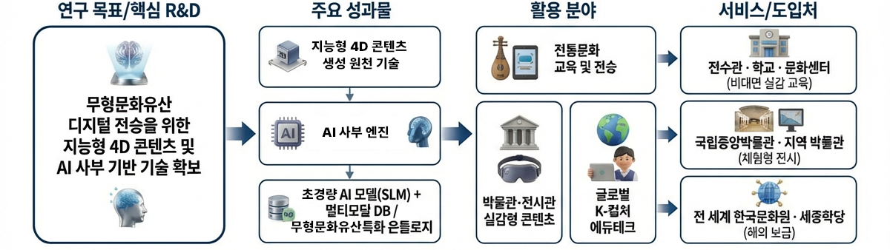
*[그림] 활용방안 개념도*

- [공통] 연구개발성과 및 보편적 활용분야
	- 주요성과물
		- 지능형 4D 콘텐츠 생성 원천 기술: 무형문화유산 고유 특징(LMA 기반)이 연동된 고실감 4D 콘텐츠 생성 기술 확보
		- 초경량화 AI 모델(SLM) 및 멀티모달 DB: 저사양 디바이스 구동이 가능한 글로벌 서비스용 경량 모델 및 무형문화유산 특화 온톨로지
	- 활용분야
		- 전통문화 교육 및 전승: 무형문화재 전수관, 학교, 문화센터 등에서의 비대면 실감 교육
		- 글로벌 K-컬처 에듀테크: 전 세계 한국문화원, 세종학당을 통한 한국 문화 교육 및 보급
- [시장중심형] 실용화·제품화 및 신산업 창출
	- 비즈니스 모델(BM) 다각화 및 타겟 세분화
		- [B2G] 공공 입찰 및 패키지 보급: 박물관, 국공립 전시관, 지자체 관광시설 대상 설치형 패키지(SI) 및 유지보수 구독 모델 구축
		- [B2B] 체험형 공간 및 플랫폼 제휴: 테마파크, 키즈파크, 리조트, 공항 면세점 내 체험존 구축 및 '키즐' 플랫폼 785개 지점 연계
		- [B2C] 개인 맞춤형 서비스: 택견 숏폼 자동 생성, 탈 커스터마이징 등 개인용 앱/웹 서비스 유료화(프리미엄 필터, 디지털 굿즈)
	- 실감형 전시 시장 진출 (Media Cave 패키지)
		- 상품 이원화 공급: '살판', '어름' 등 무형유산의 역동성을 360도로 체험하는 미디어 케이브와 보급형 키오스크 라이트 패키지 구성
		- 고부가가치 상품화: 단순 관람을 넘어선 관광 상품으로 박물관 및 테마파크 시장 진입
	- 모션 IP 및 기술 라이선싱
		- Motion IP 공급: 인간문화재의 고정밀 모션 데이터를 게임, 메타버스 플랫폼에 라이선싱
		- 기술 로열티 창출: 자세 교정, 리듬 분석 엔진을 에듀테크나 헬스케어 기업에 API/SDK 형태로 공급
- [도전혁신형] 미래 핵심기술 확보 및 기술이전
	- 차세대 4D 그래픽스 원천기술 확보
		- 기술 스핀오프(Spin-off): 향후 로보틱스, 자율주행 시뮬레이션, 원격 의료 등 고속 동적 객체 복원 분야로 기술 확장
	- 예술적 암묵지의 정량화 표준 수립
		- LMA 기반 표준화: LMA(Laban Movement Analysis) 기반 동작 분석 방법론의 표준 수립 및 데이터셋 구축
- [공공증진형] 문화 향유권 확대 및 공공 가치 실현
	- 전 세계 150여 개 한국문화원 및 세종학당 연계
		- 글로벌 거점 보급: 재외 한국문화원 및 세종학당을 거점으로 체험형 키오스크 및 인터랙티브 교육 콘텐츠 보급
	- 디지털 문화 복지 및 전승 체계 혁신
		- 과학적 전승 지원: 이수자 및 전수생에게 과학적 동작 분석 데이터(정확도 95% 목표)를 제공하여 교육 효율성 증대
		- 전승 생태계 활성화: 청년층 친화적인 에듀테크 환경 조성을 통한 자발적 참여 유도
- [대중소협력형] 개방형 혁신 생태계 조성
	- 보유 인프라 기반 확산 협력 ("키즐" 플랫폼 활용)
		- '키즐' 플랫폼 활용: 국내 점유율 1위 유아용 에듀테크 플랫폼(785개원 보급) 인프라를 통한 실감 콘텐츠 즉시 확산
		- 테스트베드 구축: 전국 어린이집 및 유아원 네트워크 활용으로 시장 초기 진입 장벽 해소
	- 오픈 API/SDK 및 글로벌 파트너십
		- SDK 공개: 동작 분석 엔진과 렌더링 모듈을 SDK 형태로 공개하여 중소 콘텐츠 기업 진입 지원
		- 글로벌 파트너십 활용: 일본(Smart Education), 스웨덴, 브라질 등 기 확보된 네트워크를 통한 현지화 및 시범 사업 추진

# 5-2. 기대효과

- 기술적 측면 (기술 선도 및 원천 기술 확보)
	- 초경량·고성능 AI 인터랙션 기술 확보
		- 세계 최초 무형문화유산 특화 4DGS(가우시안 스플래팅) 생성 모델 및 온톨로지 구축으로 4D 콘텐츠 제작 기술 우위 선점 및 100ms 이하 초저지연 모션 인식 엔진(SLM)의 국산화 달성.
- 경제·산업적 측면 (수익 창출 및 글로벌 시장 선점)
	- 수출 증가 및 글로벌 시장 선점
		- 전 세계 150여 개 재외 한국문화원 및 세종학당을 대상으로 구독형 전승 교육 플랫폼을 수출하여 지속적인 외화 수익 창출
		- 2030년 약 6,950억 달러 규모로 전망되는 글로벌 에듀테크 시장 내 '한국형 무술·놀이 솔루션'이라는 독보적 카테고리 선점(K-Heritage EdTech 브랜드화)
		- 주관기관 큐랩과 공동연구기관 셀빅의 기존 글로벌 네트워크를 활용하여 'K-Heritage EdTech'라는 새로운 수출 효자 품목 창출
	- 수익 증가 및 신시장 창출
		- B2B(테마파크, 리조트), B2C(개인용 서비스 유료화, 디지털 굿즈) 등 다각화된 비즈니스 모델로 매출 극대화
	- 생산성 향상 및 비용 절감
		- 시공간 제약 없는 고수준 전승 교육 제공으로 대면 교육에 소요되는 시간적·경제적 비용(교습비, 이동비 등)을 50% 이상 절감
	- 수입 대체 효과
		- 해외 고가 엔진 의존에서 벗어난 4D 복원 기술 국산화로 기술 로열티 유출 방지 및 국내 콘텐츠 제작 단가 하락 유도
- 문화·사회적 측면 (지속 가능한 전승 및 국가 브랜드 제고)
	- 무형문화유산의 영구적 보존 및 현대적 계승
		- 인적 전승의 단절 위기에 처한 무형문화유산을 정밀 데이터로 보존하여 국가 문화 자산의 소실을 방지하고, MZ세대와 알파세대가 즐길 수 있는 현대적 게임화(Gamification) 콘텐츠로 재탄생시켜 자발적 전승 참여 유도
	- K-컬처의 깊이와 품격 제고 (글로벌 위상 강화)
		- 대중문화(K-POP 등)에 편중된 글로벌 관심을 한국의 뿌리 깊은 전통문화(ICH)로 확장하여 국가 브랜드의 품격과 신뢰도 향상 및 민간 외교관 역할 수행

# 5-3. 사업화 전략 및 계획

**사업화 모델(BM)**

- 구독형 AI 코칭
	- 전 세계 한국어 학당(세종학당), 해외 태권도장, 국내외 체육관 등을 대상으로 한 'K-무예/연희 AI 트레이닝' 서비스.
	- 월 단위 구독료(Subscription) 기반의 안정적 수익 창출.
- AI 엔진 API 및 SDK 라이선싱
	- '무형유산 동작 분석 엔진'과 '4DGS 렌더링 엔진'을 국내외 게임사, 메타버스 플랫폼사에 API 형태로 제공.
	- 타 산업(피트니스, 재활 의료)으로의 기술 확산을 통한 기술료(Royalty) 확보.
- 글로벌 동작 IP 자산화
	- 구축된 명인들의 고품질 4D 동작 데이터를 디지털 에셋화하여 마켓플레이스 판매 및 영화/애니메이션 제작사에 라이선싱.

**사업화 추진 주체**

- 주관기관 (큐랩): 사업화 총괄, 서비스 플랫폼(SaaS) 운영, 글로벌 마케팅 및 해외 파트너십(해외 학당, 무술 협회 등) 구축, AI 엔진 라이선싱 관리
- 공동1 (셀빅): 오프라인 체험 시설 구축 및 시공, 전시용 키오스크/하드웨어 생산, 국내 지자체 및 박물관 대상 영업 총괄.
- 공동2 (한국전자기술연구원): 원천기술(4DGS, LLM)의 상용화 지원 및 기술 표준화 추진을 통한 시장 진입 장벽 구축.
- 공동3 (연세대): 모바일/Edge 환경 최적화 기술 지원으로 저사양 디바이스용 보급형 서비스 상용화 지원.
- 공동4 (용인대): 콘텐츠 공신력 확보를 위한 전문가 인증 체계 구축, 전승자 네트워크를 통한 원천 데이터 지속 공급.

**시장분석**

- 글로벌 에듀테크 시장 성장: 2030년 약 6,950억 달러 규모로 전망되는 글로벌 에듀테크 시장 내에서 'K-컬처 체험형 교육'이라는 독보적 카테고리 선점 가능.
- K-무형유산 수요 급증: 글로벌 한류 확산으로 태권도 외에 택견, 남사당놀이 등 전통문화 체험 수요는 증가하고 있으나, 전문 지도자 부재 및 시공간적 제약으로 인한 시장 미충족 수요(Unmet Needs) 존재.
- 기술적 경쟁 우위: 기존의 단순 영상 시청 교육을 넘어 실시간 AI 교정 및 4D 실감 복원 기술이 결합된 '디지털 도제' 시스템은 전 세계 최초의 시도로 기술적 진입 장벽이 매우 높음.
- 타겟 시장 규모: 전 세계 150여 개국 세종학당 학습자 및 약 1억 명의 글로벌 태권도 수련생을 잠재적 고객층으로 확보.

**사업화 전략 및 계획**

- [1단계: 시장 진입기 (과제 종료 후 1년 이내)]
	- 국내 공공시장 선점: 지자체 전수관, 국공립 박물관 대상 셀빅의 인프라를 활용한 체험존 우선 구축(B2G).
	- SaaS 서비스 론칭: 국내 태권도장 및 체육관 대상 AI 트레이닝 베타 서비스 및 유료화 전환.
	- 기존 에듀짐 도입 기관을 대상으로 ‘K-헤리티지 모듈 무상 체험 프로모션’ 실시하여 초기 사용자 피드백 확보 및 유료 전환 유도.
	- 초등 돌봄교실 및 늘봄학교 대상으로 ‘AI 디지털 도제 교육’ 제안서 배포.
- [2단계: 시장 확장기 (과제 종료 후 1~3년)]
	- 글로벌 파트너십 확대: 재외 한국문화원, 세종학당재단과 협업하여 해외 보급망 확보 및 다국어 지원 서비스 강화.
	- AI 분석 엔진을 교육부/문체부의 ‘창의적 체험활동’ 또는 ‘학교 체육’ 정규 커리큘럼과 연계하여 공공 입찰 참여.
	- 에듀짐의 하드웨어 경쟁력과 본 과제의 AI 코칭 엔진을 결합한 ‘K-Heritage Smart School’ 패키지로 해외(베트남, 태국 등) 유치원 시장 진출
- [3단계: 시장 정착기 (과제 종료 후 3년 이후)]
	- 생태계 구축: SDK/오픈 API 배포를 통해 중소 콘텐츠사가 본 플랫폼의 엔진을 활용하여 다양한 K-컬처 콘텐츠를 제작하도록 유도.
	- 글로벌 EdTech 브랜드화: 'K-Heritage EdTech'를 글로벌 고유 브랜드로 정착시켜 전통문화 교육의 세계 표준 확립.
	- 에듀짐에서 학습한 데이터를 개인 모바일 앱(SaaS)으로 연동하여 가정에서도 부모와 함께 택견/전래놀이를 즐기는 ‘하이브리드 에듀테크 생태계’ 완성.

- 초등학교 및 유치원대상 가상스포츠실 사업화
	- 초등학교, 유치원, 어린이집, 문화센터등 대상 신체활동 교육 서비스 사업화를 통해, 160여곳의 기관에 설치 운영 중
	- 메타키움, 키움테크, 키즈페이등 초등학교,유치원 전국 유통 네트워크 협력망 확보
		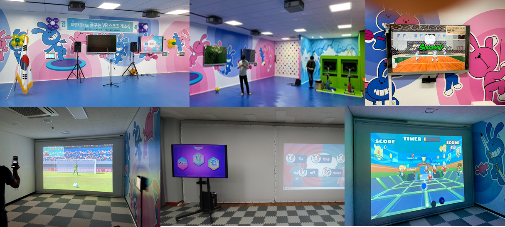
		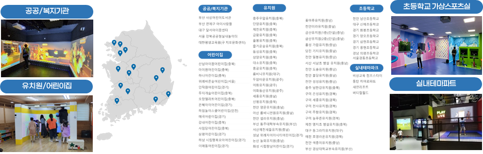
		*[그림] 초등학교 가상스포츠실 구축 예/전국 콘텐츠 보급 현황*
- 중국, 동남아등 글로벌 사업화 경험 및 네트워크 보유
	- 중국 파트너 중경기한실업유한공사 충칭시 Fortune Mall내 가상스포츠 서비스 공간 구성
		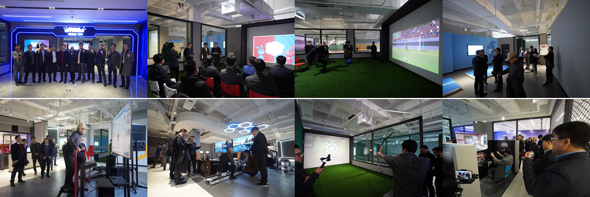
		*[그림] 중국 중경 포춘몰 가상스포츠 센터 오픈식*
	- 태국 방콕 DEJAUSORN SCHOOL(사립 초등학교)에 신체활동기반 융합교육서비스 에듀짐과 AI모션인식기반 댄스트레이닝 콘텐츠 KPOP댄스마스터 설치
		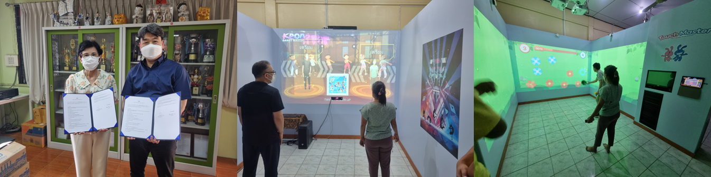
		*[그림] 태국 방콕 DEJAUSORN SCHOOL MOU 및 콘텐츠 설치 사례*
	- 태국, 중국, 베트남, 일본등 다양한 사업화 네트워크 보유
		- 태국 / 기업·기관: RJBC Thailand Co., Ltd.
		- 중국 / 기업·기관: 중경도약토과기유한공사
		- 베트남 / 기업·기관: Kristal Co., Ltd.
		- 일본 / 기업·기관: KWAVE JAPAN Co., Ltd.
		- 바레인 / 기업·기관: You & Kim Consulting Company
		- 태국 / 기업·기관: Global Asia Biz Center Co., Ltd.
	- 태국 K-CON, Face of Thailand, 베트남 Face of Vietnam, 필리핀 Guerilla K-Night등 다양한 국가에서 진행하는 이벤트에 동작인식기반 댄스서비스 ‘KPOP댄스마스터’ 사업화 경험 보유
		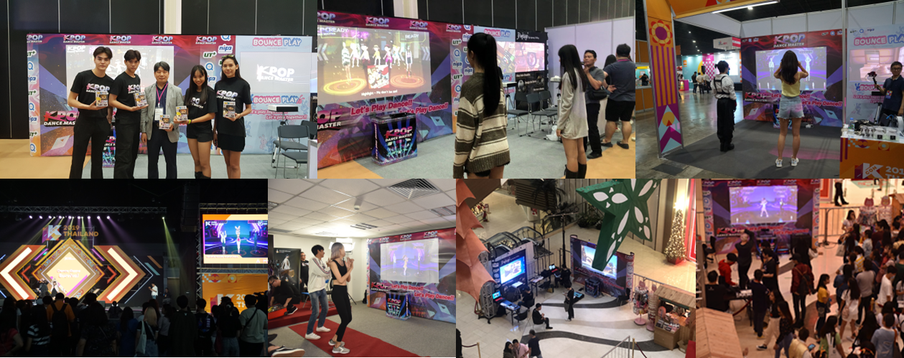
		*[그림] K-Con, Face of Thailnad, Face of Vietnam, Guerilla K-Night 이벤트 행사*
**사업화 모델(BM) — 미디어 케이브형 프리미엄 전시 및 키오스크 패키지**

- 미디어 케이브형 프리미엄 전시 및 키오스크 패키지
- [그림] '미디어 케이브형 프리미엄 전시 및 키오스크 패키지' 사업화 구조도
- 무형문화유산 실감 체험을 위한 '미디어 케이브(공간형)' 및 '인터랙티브 키오스크(모듈형)' 패키지 구축 서비스 (SI/H/W)
- 박물관 및 전시관을 위한 프리미엄 몰입형 전시 공간 구축과 어린이집 및 문화센터 보급형 키오스크 패키지를 이원화하여 공급
	- 미디어 케이브형 프리미엄 전시/공연 패키지
		- 4DGS 기반 살판(땅재주) 360도 관람형, 풍물(농악) 합주형, 덧뵈기(탈놀이) 군중 퍼포먼스형 등 대형 몰입 전시로 구성
	- 키오스크형 라이트 패키지
		- 덜미(디지털 퍼핏), 버나(센서 막대/물리 시뮬), 덧뵈기(생성형 탈 커스터마이징), 택견(품밟기 분석+숏폼 생성) 등

**사업화 추진 주체 — 미디어 케이브형 프리미엄 전시 및 키오스크 패키지**

- 공동연구기관 : 셀빅
	- 20년 업력의 AI, 체감형 콘텐츠 구축 사업 전문 업체.
	- 광고프로모션, 디지털 키즈 테마파크, 쇼핑몰, 위락시설 O2O [교육, 헬스케어, 의료, 게임, 스포츠] 전문 제작사
	- 협력기관 : 문화재청, 국립박물관, 지자체 전시관, 미술관, 전통예술 단체, IT기업
	- 역할: 국내외 전시관, 박물관 공공 입찰 주도 및 양산 시스템 가동

**시장분석 — 미디어 케이브형 프리미엄 전시 및 키오스크 패키지**

- 수요 확대 요인
	- K-컬처 글로벌 소비 확대 전망: 2030년 한국 문화 관련 글로벌 소비가 약 1,430억 달러(약 192조 원) 수준으로 성장 전망 보도
	- 박물관·전시관 중심으로 실감형·디지털 경험 확대 전략이 공공 영역에서 지속 추진
	- 디지털 뮤지엄/가상 전시에서 VR/AR 기반 몰입형 스토리텔링이 접근성과 교육 효과를 넓힌다는 연구 흐름
	- 박물관·전시관의 트렌드가 단순 관람에서 '몰입형 체험'으로 변화하며 디지털 인터랙션 수요 급증
- 경쟁/대체재
	- (대체재) 일반 XR 전시 제작사, 미디어아트 스튜디오, 체험형 테마파크 제작사
	- (부분 경쟁) 생성형 AI 기반 크리에이티브 툴/플랫폼(영상/이미지/아바타)
	- 차별 포인트: "전통 무형"은 동작의 물리 제약, 전승 맥락, 구술/문헌 의미가 핵심이라 범용 생성형 툴만으로는 '정통성+체험성'을 동시에 확보하기 어려움

**사업화 전략 및 계획 — 미디어 케이브형 프리미엄 전시 및 키오스크 패키지**

- 목표 고객 및 판로
	- B2G: 박물관/국공립 전시관/지자체 관광시설 공공입찰
	- B2B: 테마파크·키즈파크·복합문화공간·리조트·공항/면세점 체험존
	- 해외 B2B: 해외 한국문화원/아시아·미주 박물관의 K-컬처 특별전
	- B2C: 택견 숏폼·탈 커스터마이징 등 개인용 앱/웹 서비스(현장 체험을 온라인 재방문으로 연결)
- 수익 창출 방안
	- [B2G/B2B]
		- 설치형 패키지 공급(SI): 키오스크 1식/미디어케이브 1식 구축비 + 커스터마이징 비용
		- 연간 유지보수/운영 구독: 장비 점검, 콘텐츠 업데이트(시즌 이벤트), 로그 기반 성능개선
		- 모듈 라이선스 판매: 덜미/버나/덧뵈기/택견/살판/풍물 등 "콘텐츠 모듈" 단위로 추가 구매
		- SDK/API 라이선스: 자세 교정/리듬 분석/질의응답 엔진을 파트너 서비스에 탑재
	- [B2C]
		- UGC 유료화: 프리미엄 스타일 필터, 고해상도 다운로드, 기념 영상 패키지
		- 구독형 교육: 택견 코칭 코스(기초→심화), 개인 리포트/배지 시스템
		- 디지털 굿즈/커머스 연계: 나만의 탈/꼭두각시 아바타를 포토카드, 스티커, AR 필터로 상품화
- 유아용 실감형 에듀테크 콘텐츠 시장점유율 1위
	- 전국 어린이집, 유아원 대상 수익쉐어 기반 ‘키즐‘ 공동 785개원 보급 완료. 향후 1000여곳 공급 확대.  / 해마다 100% 이상의 빠른 성장율
	- 키즐은 343개원의 3,630개학급에서 42,381개 원아 사용(2022년 11월 기준)
	- 2025년까지 2,100 곳 설치 목표(애듀테크 도입 기관 18%, 가정어린이집 제외)
	- 온오프믹스 융합형 실감 콘텐츠로 어린이 에듀테크 교육사업 전국 대리점, 총판대상 홍보 및 판매 전개.
		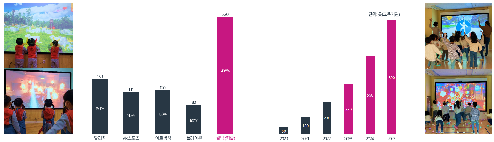
		*[도표] 셀빅(키즐) 관련 사업 점유율 및 설치 보급 현황*
		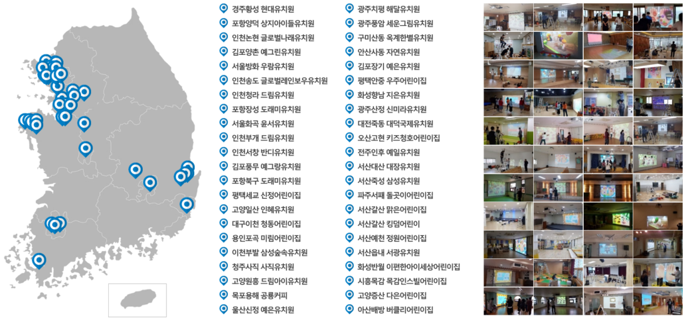
		*[그림]  전국 키즈 에듀테인먼트 콘텐츠 대표 보급 위치*
			- 셀빅 자사의 생산 및 국내 판매 인프라를 활용하여 실감 콘텐츠 서비스 보급 구축 사업 전개
				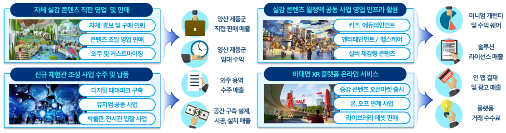
				*[그림] 실감형 콘텐츠 및 연구 기술 사업화 전개*
	- 판타박스’ 브랜드로 광주, 곤지암, 세종, 진주.. 국내외 디지털 파크 보급 사업. 및 중국 박물관 콘텐츠 보급 RS BM 협의
	- EBS 디지털 놀이터 대전시 ‘유성 AI 놀터’ 콘텐츠 개발, 동두천시 키즈헬스케어센터 조성사업, 보훈 메타버스 플랫폼 개발, 전라남도/Joia 전남 관광 메타버스 콘텐츠 제작, 국민체육진흥공단 스포츠XR 메타스페이스, 서대문 자연사 박물관 실감 콘텐츠 개발, 독립기념관 콘텐츠 구축사업, 수학사랑 울산 수학 문화관 체험공간 콘텐츠,  수원박물관 전시도슨트시스템 구축사업, 부산 유아교육 진흥원 ‘살아있는 숲’ 디지털 체험 콘텐츠, 고령 대가야생활촌 실감형 디지털 박물관.. 등 다수의 공공 서비스 및 전시 공간 콘텐츠 구축 사업 수주 진행.
		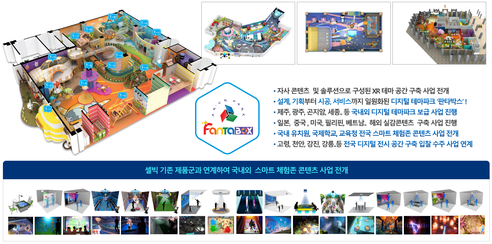
		*[그림] 기존 추진중인 주관기업 추진 실적 및 체험존 콘텐츠 사업 연계*
		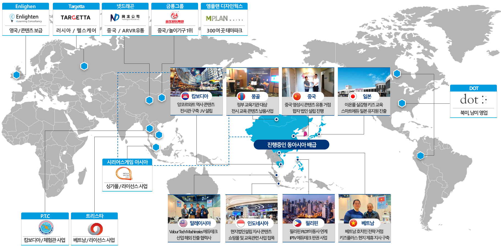
		*[그림] 셀빅 글로벌 체감형 콘텐츠 거래처 및 제휴 업체*
	- 교육·학습 시설인 전시관, 박물관 등에 보유 콘텐츠와 시설물을 시공, 납품, 설치한 경험이 있으며, 해당 인프라를 통해 개발 콘텐츠 보급 및 확산이 용이함.
- ㈜셀빅은 다수의 해외국가와 체감형 콘텐츠 사업 제휴를 진행하고 있으며 해외 거점을 확대하고 있음.
	- 한글교육 및 한국문화 콘텐츠 보급과 한류 확산을 위한 글로벌 네트워크 구축 지역내 한류 보급과 확산을 위한 거점 연계 기관 확보
		- Ateneo de Manila University(필리핀): Aurea Javier 교수 서강대 및 셀빅 방문. 콘텐츠 개발 결과에 대해 아테네오 대학에 설치 및 시법 사용 협조에 대해 논의함
		- Jawaharlal Nehru University(인도): NEERJA SINGH 교수와 인도 학습자의 한국 문화 콘텐츠 사용 협조에 대해 논의함
		- Dong A University(베트남 다낭), Hue University(베트남 후에): 현지 교수들과 한글 교육 및 한국문화 콘텐츠 사용에 대한 협조 논의
		- The University of Melbourn(호주): Nicola Fraschini 교수와 협의. 1월 중 한국어 단기 과정 연수생 사용자 실증 협의
		- Singapore Management University(싱가포르): 서지윤 교수가 담당하는 비즈니스 한국어 프로그램 수강생 2026년 한국 방문 시 콘텐츠 개발 및 사용 관련 피드백 제공 협의
			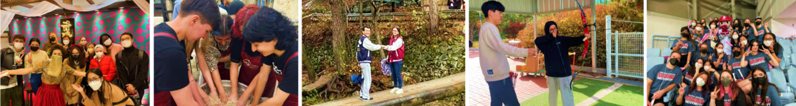
			*[사진] 셀빅 글로벌 해외 한국어학과 학생 교류*
			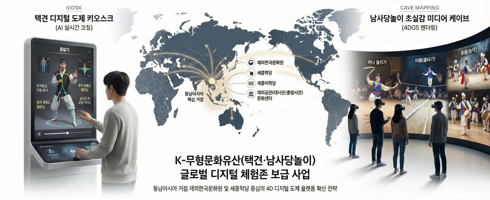
			*[그림] 필리핀, 베트남을 교두보로 동남아시아 거점 확산*
	- 동남아시아, 중국 등 해외 시장 진출을 위한 기존 실감형 전시, 박물관 사업 인프라 이용
		- 각 진출 국가 별 시장 상황 및 이용자의 반응 탐색을 위해 기존 에듀테크 실감 콘텐츠 기획 및 해외 배급 경험을 토대로 관련 인프라 중심의 프로토타입 서비스 제공을 통해 현지화 및 마케팅 계획
		- 캐나다 : 원주민 디지털헤리티지 주정부 사업 계약 진행
		- 스웨덴 : 시타델 마이스터 고등학교에 하드웨어 와 소프트 웨어 공급을 추진 중.
		- 브라질 : 파라나 주에 있는 셀레파 공기업 현지쇼케이스 공교육 기관 중심, 뮤지엄 공급 사업
		- 일본 : 스마트 에듀케이션’ 일본 대표 영유아 교육업체 300여곳과 보급사업 전개 논의. 일본 Smart Education사에서 키즐 글로벌 발주 계약
		- 말레이시아 : 국립 어린이 연구소와 교육부에 셀빅 미래 스마트 교실 예산 편성, 교육부 신청
		- 베트남 - 다온 커머스의 베트남내 도담 파크 및 뮤지엄 사업 진행.
