# 0. 문서 정보

| 버전    | 날짜         | 내용                         | 항목       | 작성자 |
| ----- | ---------- | -------------------------- | -------- | --- |
| 1.0.0 | 2026.07.23 | 초안 작성                      | 전체       | 조상연 |
| 2.0.0 | 2026.08.05 | 개발 리뷰 반영하여 체험을 중점으로 전면 재설계 | 전체       | 조상연 |
| 2.0.1 | 2026.08.05 | 문구 수정 히스토리 기록           | 2 4.3 | 조상연 |

# 1. 개요

- **콘텐츠 정의**: 덧뵈기를 소재로 한 탈춤 따라추기 체험 키오스크 콘텐츠
- **소재**: 남사당놀이 탈놀음 덧뵈기
- **목표 경험**: 유저가 덧뵈기 배역을 고른 후 그 배역의 상징 동작을 코치를 따라 풍물 장단에 맞춰 따라하고 정확도에 따라 판정 피드백을 받음.
- **핵심 메커닉**: 선택한 배역의 동작을 자세 일치도와 풍물 장단 타이밍으로 실시간 채점해 판정 피드백으로 보상하고, 채점 누적을 신명 게이지와 최종 점수로 보여줌
- **결과 안내**: 체험이 끝나면 결과 화면에서 신명 게이지 종합 값을 최종 점수로 안내함. 별도 반출 결과물(사진 저장, 파일 다운로드)은 두지 않음

# 2. 전체 플로우

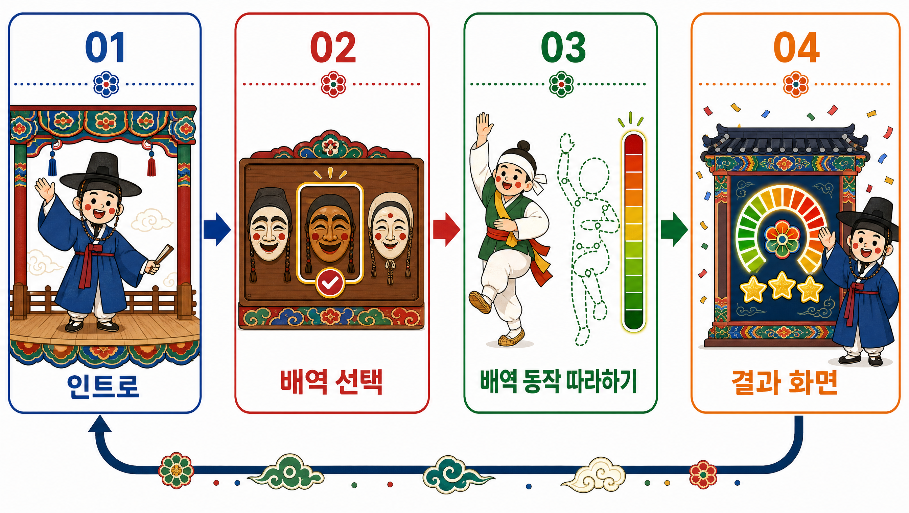

%%
1회 완결로 한 배역의 탈춤을 체험하고 최종 점수를 확인하는 세션임. Step 1 인트로 → Step 2 탈 선택 → Step 3 배역 동작 따라하기(핵심) → Step 4 결과 화면 → Step 5 종료와 리셋.
%%

- **중단 처리**
	- 대상: 진행 중 이탈과 실패가 모두 이 공통 처리로 모임
	- 처리: 결과 화면(완주 전용)을 건너뛰고, 세션을 종료해 임시 데이터를 파기한 뒤 시작 화면으로 돌아감. 실패는 상황 안내 팝업을 띄운 뒤 진행하고, 이탈은 팝업 없이 진행함
- **파기**
	- 정상 종료 시 남은 세션 임시 데이터(동작 채점 기록의 식별 원본)를 파기함
	- 영상 피드는 처리 직후 실시간 파기라 종료 시점에는 남지 않음

# 3. 공용 시스템

## 3.1 세션 데이터

### 3.1.1 역할과 목적

한 세션이 만드는 데이터를 담는 시스템. 전 Step이 같은 상태를 공유하게 하고, 데이터 종류별 보관과 파기를 관리하기 쉽게 함.

### 3.1.2 동작과 규칙

| 데이터      | 분류     | 들어가는 값과 구성                             | 보관 기간                        | 비고                            |
| -------- | ------ | -------------------------------------- | ---------------------------- | ----------------------------- |
| 세션 ID    | 시스템    | 세션마다 부여되는 고유 식별자                       | 보관 (잠정, 규정 검토 후 확정)          | Step 1에서 생성. 디버깅과 품질 분석용      |
| 현재 언어    | 시스템    | 세션에 적용 중인 언어(기본 한국어)                   | 보관 (잠정, 규정 검토 후 확정)          | 시작 화면 언어 선택에서 설정. 현지화 기준      |
| 현재 Step  | 시스템    | 현재 진행 중인 Step                          | 보관 (잠정, 규정 검토 후 확정)          | 진행 단계 기록                      |
| 에러 유형    | 시스템    | 에러 발생 시 에러 케이스 유형 기록                   | 보관 (잠정, 규정 검토 후 확정)          | 디버깅과 품질 분석용                   |
| 동의 기록    | 시스템    | 약관 버전, 동의 시각, 동의 항목(필수: 카메라 촬영)        | 보관 (잠정, 규정 검토 후 확정)          | 약관 버전 체계는 운영 단계에서 결정함         |
| 선택 배역    | 콘텐츠 입력 | 유저가 고른 배역의 식별자(그 배역의 탈 에셋과 동작 세트를 가리킴) | 보관 (잠정, 규정 검토 후 확정)          | Step 2 산출. 식별자만 저장(에셋은 사전 배포) |
| 동작 채점 기록 | 콘텐츠 생성 | 자세 일치도와 타이밍 점수, 신명 게이지                 | 익명 통계는 보관, 식별 원본은 세션 종료 시 파기 | Step 3 산출                     |
| 영상 피드    | 콘텐츠 입력 | 카메라 원본 스트림(포즈 추정 입력)                   | 메모리 임시, 처리 직후 파기             | 디스크 저장 금지. 얼굴과 신체 포함          |

- **Step별 세션 동작**
	- Step 1: 생성
	- Step 2~Step 4: 갱신
	- Step 5: 종료, 임시 데이터 파기, 리셋
- **서버 전송 시점 (이벤트 기반)**: 세션 데이터 갱신은 클라이언트 로컬 상태에만 반영하고, 서버로는 정기 전체 동기화 없이 이벤트 시점에만 전송함(이어하기 없는 1차연도 기준)
	- 단계 이동: 각 Step 진입과 종료 시 현재 Step을 전송함
	- 동의 기록: 이용 동의 화면에서 동의 확정 시 동의 이벤트를 전송함. 클라이언트는 서버의 저장 확인 응답을 받은 뒤에만 다음 단계로 진행함(동의 기록 유실 방지)
	- 에러와 이탈: 에러 발생 시, 이탈(약관 미동의, 미입력 타임아웃 종료) 시 전송함
	- 배역 확정: 선택 배역 식별자는 Step 2 확정 시 서버 세션에 반영함

## 3.2 개인정보 처리

### 3.2.1 역할과 목적

카메라로 찍는 유저 얼굴과 신체 데이터의 처리 규칙을 정의하는 시스템. 쓰임이 끝난 데이터를 즉시 파기해 유출 위험을 줄임.

### 3.2.2 동작과 규칙

#### 1) 구현 제약

- **개인정보 범위**
	- 얼굴과 신체 영상
- **카메라 동의 게이트**
	- 카메라 촬영이 필수 동의이므로 동의가 없으면 세션을 진행하지 않음
- **영상 피드 처리**
	- 메모리에서 임시로 처리한 뒤 즉시 파기하고, 디스크에 저장하거나 로그로 기록하지 않음. 

#### 2) 규정 검토 대기

- **동의 고지 문구**
	- 카메라 영상은 채점 처리에만 쓰고 저장하지 않는다는 내용을 개인정보 수집과 이용 안내에 포함함. 정확한 안내 문구와 동의 범위는 규정 검토 후 확정함
- **보관 기간**
	- 잠정값은 규정 검토 후 확정함
- **재방문 연속성**
	- 학습 프로필, 이어하기, 학습 토큰, 콘텐츠 진행 결과 누적은 2차연도 확장 설계로 두며 1차연도는 익명 1회로 운영함

## 3.3 언어 선택 시스템

### 3.3.1 역할과 목적

세션 전체에 적용할 언어를 정하는 관문. 한국어가 아닌 언어를 쓰는 유저도 자기 언어로 탈춤을 체험하게 함.

### 3.3.2 입력과 출력

- **입력**: 유저의 언어 선택
- **출력**: 현재 언어(세션 데이터에 저장). 현지화 JSON(localization.json)에서 해당 언어값을 불러옴

### 3.3.3 동작과 규칙

- 유저가 언어를 선택하고 시작하기 버튼을 터치하면 현재 언어로 반영함. 기본값은 한국어임
- **현지화 범위**: UI 카피, 말뚝이 대사와 TTS 음성, 안내 팝업을 현재 언어로 제공함. 최종 점수는 언어 중립 값이라 현지화하지 않음. 지원 언어는 한국어와 영어를 우선 적용함

## 3.4 말뚝이 진행 호스트

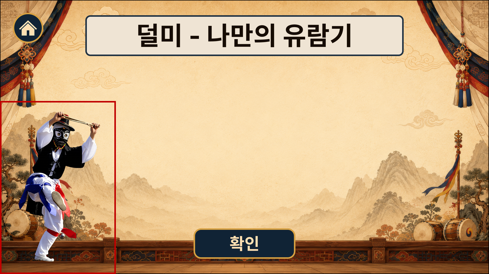

### 3.4.1 역할과 목적

양반을 놀리는 탈춤 풍자의 화자 말뚝이를 세션 진행 호스트로 세운 시스템. 관객과 대거리하던 역할을 이어받아 진행에 덧뵈기의 전통 정체성을 살림.

### 3.4.2 동작과 규칙

- **범위**
	- 전 세션 호스트
- **재담 연출 (배역 동작 중)**
	- 유저가 배역 동작을 따라 추는 동안 그 배역의 성격과 풍자 맥락을 재담으로 얹음(예: 샌님 선택 시 양반의 거드름을 눙치는 재담)
- **발화 방식**
	- TTS 음성으로 대사를 재생하고 같은 대사를 화면에 텍스트로 표시함.
	- 대사와 화면 텍스트는 세션의 현재 언어로 제공함(TTS도 현재 언어로 합성)
	- 발화 중 동작 애니메이션(입 모양 포함)을 재생함
- **입 모양**
	- 립싱크는 맞추지 않고 사전 생성한 입 움직임 애니메이션을 발화 중 재생함
- **재생 컨트롤러**
	- 동작 애니메이션 재생과 동시에 TTS 오디오를 재생하고 그 길이만큼 입 애니메이션을 루프
	- 립싱크가 없어 음소 정렬은 불필요
- **스킵**
	- 발화 중 다음 버튼을 누르면 발화를 중단하고 다음으로 진행함
- **타임아웃**
	- 발화 중에는 터치 미입력 타임아웃을 멈추고, 발화가 끝난 뒤 시간 체크 시작
- **대사 적용**
	- 대사는 런타임 생성 없이 사전 작성함. 진행 단계별 안내와 배역별 재담을 미리 써 두고 상황에 맞춰 재생함(구체 문안은 작성 예정)

### 3.4.3 필요 리소스

- 말뚝이 호스트 캐릭터(탈춤 양식, 2D, 애니메이션 가능하게 제작, 배역 탈 양식과 시각 정체성 일치)
- 동작 애니메이션 세트(예시: 대기, 인사, 말하기, 제스처)
- 말뚝이 TTS 보이스(지원 언어별 확보 필요)
- 추임새와 대사(사전 작성)

### 3.4.4 실패와 복구

캐릭터 렌더나 TTS 재생이 실패하면 음성과 애니메이션 없이 대표 이미지와 텍스트 박스로만 진행함. 대사는 표시하고 세션은 계속함.

## 3.5 진행 중 종료

### 3.5.1 역할과 목적

유저에게 진행 중 그만둘 수단을 주는 시스템. 원치 않는 세션을 빨리 끝내 키오스크 회전율을 높임.

### 3.5.2 동작과 규칙

#### 1) 일반 규칙

- **처리**
	- 진행 중인 화면을 멈추고 결과 화면(완주 전용)을 건너뛰어 세션 종료와 파기 후 시작 화면으로 복귀함(비완주 종료)

#### 2) 유저의 종료 선택 시 규칙

- **처리**
	- 그만두기 터치 시 그만두기 확인 팝업 표시
	- 확인 시 종료 처리하고, 취소 시 원래 화면 복귀
	  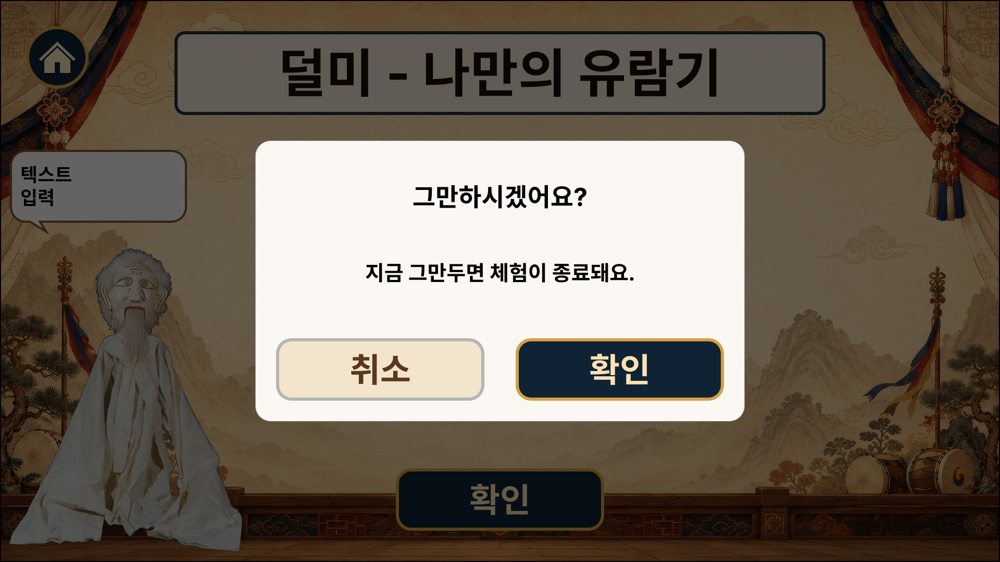

- **적용 화면**
	- Step 1 가이드 화면, 이용 동의 화면
	- Step 2 탈 선택 화면
	- Step 3 배역 동작 체험 화면
- **예외 (미적용)**
	- Step 1 시작 화면
	- Step 4 결과 화면 (완주 마침 화면, 처음으로 버튼과 화면 타임아웃으로 넘김)
- **그만두기와 동시 이벤트 처리 (카메라 화면)**: Step 3(동작 따라하기)에서 그만두기가 채점이나 타임아웃과 겹칠 때의 규칙임
	- 확정된 그만두기는 진행 중인 채점 루프를 멈추고 세션 종료로 감
	- 확인 팝업이 열린 동안에는 터치 미입력 타임아웃과 사람이나 포즈 미검출 측정을 멈춤(말뚝이 발화 중 멈춤과 같은 방식)
	- 종료는 한 번만 처리해 이중 종료를 막음

## 3.6 화면 타임아웃

### 3.6.1 역할과 목적

유저가 한 화면에 오래 머무는 것을 막아, 무인 키오스크가 한 유저에게 묶이지 않게 하는 시스템.

### 3.6.2 동작과 규칙

- **처리**
	- 한 화면에서 60초(잠정) 이상 머물면 그 화면의 정상 진행 경로로 넘어감
	- 화면별 오버라이드: 배역 동작 체험 화면 5분(잠정). 탈 선택 화면, 결과 화면은 기본값(60초, 잠정) 적용
	  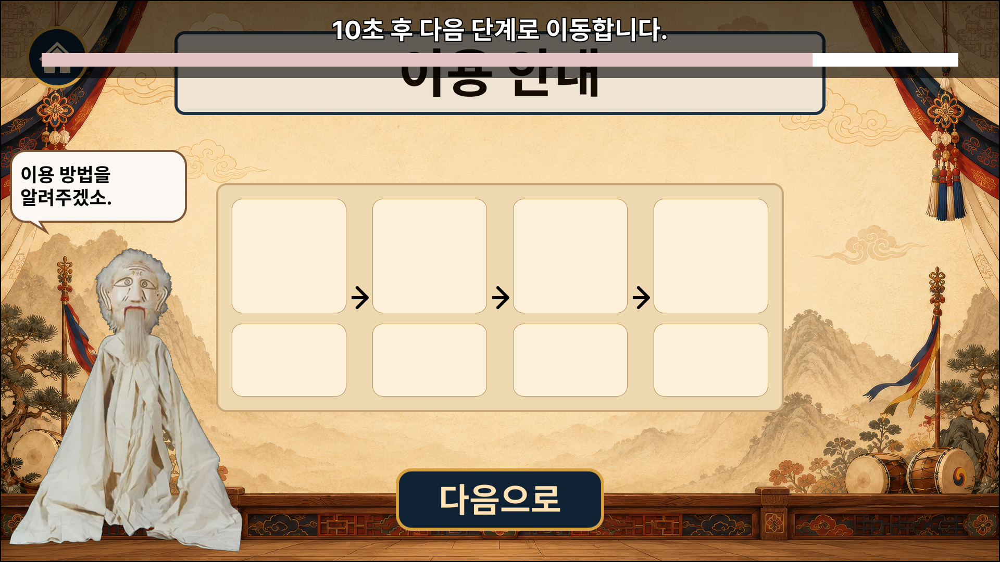

- **작업 상태**
	- 유저 선택 상태가 있으면 세션에 확정 저장한 뒤 진행함(선택 배역, 기본 배역이 사전 선택돼 있어 항상 값이 있음). 없으면 바로 다음으로 진행함
- **예외**
	- 필수 입력, 호스트 대화, 가이드, 팝업 화면 미적용

## 3.7 터치 미입력 타임아웃

### 3.7.1 역할과 목적

입력이 끊긴 유저 이탈을 감지해 방치된 세션을 정리하고 키오스크 회전율을 높이는 시스템.

### 3.7.2 동작과 규칙

- **처리**
	- 한 화면에서 45초(잠정) 이상 터치나 동작 입력이 없으면 이탈로 보고 진행 중 종료 처리
	- 카메라와 모션 화면(배역 동작 체험)은 터치가 없는 화면이라 사람이나 포즈 미검출을 이탈 기준으로 삼음
	- 말뚝이 발화 중에는 측정을 멈추고, 발화가 끝나거나 스킵한 뒤부터 측정 시작
	  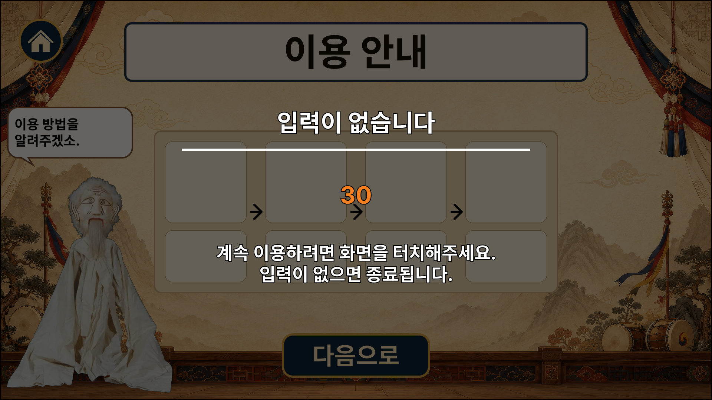

- **예외**
	- 감상 성격 화면(결과 화면) 미적용

## 3.8 외부 서비스 호출 래퍼

### 3.8.1 역할과 목적

외부 서비스 호출(TTS)을 감싸는 공통 계층. 재시도와 타임아웃 대응을 한 곳에 모아, 호출마다 장애 처리를 따로 짜지 않게 함.

### 3.8.2 동작과 규칙

- **재시도 횟수**
	- 2회(잠정). 백오프는 1차 1초, 2차 3초(잠정)
- **호출 타임아웃**
	- TTS 30초(잠정)
- **한도 초과**
	- 재시도 한도를 넘긴 실패는 실패 처리로 넘김

## 3.9 실패 처리

### 3.9.1 역할과 목적

런타임 실패의 처리 정책. 무인 운영에서 실패가 방치되지 않게 함.

### 3.9.2 동작과 규칙

이 콘텐츠의 실패는 기능 축소와 중단 둘로 갈림. 유저가 입력하는 텍스트나 음성이 없어, 입력만 다시 받아 잇거나 다른 입력 수단으로 바꿔 잇는 갈래는 없음.

#### 1) 기능 축소

- 보조 기능이 빠져도 체험이 남는 갈래임. 그 기능만 빼고 세션을 이어 감
- 포즈 미검출 구간(채점 보류로 처리)과 말뚝이 발화 실패가 여기 속함

#### 2) 중단

- 세션을 시작하거나 핵심 체험을 이어 갈 수 없는 실패 갈래임(세션 생성 실패, 동작 가이드 리소스 로드 실패, 음원 재생 시한 초과, 카메라와 인식 계통의 지속 장애)
- 상황 안내 팝업을 띄우고 결과 화면(완주 전용)을 건너뛰어 세션 종료와 파기 후 시작 화면으로 자동 진행함. 별도 실패 화면을 두지 않음
	- 예외: 세션 생성 실패는 정리할 세션 자체가 없어 종료 처리도 거치지 않고 곧장 시작 화면으로 되돌림

#### 3) 운영 알림

- 원인이 외부 서비스나 시스템이면 운영 알림을 보내고, 유저면 보내지 않음

## 3.10 탈과 배역 동작 고증 (공통 레퍼런스)

### 3.10.1 역할과 목적

배역 탈과 배역 동작의 고증 기준을 정의하는 설계 레퍼런스. 탈 선택 목록, 포즈 채점, 사전 자산 검수가 같은 기준을 참조해 전통 정합성 판정이 서로 어긋나지 않게 함.

### 3.10.2 동작과 규칙

- **탈**
	- 덧뵈기 배역 탈을 사전 제작해 제공함. 
	- 10종(샌님, 노친네, 취발이, 말뚝이, 먹중, 옴중, 피조리 甲, 피조리乙, 꺽쇠, 장쇠) 중 우선 꺽쇠, 샌님, 취발이 진행(확인 필요, 고증 자문)
	- 한국 탈춤 탈 양식을 유지하고 일본 노멘이나 중국 가면과 혼동하지 않음
- **배역 동작**
	- 선택한 배역의 상징 동작 세트와 풍물 장단의 고증 매핑(작성 예정, 고증 자문 연계). 
	- 덧뵈기 전승 춤사위 3종(나비춤, 닭이똥 사위, 피조리춤)을 코어로 두고, 배역별 특색 동작은 같은 산대놀이 계통 다른 종목의 배역 동작(취발이 깨끼춤, 말뚝이 두어춤 등)을 차용해 구성함. 
	- 차용 동작의 출처는 확인 필요로 두고 고증 자문에서 확정함. 이 동작 세트가 포즈 채점의 기준 동작이 됨
- **시각 정체성**
	- 탈 양식과 질감의 전통 정합성 유지

# 4. 세션 진행

## 4.1 Step 1. 인트로

### 4.1.1 클라이언트: 시작 화면

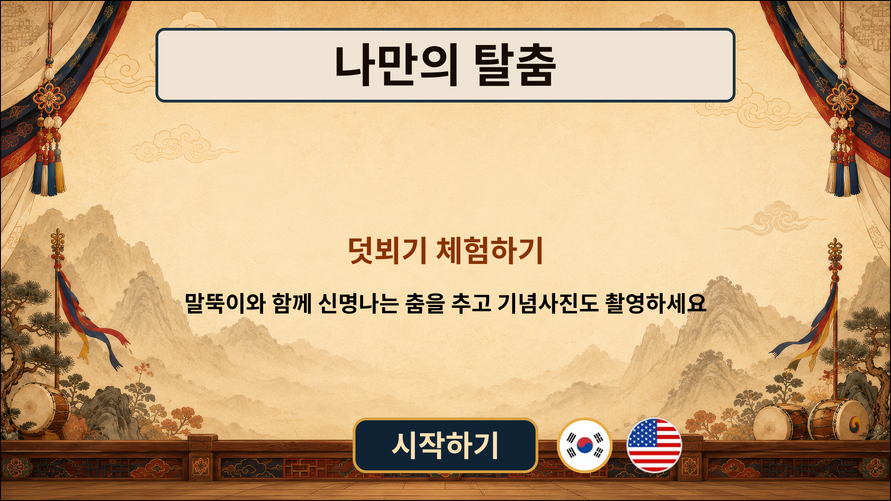

#### 1) 진행

- 시작하기 버튼 터치 시 선택한 언어를 반영하여 다음 단계 진행
	- 서버로 신규 세션 생성 요청

### 4.1.2 서버: 세션 생성

#### 1) 진행

- 신규 세션 생성(익명) 및 세션 ID 부여, 선택 언어 저장
	- 분기: 세션 생성 실패 시 재시도(2회 잠정) 후 상황 안내 팝업 → 시작 화면 복귀

### 4.1.3 클라이언트: 가이드 화면

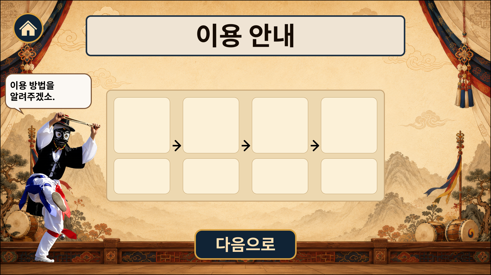

#### 1) 진행

- 진행 흐름 안내, 다음 버튼 터치 시 다음 단계 진행
	- 분기: 미입력 타임아웃 → 종료 처리
	- 분기: 그만두기 선택 시 확인 팝업 → 확정 시 종료 처리

### 4.1.4 클라이언트: 이용 동의 화면

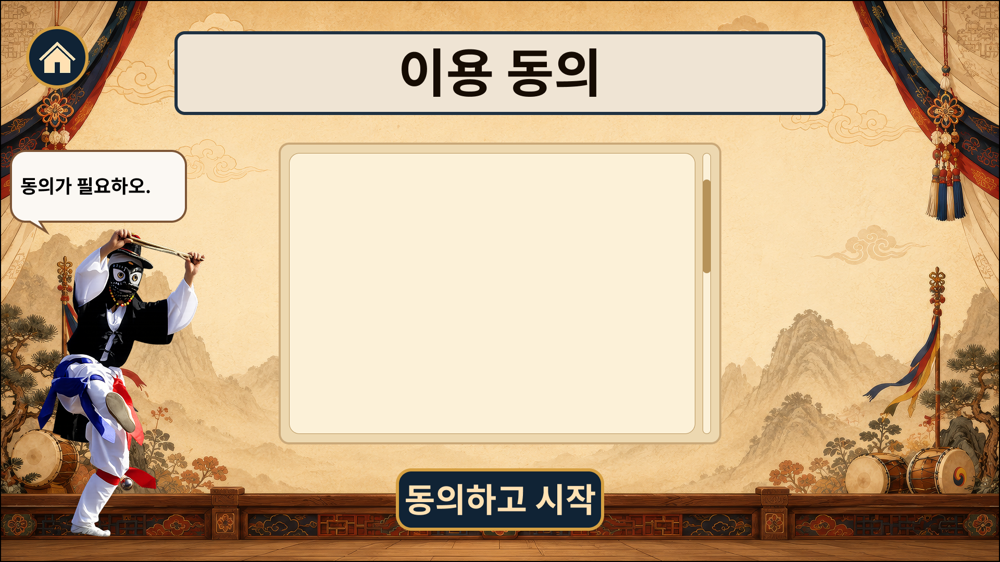

카메라로 얼굴과 신체를 찍으므로 카메라 촬영 동의를 필수로 받음. 정확한 동의 항목과 문구는 규정 검토에서 확정함.

#### 1) 진행

- 동의하고 시작하기 터치 시 클라이언트가 동의 확정 이벤트(약관 버전, 동의 시각, 카메라 촬영 동의 항목)를 서버에 전송하고, 서버의 저장 확인 응답을 받은 뒤 다음 단계로 진행함 (이 화면은 화면 타임아웃 미적용). 서버는 이 이벤트를 받아 세션에 동의 기록을 저장함
	- 분기: 미입력 타임아웃 → 종료 처리
	- 분기: 그만두기 선택 시 확인 팝업 → 확정 시 종료 처리

## 4.2 Step 2. 탈 선택

### 4.2.1 클라이언트: 탈 선택 화면

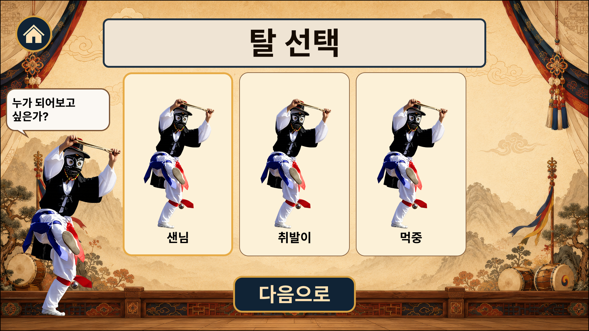

#### 1) 진행

- 사전 제작한 배역 탈 목록을 보여줌. 유저가 배역을 고르거나 기본 선택을 그대로 두고 확정하면 다음 단계로 진행함
	- 분기: 화면 타임아웃(기본 60초, 잠정) → 현재 선택 배역을 확정하고 다음 단계로 정상 진행
	- 분기: 미입력 타임아웃 → 종료 처리
	- 분기: 그만두기 선택 시 확인 팝업 → 확정 시 종료 처리

#### 2) 배역 선택 목록

##### (1) 역할과 목적

유저가 체험할 배역 하나를 고르는 선택 도구. 전통 배역 탈을 그대로 제공하여 전통 정합성을 유지하면서 유저가 자기 배역을 정하게 함.

##### (2) 동작과 규칙

- **목록 구성**: 유저가 선택할 수 있는 탈 배역 목록. 제공 배역과 종수, 목록 순서는 탈과 배역 동작 고증에서 확정함(1차년도 개발 시에는 꺽쇠, 샌님, 취발이로 개발 진행)
- **기본 선택**: 진입 시 목록 첫 번째 배역을 기본 선택으로 둠
- **미리보기**: 선택한 배역의 상징 동작 시연 영상을 루프로 보여주어 어떤 춤을 추게 될지 보고 고르게 함. 시연 영상은 가능하면 Step 3 동작 가이드의 코치 시연 영상을 재활용하고, 선택 화면에서는 무음 재생을 잠정 적용함

##### (3) 필요 리소스

- 배역 탈 세트(탈 에셋, 배역별 동작 세트, 배역 소개 문구)를 사전 제작함.

### 4.2.2 서버: 선택 배역 저장

#### 1) 진행

- 세션에 선택 배역 식별자를 저장함.

## 4.3 Step 3. 배역 동작 따라하기 (핵심 체험)

배역 동작 체험의 진행 방식은 두 안 중 결정 대기임. A안은 플레이 화면에 코치 시연 영상을 재생해 유저가 거울을 보듯 따라 추게 하고, B안은 플레이 화면에 유저의 카메라 영상을 비추면서 픽토그램 안내로 동작을 지시함. 두 안은 동작 안내 바와 포즈 채점, 신명 게이지를 공유하며 플레이 화면의 안내 방식만 다름.

### 4.3.1 클라이언트: 배역 동작 체험 화면 A안

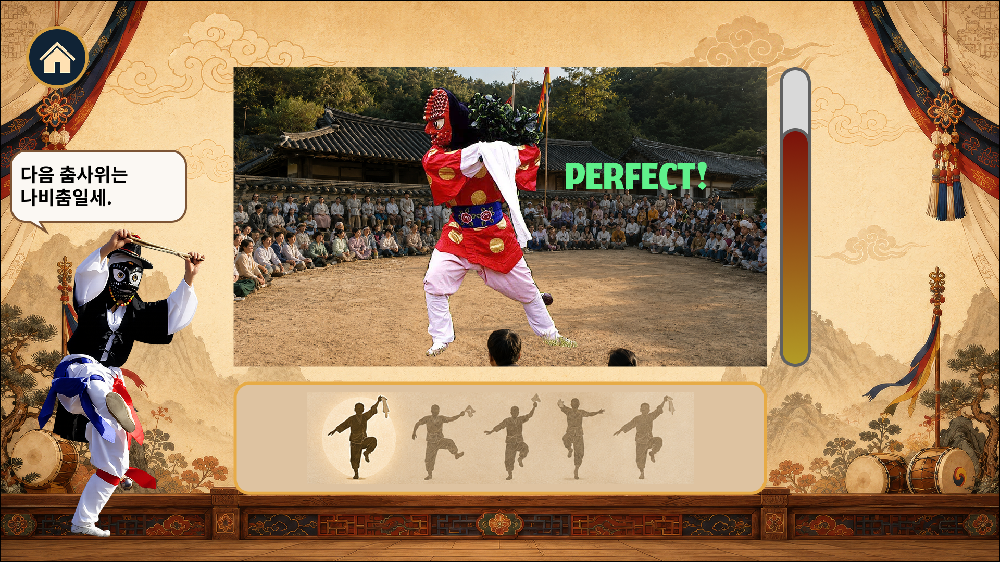

#### 1) 진행

##### (1) 동작 가이드

- 유저가 고른 배역의 동작을 코치가 화면 중앙에서 시연함(좌우 반전 거울 방식)
- 화면 하단 동작 안내 바에서 각 배역에 할당된 동작 타임라인 JSON에 따라 픽토그램을 우 → 좌로 이동시킴

##### (2) 판정

- 동작 안내 바에서 픽토그램이 판정 마커에 닿는 순간 자세 정확도를 채점하고 세션 데이터에 점수를 저장
- 자세 정확도에 따라 점수를 매기고 유저에게 피드백 전달
	- 판정 피드백: PERFECT(완전 일치), GOOD(대체로 일치), OK(일부 일치), X(불일치)
	- 말뚝이: 배역과 점수에 따라 다른 대사 출력
	- 점수가 누적된 게이지를 화면에 표시
- 포즈 미검출이나 저신뢰 시 해당 동작은 점수 획득이 없으며, 비모달 가이드(화면 테두리 하이라이트, 말뚝이 추임새)로 안내함

##### (3) 주요 분기

- 음원 재생 완료(마지막 동작 판정 처리 후) → Step 4 결과 화면 진행
	- 음원 로드 시 확인한 음원 길이 + 30초(잠정)가 지나도 재생이 완료되지 않을 경우 → 시한 초과 실패로 간주하여 중단 처리
- 그만두기 선택 시 확인 팝업 → 확정 시 종료 처리
- 미입력 타임아웃 → 종료 처리
	- 사람 미검출이나 포즈 미검출이 터치 미입력 타임아웃 임계를 넘길 경우

#### 2) 동작 가이드 (코치 영상과 동작 안내 바)

##### (1) 역할과 목적

유저에게 배역 춤사위를 안내하는 시스템. 처음 보는 춤사위도 끊김 없이 따라 하게 함.

##### (2) 입력과 출력

- **입력**: 선택 배역 식별자 (Step 2에서 세션에 저장한 값)
- **출력**: 동작별 판정 시각 이벤트 (포즈 채점으로 전달)

##### (3) 동작과 규칙

- **코치 영상 (거울 방식)**: 선택 배역의 상징 동작 시연 영상을 화면 중앙에서 풍물 장단 음원과 동기화해 재생함
	- **미러 규약**: 코치 영상과 채점 기준 스켈레톤은 원본을 좌우 반전하여 표시. 유저는 거울을 보듯 화면에 보이는 대로 따라 하기만 하면 됨.
- **동작 안내 바 (픽토그램 스크롤)**: 화면 하단의 가로 바. 다가올 동작의 픽토그램이 바 오른쪽 끝에서 등장해 왼쪽의 판정 마커를 향해 일정 속도로 이동함
	- **타이밍 표현**: 픽토그램이 판정 마커에 닿는 순간이 그 동작의 판정 시각(유저가 동작을 수행할 순간)임.
	- **판정 피드백**: 동작의 채점 등급이 나오면 판정 마커 위에 등급을 짧게 표기함(포즈 채점 출력 연동). 판정이 끝난 픽토그램은 왼쪽으로 빠져나가며 화면에서 사라짐
- **동작 타임라인 JSON**: 픽토그램 등장/판정 타이밍을 음원 재생 시작 기준 초 단위로 관리함
	- **단일 파일 공유**: 동작 안내 바와 포즈 채점이 판정 타이밍을 이 파일 하나에서 읽어 두 시스템의 판정 싱크를 맞춤
	- **코치 영상 동기화**: 코치 영상은 이 파일 대신 같은 음원 재생 위치를 따라 재생해 전체 싱크를 맞춤

##### (4) 기술 요건

- **재생 동기화**: 음원 재생 위치를 유일한 기준 시계로 삼음. 코치 영상 재생 위치와 픽토그램 스크롤 좌표를 매 프레임 이 기준 시계에서 계산하고, 별도 타이머를 두지 않아 오래 재생해도 어긋남(드리프트)이 쌓이지 않게 함
- **사전 로드**: 배역 확정(Step 2) 후 Step 3 진입 전에 해당 배역의 타임라인 JSON, 코치 영상, 픽토그램, 음원을 미리 로드해 체험 중 로딩 끊김을 없앰
- **적용**: 전부 클라이언트 로컬 재생임. 서버 왕복 없음

##### (5) 필요 리소스

- 동작 타임라인 JSON
- 코치 시연 영상 (배역별 상징 동작, 좌우 반전 거울 방식. 모션 레퍼런스에서 파생)
- 동작별 픽토그램 이미지 (동작 안내 바에 사용할 이미지. 동작 타임라인 JSON의 동작과 1:1)
- 풍물 장단 음원 (재생 위치가 기준 시계)

##### (6) 실패와 복구

- 타임라인 JSON, 코치 영상, 픽토그램, 음원 로드나 검증이 실패 시 처리
	- 재시도 (2회. 잠정) 실행
	- 한도 넘길 경우 체험을 시작할 수 없으므로 상황 안내 팝업 생성 후 종료 처리(원인: 시스템)
- 재생 중 일시 끊김
	- 기준 시계(음원 재생 위치) 재동기화로 복구함

#### 3) 포즈 채점과 신명 게이지

##### (1) 역할과 목적

유저가 직접 따라 춘 배역 동작에 즉각 피드백을 주는 핵심 루프. 잘 춘 만큼 보상해 체험의 성취감을 줌.

##### (2) 입력과 출력

- **입력**: 카메라 영상 프레임, 동작별 판정 시각 이벤트(동작 가이드에서 수신)
- **출력**:
	- 동작별 채점 등급 (동작 안내 바 판정 피드백과 말뚝이 반응에 전달)
	- 신명 게이지 값 (화면 게이지 표시)
	- 최종 점수 (게이지 종합 값, Step 4 결과 화면에 전달)
	- 동작 채점 기록 (세션 데이터에 저장)

##### (3) 채점 기본 규칙

- **채점 기준**: 동작마다 자세 일치도(포즈 추정 기반)와 풍물 장단 타이밍의 두 기준으로 채점함
- **채점 단위**: 동작 타임라인 JSON의 동작 항목 1개가 채점 단위 1개임
- **판정 구간**: 동작마다 판정 시각 앞뒤 0.5초(잠정)를 판정 구간으로 삼고, 구간 안의 프레임들을 그 동작의 채점 레퍼런스 스켈레톤과 비교함
	- 앞뒤 0.5초는 리듬 게임 판정 관례를 참고한 잠정값이라 실기기 인식 성능을 보고 개발 단계에서 확정함
- **미러**: 채점 레퍼런스 스켈레톤은 코치 영상과 똑같이 좌우 반전한 것을 씀(동작 가이드의 미러 규약과 짝을 이룸). 유저가 화면에 보이는 대로 따라 한 자세를 좌우 보정 없이 그대로 비교하기 위한 전제임

##### (4) 자세와 타이밍 점수 산출

판정 구간의 프레임들을 아래 5단계로 처리해 동작 1개의 자세 점수와 타이밍 점수를 냄. 단계 구성은 동작 유사도 채점에 통용되는 기법을 따름.

1. **포즈 추정**: 카메라 프레임에서 유저의 2D 키포인트(관절 좌표 + 신뢰도)를 실시간 추출함
2. **전처리**: 신뢰도 임계(잠정 0.3) 미만 키포인트는 그 프레임의 일치도 비교에서 제외하고, 프레임 간 좌표 떨림은 스무딩으로 완화함
	- 신뢰도 임계는 채택할 포즈 추정 모델의 권장 임계와 실측으로 개발 단계에서 확정함
3. **정규화**: 몸 중심(양 힙의 중점)을 원점으로 옮기고 몸통 길이로 나눠 크기를 맞춤. 유저의 키, 화면 내 위치, 카메라까지의 거리와 무관하게 레퍼런스 스켈레톤과 비교하게 하는 단계임
4. **부위별 유사도**: 부위 벡터(어깨→팔꿈치, 팔꿈치→손목, 힙→무릎 등)의 방향을 레퍼런스 스켈레톤의 같은 부위와 코사인 유사도로 비교하고, 부위별 가중 평균으로 프레임 일치도를 냄
	- 덧뵈기 전승 춤사위가 팔 중심이라 팔 부위 가중을 상향함(잠정)
	- 관절 각도 차 비교는 동급 대안으로 두고 개발 단계에서 인식 성능을 보고 확정함
5. **판정**: 판정 구간 안 프레임 일치도의 최댓값을 그 동작의 자세 점수로 삼고, 최댓값이 나온 시점과 판정 시각의 차를 타이밍 점수로 환산함(차가 작을수록 높게, 환산 곡선은 개발 단계 확정)

##### (5) 등급 판정과 피드백

- **등급 산출**
	- 동작마다 자세 점수와 타이밍 점수를 가중 합산해 4단계 등급(상위부터 PERFECT, GOOD, OK, X)으로 판정함
		- 등급 경계값과 두 축의 가중치는 정량 미정. 개발 단계에서 실제 인식 성능을 보고 확정함
- **피드백**: 등급이 확정되는 순간 세 갈래로 내보냄
	- **등급 표시**: 동작 안내 바의 판정 피드백이 판정 마커 위에 등급을 표기함
	- **말뚝이 반응**: 말뚝이가 등급별 추임새 대사를 출력함(최상위 등급의 "얼쑤" 등, 대사 문안은 별도 확정)
	- **게이지 가산**: 신명 게이지에 등급별 가산량(정량 미정)과 동작 타임라인 JSON에 정의된 동작별 가중치를 곱한 값을 더함
- **기록**: 동작별 등급과 자세, 타이밍 점수를 동작 채점 기록으로 세션 데이터에 저장함

##### (6) 신명 게이지와 종합 점수

- **게이지 상승**: 동작마다 점수가 누적되어 게이지가 오름
- **달성 보상**: 게이지가 달성 임계를 넘기면 환호 사운드(군중 추임새, 박수)로 보상함. 달성 임계는 정량 미정으로 개발 단계에서 확정함
- **미달 처리**: 임계 미달이면 말뚝이가 눙치며 마무리함
- **최종 점수 출력**: 게이지 종합 값을 최종 점수로 확정해 Step 4 결과 화면에 넘겨 표시함
- **학습 진척**: 1차연도는 세션 안 채점으로 끝남. 재방문 진척 누적(향상 곡선, 약점 동작 피드백)은 2차연도 확장 설계로 둠
- **세부 설계 (작성 예정)**: 등급별 가산량과 동작별 가중치, 게이지 달성 임계, 미달 처리 상세

##### (7) 기술 요건

- **모델 확보**: 실시간 포즈 추정은 사전학습 모델과 온디바이스 SDK를 우선 검토함(MoveNet, MediaPipe Pose 류 실시간 경량 2D 키포인트 모델이 후보, 확인 필요). 채점 로직은 레퍼런스 동작 대비 자체 규칙
- **판정 기준**: 포즈 추정 정확도, 채점 임계와 가중치, 실시간 처리 지연(프레임률). 채점 정확도 검증 방법은 확인 필요
- **적용**: 실시간 처리. 온디바이스 처리를 우선 검토하고 서버 처리는 대안으로 둠. 라이브는 원거리에서 전신 포즈를 채점하는 단일 구도임. 모션 인식은 전신 싱글 카메라 기준 손목까지가 현실적이라 배역 동작 채점 대상을 이 범위로 설계함. 덧뵈기 전승 춤사위가 팔 중심(상체 위주)이라 이 범위와 방향이 맞음
- **데이터**: 배역 동작 모션 레퍼런스가 채점 기준 데이터임(국가유산청 공식 기록영상 활용이나 모캡 등 확보 방식 확인 필요, 고증 자문). 코치 시연 에셋은 이 레퍼런스를 좌우 반전해 만듦(미러 규약)

##### (8) 필요 리소스

- 배역 동작 모션 레퍼런스(따라 추기 대상과 채점 기준, 배역별 동작 세트, 모캡이나 기록영상 확인 필요, 고증 자문)
- 동작별 채점 레퍼런스 스켈레톤(모션 레퍼런스에서 추출한 키포인트 시퀀스, 미러 반전본. 동작 타임라인 JSON의 동작과 1:1)
- 환호와 추임새 사운드(게이지 달성 보상, 제작 방식 확인 필요)
- 코치 시연 영상, 픽토그램, 풍물 장단 음원, 동작 타임라인 JSON은 동작 가이드의 필요 리소스임(그쪽에서 정의)

##### (9) 실패와 복구

- 판정 구간 안에서 포즈가 인식되지 않거나 신뢰도가 낮을 경우 및 인식 지연 시 처리
	- 해당 동작(채점 단위)에는 점수를 주지 않고 다음 동작으로 넘어감
- 사람 미검출이나 포즈 미검출이 터치 미입력 타임아웃 임계를 넘길 시 처리
	- 미입력 타임아웃으로 간주하여 종료 처리
- 카메라 영상이 들어오지 않거나 전 프레임 저신뢰가 지속될 시 처리(지속 임계는 잠정, 개발 단계 확정)
	- 유저 요인이 아니라 시스템 장애(카메라 고장이나 가림, 조명, 성능 저하)로 보고 상황 안내 팝업 후 중단 처리함. 운영 알림 대상임

### 4.3.2 클라이언트: 배역 동작 체험 화면 B안

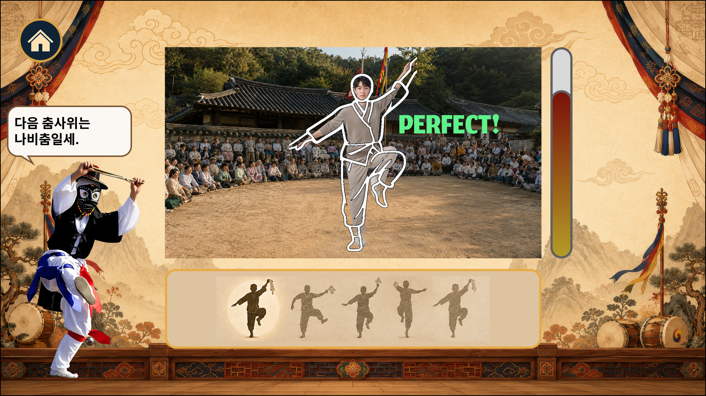

#### 1) 진행

##### (1) 동작 가이드

- 화면 하단 동작 안내 바에서 유저가 고른 배역에 할당된 동작의 픽토그램을 동작 타임라인 JSON에 따라 우 → 좌로 이동시킴
- 유저가 현재 취해야 할 동작은 플레이 화면에 픽토그램으로 표시해 안내함
	- 타이밍에 맞춰 플레이 화면 우측 바깥에서 생성 → 좌로 이동 → 플레이 화면 좌측 바깥에서 사라짐

##### (2) 판정

- 동작 안내 바에서 픽토그램이 판정 마커에 닿는 순간 자세 정확도를 채점하고 세션 데이터에 점수를 저장
- 자세 정확도에 따라 점수를 매기고 유저에게 피드백 전달
	- 판정 피드백: PERFECT(완전 일치), GOOD(대체로 일치), OK(일부 일치), X(불일치)
	- 말뚝이: 배역과 점수에 따라 다른 대사 출력
	- 점수가 누적된 게이지를 화면에 표시
- 포즈 미검출이나 저신뢰 시 해당 동작은 점수 획득이 없으며, 비모달 가이드(화면 테두리 하이라이트, 말뚝이 추임새)로 안내함

##### (3) 주요 분기

- 음원 재생 완료(마지막 동작 판정 처리 후) → Step 4 결과 화면 진행
	- 음원 로드 시 확인한 음원 길이 + 30초(잠정)가 지나도 재생이 완료되지 않을 경우 → 시한 초과 실패로 간주하여 중단 처리
- 그만두기 선택 시 확인 팝업 → 확정 시 종료 처리
- 미입력 타임아웃 → 종료 처리
	- 사람 미검출이나 포즈 미검출이 터치 미입력 타임아웃 임계를 넘길 경우

#### 2) 동작 가이드 (플레이 화면 픽토그램과 동작 안내 바)

##### (1) 역할과 목적

유저에게 배역 춤사위를 안내하는 시스템. 처음 보는 춤사위도 끊김 없이 따라 하게 함.

##### (2) 입력과 출력

- **입력**: 선택 배역 식별자 (Step 2에서 세션에 저장한 값)
- **출력**: 동작별 판정 시각 이벤트 (포즈 채점으로 전달)

##### (3) 동작과 규칙

- **플레이 화면 픽토그램**: 유저가 현재 취해야 할 동작의 픽토그램을 타임라인의 등장 타이밍에 맞춰 플레이 화면에 표시함(우측 바깥 등장 → 좌로 이동 → 좌측 바깥 사라짐). 판정 시각 자체는 동작 안내 바의 판정 마커가 기준임
- **동작 안내 바 (픽토그램 스크롤)**: 화면 하단의 가로 바. 다가올 동작의 픽토그램이 바 오른쪽 끝에서 등장해 왼쪽의 판정 마커를 향해 일정 속도로 이동함
	- **타이밍 표현**: 픽토그램이 판정 마커에 닿는 순간이 그 동작의 판정 시각(유저가 동작을 수행할 순간)임.
	- **판정 피드백**: 동작의 채점 등급이 나오면 판정 마커 위에 등급을 짧게 표기함(포즈 채점 출력 연동). 판정이 끝난 픽토그램은 왼쪽으로 빠져나가며 화면에서 사라짐
- **동작 타임라인 JSON**: 픽토그램 등장/판정 타이밍을 음원 재생 시작 기준 초 단위로 관리함
	- **단일 파일 공유**: 동작 안내 바, 플레이 화면 픽토그램, 포즈 채점이 등장과 판정 타이밍을 이 파일 하나에서 읽어 표시와 판정의 싱크를 맞춤

##### (4) 기술 요건

- **재생 동기화**: 음원 재생 위치를 유일한 기준 시계로 삼음. 동작 안내 바 스크롤 좌표와 플레이 화면 픽토그램 위치를 매 프레임 이 기준 시계에서 계산하고, 별도 타이머를 두지 않아 오래 재생해도 어긋남(드리프트)이 쌓이지 않게 함
- **사전 로드**: 배역 확정(Step 2) 후 Step 3 진입 전에 해당 배역의 타임라인 JSON, 픽토그램, 음원을 미리 로드해 체험 중 로딩 끊김을 없앰
- **적용**: 전부 클라이언트 로컬 재생임. 서버 왕복 없음

##### (5) 필요 리소스

- 동작 타임라인 JSON
- 동작별 픽토그램 이미지 (동작 안내 바와 플레이 화면 안내에 사용할 이미지. 동작 타임라인 JSON의 동작과 1:1)
- 풍물 장단 음원 (재생 위치가 기준 시계)

##### (6) 실패와 복구

- 타임라인 JSON, 픽토그램, 음원 로드나 검증이 실패 시 처리
	- 재시도 (2회. 잠정) 실행
	- 한도 넘길 경우 체험을 시작할 수 없으므로 상황 안내 팝업 생성 후 종료 처리(원인: 시스템)
- 재생 중 일시 끊김
	- 기준 시계(음원 재생 위치) 재동기화로 복구함

#### 3) 포즈 채점과 신명 게이지

##### (1) 역할과 목적

유저가 직접 따라 춘 배역 동작에 즉각 피드백을 주는 핵심 루프. 잘 춘 만큼 보상해 체험의 성취감을 줌.

##### (2) 입력과 출력

- **입력**: 카메라 영상 프레임, 동작별 판정 시각 이벤트(동작 가이드에서 수신)
- **출력**:
	- 동작별 채점 등급 (동작 안내 바 판정 피드백과 말뚝이 반응에 전달)
	- 신명 게이지 값 (화면 게이지 표시)
	- 최종 점수 (게이지 종합 값, Step 4 결과 화면에 전달)
	- 동작 채점 기록 (세션 데이터에 저장)

##### (3) 채점 기본 규칙

- **채점 기준**: 동작마다 자세 일치도(포즈 추정 기반)와 풍물 장단 타이밍의 두 기준으로 채점함
- **채점 단위**: 동작 타임라인 JSON의 동작 항목 1개가 채점 단위 1개임
- **판정 구간**: 동작마다 판정 시각 앞뒤 0.5초(잠정)를 판정 구간으로 삼고, 구간 안의 프레임들을 그 동작의 채점 레퍼런스 스켈레톤과 비교함
	- 앞뒤 0.5초는 리듬 게임 판정 관례를 참고한 잠정값이라 실기기 인식 성능을 보고 개발 단계에서 확정함
- **미러**: 채점 레퍼런스 스켈레톤과 픽토그램을 미리 거울상(좌우 반전)으로 만들어 둠. 유저가 화면에 보이는 대로 따라 한 자세를 입력 반전 보정 없이 그대로 비교하기 위한 전제임

##### (4) 자세와 타이밍 점수 산출

판정 구간의 프레임들을 아래 5단계로 처리해 동작 1개의 자세 점수와 타이밍 점수를 냄. 단계 구성은 동작 유사도 채점에 통용되는 기법을 따름.

1. **포즈 추정**: 카메라 프레임에서 유저의 2D 키포인트(관절 좌표 + 신뢰도)를 실시간 추출함
2. **전처리**: 신뢰도 임계(잠정 0.3) 미만 키포인트는 그 프레임의 일치도 비교에서 제외하고, 프레임 간 좌표 떨림은 스무딩으로 완화함
	- 신뢰도 임계는 채택할 포즈 추정 모델의 권장 임계와 실측으로 개발 단계에서 확정함
3. **정규화**: 몸 중심(양 힙의 중점)을 원점으로 옮기고 몸통 길이로 나눠 크기를 맞춤. 유저의 키, 화면 내 위치, 카메라까지의 거리와 무관하게 레퍼런스 스켈레톤과 비교하게 하는 단계임
4. **부위별 유사도**: 부위 벡터(어깨→팔꿈치, 팔꿈치→손목, 힙→무릎 등)의 방향을 레퍼런스 스켈레톤의 같은 부위와 코사인 유사도로 비교하고, 부위별 가중 평균으로 프레임 일치도를 냄
	- 덧뵈기 전승 춤사위가 팔 중심이라 팔 부위 가중을 상향함(잠정)
	- 관절 각도 차 비교는 동급 대안으로 두고 개발 단계에서 인식 성능을 보고 확정함
5. **판정**: 판정 구간 안 프레임 일치도의 최댓값을 그 동작의 자세 점수로 삼고, 최댓값이 나온 시점과 판정 시각의 차를 타이밍 점수로 환산함(차가 작을수록 높게, 환산 곡선은 개발 단계 확정)

##### (5) 등급 판정과 피드백

- **등급 산출**
	- 동작마다 자세 점수와 타이밍 점수를 가중 합산해 4단계 등급(상위부터 PERFECT, GOOD, OK, X)으로 판정함
		- 등급 경계값과 두 축의 가중치는 정량 미정. 개발 단계에서 실제 인식 성능을 보고 확정함
- **피드백**: 등급이 확정되는 순간 세 갈래로 내보냄
	- **등급 표시**: 동작 안내 바의 판정 피드백이 판정 마커 위에 등급을 표기함
	- **말뚝이 반응**: 말뚝이가 등급별 추임새 대사를 출력함(최상위 등급의 "얼쑤" 등, 대사 문안은 별도 확정)
	- **게이지 가산**: 신명 게이지에 등급별 가산량(정량 미정)과 동작 타임라인 JSON에 정의된 동작별 가중치를 곱한 값을 더함
- **기록**: 동작별 등급과 자세, 타이밍 점수를 동작 채점 기록으로 세션 데이터에 저장함

##### (6) 신명 게이지와 종합 점수

- **게이지 상승**: 동작마다 점수가 누적되어 게이지가 오름
- **달성 보상**: 게이지가 달성 임계를 넘기면 환호 사운드(군중 추임새, 박수)로 보상함. 달성 임계는 정량 미정으로 개발 단계에서 확정함
- **미달 처리**: 임계 미달이면 말뚝이가 눙치며 마무리함
- **최종 점수 출력**: 게이지 종합 값을 최종 점수로 확정해 Step 4 결과 화면에 넘겨 표시함
- **학습 진척**: 1차연도는 세션 안 채점으로 끝남. 재방문 진척 누적(향상 곡선, 약점 동작 피드백)은 2차연도 확장 설계로 둠
- **세부 설계 (작성 예정)**: 등급별 가산량과 동작별 가중치, 게이지 달성 임계, 미달 처리 상세

##### (7) 기술 요건

- **모델 확보**: 실시간 포즈 추정은 사전학습 모델과 온디바이스 SDK를 우선 검토함(MoveNet, MediaPipe Pose 류 실시간 경량 2D 키포인트 모델이 후보, 확인 필요). 채점 로직은 레퍼런스 동작 대비 자체 규칙
- **판정 기준**: 포즈 추정 정확도, 채점 임계와 가중치, 실시간 처리 지연(프레임률). 채점 정확도 검증 방법은 확인 필요
- **적용**: 실시간 처리. 온디바이스 처리를 우선 검토하고 서버 처리는 대안으로 둠. 라이브는 원거리에서 전신 포즈를 채점하는 단일 구도임. 모션 인식은 전신 싱글 카메라 기준 손목까지가 현실적이라 배역 동작 채점 대상을 이 범위로 설계함. 덧뵈기 전승 춤사위가 팔 중심(상체 위주)이라 이 범위와 방향이 맞음
- **데이터**: 배역 동작 모션 레퍼런스가 채점 기준 데이터임(국가유산청 공식 기록영상 활용이나 모캡 등 확보 방식 확인 필요, 고증 자문). 동작 픽토그램은 이 레퍼런스의 자세를 도식화해 만들고, 채점 레퍼런스 스켈레톤과 같은 좌우 반전 기준을 적용함

##### (8) 필요 리소스

- 배역 동작 모션 레퍼런스(따라 추기 대상과 채점 기준, 배역별 동작 세트, 모캡이나 기록영상 확인 필요, 고증 자문)
- 동작별 채점 레퍼런스 스켈레톤(모션 레퍼런스에서 추출한 키포인트 시퀀스, 미러 반전본. 동작 타임라인 JSON의 동작과 1:1)
- 환호와 추임새 사운드(게이지 달성 보상, 제작 방식 확인 필요)
- 픽토그램, 풍물 장단 음원, 동작 타임라인 JSON은 동작 가이드의 필요 리소스임(그쪽에서 정의)

##### (9) 실패와 복구

- 판정 구간 안에서 포즈가 인식되지 않거나 신뢰도가 낮을 경우 및 인식 지연 시 처리
	- 해당 동작(채점 단위)에는 점수를 주지 않고 다음 동작으로 넘어감
- 사람 미검출이나 포즈 미검출이 터치 미입력 타임아웃 임계를 넘길 시 처리
	- 미입력 타임아웃으로 간주하여 종료 처리
- 카메라 영상이 들어오지 않거나 전 프레임 저신뢰가 지속될 시 처리(지속 임계는 잠정, 개발 단계 확정)
	- 유저 요인이 아니라 시스템 장애(카메라 고장이나 가림, 조명, 성능 저하)로 보고 상황 안내 팝업 후 중단 처리함. 운영 알림 대상임

## 4.4 Step 4. 결과 화면

### 4.4.1 클라이언트: 결과 화면

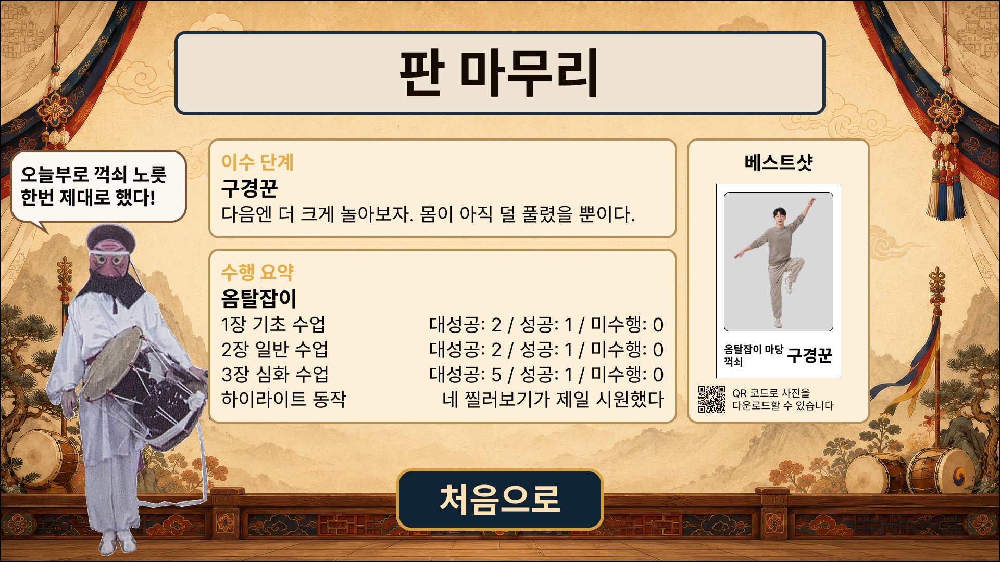

#### 1) 진행

- 신명 게이지 종합 값을 최종 점수로 표시하고, 말뚝이가 점수에 맞춘 마무리 재담을 출력함.
	- 분기: 처음으로 버튼 터치 또는 화면 타임아웃(기본 60초, 잠정) → Step 5 종료와 리셋으로 진행

## 4.5 Step 5. 종료와 리셋

완주와 비완주 두 경로로 진입하고 모두 세션 종료와 파기 실행함. 별도 UI 없음.
### 4.5.1 클라이언트: 종료 이벤트 전송과 리셋

#### 1) 진행

- 종료 이벤트(완주 또는 이탈 결과)를 서버로 전송하고, 서버의 저장 확인 응답을 받은 뒤 클라이언트 세션 데이터를 초기화함
	- 확인 응답을 재시도(2회 잠정) 후에도 받지 못하면 로컬 세션 데이터를 파기하고 시작 화면으로 복귀함(다음 유저의 키오스크 점유가 우선). 미종료로 남은 서버 세션의 정리 방식은 서버 구현에서 확정함(확인 필요)
	- 완주는 유형(처음으로 버튼 터치, 결과 화면 타임아웃)을 구분해 기록함: 완주율 관측에서 방치 완주를 분리함
	- 완주와 비완주 종료가 모두 모이는 종착점임. 비완주 종료는 결과 화면을 건너뛰고 여기로 바로 들어옴

### 4.5.2 서버: 세션 종료와 임시 데이터 파기

#### 1) 진행

- 세션 종료를 확정하고 세션 데이터를 정리함(동작 채점 기록의 식별 원본은 파기하고 익명 통계만 남김. 영상 피드는 처리 직후 이미 파기됨)

### 4.5.3 클라이언트: 시작 화면 복귀

#### 1) 진행

- Step 1의 시작 화면으로 복귀하여 다음 유저 대기함

# 5. 운영 기준

## 5.1 운영 파라미터

| 구분         | 파라미터                                   | 잠정값                    | 적용 위치                                             |
| ---------- | -------------------------------------- | ---------------------- | ------------------------------------------------- |
| 화면 타임아웃    | 화면 타임아웃 (기본)                           | 60초 (결과 화면은 처음으로 버튼이 주 종료, 타임아웃은 안전망) | 화면 타임아웃 (탈 선택, 결과 화면 포함)                  |
| 화면 타임아웃    | 화면 타임아웃 (배역 동작 오버라이드)                  | 5분                     | 화면 타임아웃, Step 3                                   |
| 화면 타임아웃    | 터치 미입력 타임아웃                            | 45초                    | 터치 미입력 타임아웃                                       |
| 외부 호출      | 외부 서비스 호출 재시도                          | 2회                     | 외부 서비스 호출 래퍼 (TTS)                                |
| 외부 호출      | 세션 생성 재시도 한도                           | 2회                     | Step 1 서버                                         |
| 외부 호출      | 호출 타임아웃 (TTS)                          | 30초                    | 외부 서비스 호출 래퍼                                      |
| 외부 호출      | 호출 재시도 백오프                             | 1차 1초, 2차 3초           | 외부 서비스 호출 래퍼                                      |
| 동작 가이드     | 가이드 리소스 로드 재시도 한도                      | 2회                     | 동작 가이드, 에러 케이스                                    |
| 채점 튜닝      | 판정 구간 (판정 시각 앞뒤)                       | 0.5초 (잠정, 개발 단계 확정)     | 포즈 채점과 신명 게이지                                     |
| 채점 튜닝      | 키포인트 신뢰도 임계                            | 0.3 (잠정, 개발 단계 확정)      | 포즈 채점과 신명 게이지                                     |
| 채점 튜닝      | 판정 등급 단계                               | 4단계 (PERFECT, GOOD, OK, X)  | 포즈 채점과 신명 게이지, 동작 안내 바                            |
| 채점 튜닝      | 등급 경계값과 자세 대 타이밍 가중치                   | 정량 미정 (개발 단계 확정)       | 포즈 채점과 신명 게이지                                     |
| 채점 튜닝      | 신명 게이지 달성 임계                           | 정량 미정 (개발 단계 확정)       | 포즈 채점과 신명 게이지                                     |

## 5.2 에러 케이스

### 5.2.1 케이스 목록과 처리

**처리**는 그 실패가 세션을 어떤 상태로 끝내는지를, **원인**은 실패가 어디에서 비롯되었는지를 나타냄. 원인이 외부 서비스나 시스템일 경우에만 운영 알림을 보냄. 갈래를 나누는 판정 규칙은 3.9 실패 처리에 있고, 본 표는 그 규칙을 케이스에 적용한 결과임. 이후 동작의 Step 5는 모두 비완주 종료라 결과 화면을 건너뛰고 세션 종료와 파기 후 시작 화면으로 복귀함.

| 발생 지점                        | 처리    | 원인     | 팝업             | 이후 동작                     |
| ---------------------------- | ----- | ------ | -------------- | ------------------------- |
| 말뚝이 TTS 합성이나 호출 실패           | 기능 축소 | 외부 서비스 | 없음             | 세션 계속, 대표 이미지와 텍스트로 진행    |
| 말뚝이 캐릭터 렌더나 음성 재생 실패         | 기능 축소 | 시스템    | 없음             | 세션 계속, 대표 이미지와 텍스트로 진행    |
| 동작 가이드 리소스 로드나 검증 실패(재시도 한도 초과) | 중단    | 시스템    | 상황 안내          | Step 5                    |
| 음원 재생 시한 초과(음원 길이 + 30초 잠정)   | 중단    | 시스템    | 상황 안내          | Step 5                    |
| 카메라 미수신이나 전 프레임 저신뢰 지속(임계 잠정) | 중단    | 시스템    | 상황 안내          | Step 5                    |
| 세션 생성 실패                     | 중단    | 시스템    | 상황 안내          | 시작 화면 복귀                  |
%%
# 6. 관련 문서

- [[시범콘텐츠 공통 사양]]: 세션, 공용 기능, 실패 처리와 에러 케이스, 공통 화면, 진행 호스트, 개인정보와 가드레일 원칙, 공통 기술 방향(회의 근거) 정본
- [[콘텐츠 기획서 작성 양식]]: 본 문서가 따르는 작성 양식 (기준 구현은 유람기 기획서)
- [[플랫폼 사양]]: 1차연도 플랫폼 계층 정본 (런처, 서버, 결과물 호스팅, 익명 1회성 사용자 모델). 연속성은 2차연도 확장 설계
- [[콘셉트 정리]]: 종목별 콘셉트 (본 문서 입력은 1) 나만의 탈춤)
- [[덧뵈기]]: 소재 종목 개요 (배역 탈 10종, 춤사위, 장단)
- [[남사당놀이 - 덧뵈기]]: 소재 원본 전사본 (탈 목록과 규격, 춤사위, 마당 구성의 L2 출처)
- [[디바이스 사양]]: 키오스크 물리 사양 정본
- [[덜미 - 나만의 유람기 기획서]]: 양식의 기준 구현 (본 문서가 따르는 구조)
- [[덜미 - 나만의 꼭두각시 기획서]]: 자매 시범콘텐츠 기획서 (체험형 골격 공유)
- [[버나 - 버나잡이 한 판 기획서]]: 자매 시범콘텐츠 기획서 (체험형 골격 공유)
- [[덧뵈기 - 양반 놀리기 4컷 기획서]]: 자매 시범콘텐츠 기획서 (덧뵈기 생성형)
- [[1차연도 셀빅 개발 준비자료]]: 개발 콘텐츠 5종, 개발 순서
- [[2. 연구개발의 목표 및 내용]]: 6종목 콘텐츠 명세 원본 (제안서 변환본)
%%
