# 0. 문서 정보

| 버전    | 날짜         | 내용                         | 항목       | 작성자 |
| ----- | ---------- | -------------------------- | -------- | --- |
| 1.0.0 | 2026.07.23 | 초안 작성                      | 전체       | 조상연 |
| 2.0.0 | 2026.08.05 | 개발 리뷰 반영하여 체험을 중점으로 전면 재설계 | 전체       | 조상연 |
| 2.0.1 | 2026.08.05 | 문구 수정 히스토리 기록           | 2 4.3 | 조상연 |
| 2.0.2 | 2026.08.05 | 배역 선택 시 해당 배역에 대한 설명 표시    | 4.2      | 조상연 |
| 3.0.0 | 2026.08.14 | 가면극 재규정 반영 전면 재설계          | 전체       | 조상연 |
| 4.0.0 | 2026.08.31 | 방향성 수정에 따른 콘텐츠명 변경 및 내용 수정 | 전체       | 조상연 |
| 4.1.0 | 2026.09.01 | 내부 리뷰 후 피드백 적용             | 전체       | 조상연 |

# 1. 개요

- **콘텐츠 정의**
	- 남사당놀이 덧뵈기 3개 마당(옴탈잡이, 샌님잡이, 먹중잡이) 중 옴탈잡이 마당을 체험하는 키오스크 콘텐츠
		- 1차년도 개발 대상으로 옴탈잡이 우선 개발 진행
- **소재**
	- 남사당놀이의 덧뵈기는 여타 탈 관련 무형문화재에 비해 춤사위보다 마임과 재담 및 사회 풍자가 두드러지는 특징을 지님
	- 마당씻이 -> 옴탈잡이 -> 샌님잡이 -> 먹중잡이로 진행되나 각 마당은 독자적인 구성이며 마당씻이는 오프닝 성격이어서 본 체험에서는 제외함
	- 각 마당은 희극이라는 카테고리에 묶일 수 있으나 웃음을 유발하는 요인은 각자 다름 (옴탈잡이: 기괴한 존재 퇴치, 샌님잡이: 권위 전복, 먹중잡이: 위선 폭로)
- **개발 목적**
	- 유저에게 덧뵈기의 각 마당 별 재미 요소 체험 수단을 제공하여 마당 별 특성을 체험 및 학습할 수 있도록 함

# 2. 전체 진행

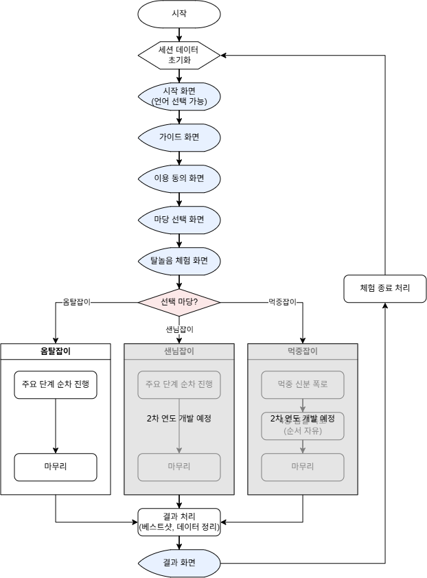

# 3. 공용 시스템

## 3.1 세션 데이터

### 3.1.1 개요

- **정의**
	- 세션 진행 중 필요한 상태, 선택 및 수행 기록 등을 통합 관리하는 데이터
- **목적**
	- 콘텐츠 진행에 필요한 데이터를 체계화하여 **진행 상태 관리 및 데이터 관리 편의성 향상**

### 3.1.2 구성

| 데이터   | 유형  | 값                                                   |
| ----- | --- | --------------------------------------------------- |
| 세션 ID | 시스템 | 세션마다 부여되는 고유 식별자                                    |
| 현재 언어 | 시스템 | 세션에 적용 중인 언어 (기본값: 한국어)                          |
| 현재 단계 | 시스템 | 현재 진행 중인 단계 (시작, 가이드, 이용 동의, 마당 선택, 탈놀음 체험, 마무리) |
| 에러 유형 | 시스템 | 에러 발생 시 확인된 에러 유형 (기본값: None)                    |
| 동의 내역 | 시스템 | 약관 버전, 동의 시각 기록                                     |
| 선택 마당 | 콘텐츠 | 유저가 선택한 마당의 식별자 (기본값: 옴탈잡이)                      |
| 체험 단계 | 콘텐츠 | 유저가 선택한 각 마당의 진행 단계                                 |
| 수행 기록 | 콘텐츠 | 탈놀음 체험 진행 점수                                        |

## 3.2 언어 선택

### 3.2.1 개요

- **정의**
	- 세션 진행 시 사용할 텍스트 언어를 결정하는 시스템
- **목적**
	- 비한국어권 유저에게도 원활한 콘텐츠 참여 기회 제공

### 3.2.2 동작 방식

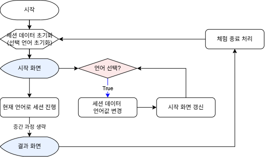
 
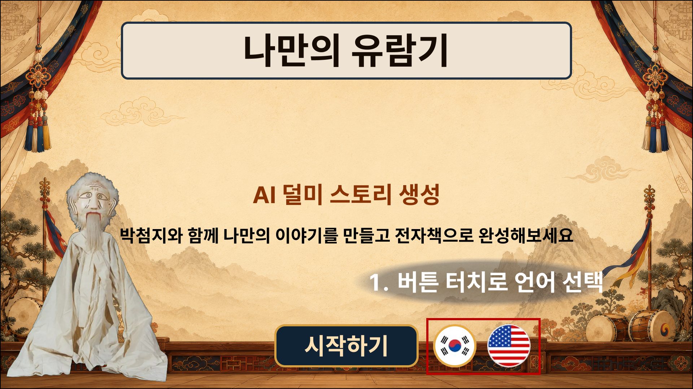

#### 1) 언어 선택 및 적용

- **기본값 설정**
	- 세션 데이터 초기화 시 **한국어**로 설정
- **언어 선택 시 처리**
	- 해당 언어를 세션 데이터에 적용 후 화면 갱신 실행
- **적용 범위**
	- 텍스트에만 적용하며 음성은 적용하지 않음

### 3.2.3 설정

#### 1) Localization 데이터

- JSON 파일로 관리

#### 2) 고려 사항

- 추후 프로젝트의 콘텐츠를 통합하게 되어 콘텐츠 선택 단계가 추가될 경우 언어 선택 시스템의 적용 위치를 통합 시작 화면으로 이전해야 하므로 개발 시 고려 필요

## 3.3 화면 타임아웃

### 3.3.1 개요

- **정의**
	- 한 화면에서 일정 시간(예: 60초) 이상 머무를 경우 다음 단계로 넘어가는 시스템
- **목적**
	- 유저의 장시간 키오스크 체류를 방지하여 키오스크 회전율 제고

### 3.3.2 동작 방식

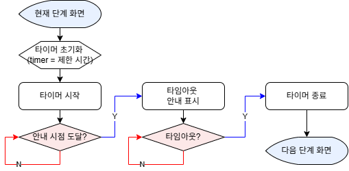
 
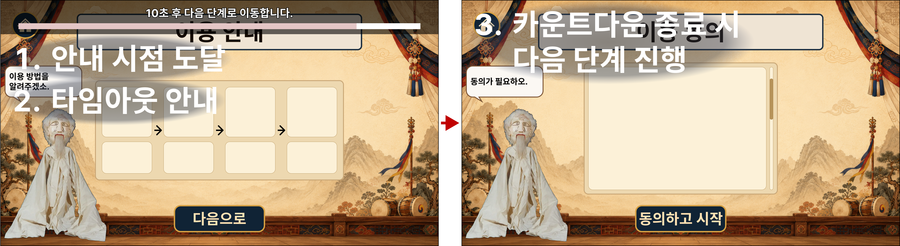

#### 1) 타임아웃

- 현재 단계 화면 진입 시 타이머 초기화 후 카운트다운 시작
- 카운트다운 종료 시 타이머 종료하고 다음 단계 진행

#### 2) 예외 처리

- 필수 입력이 필요한 화면(Ex. 이용 동의 화면, 텍스트 입력 화면)이나 생성 대기 화면에서는 사용하지 않음

#### 3) 기획서에서의 표시

- 해당 시스템이 적용되는 화면에는 상기 아이콘 표시

## 3.4 중도 종료

### 3.4.1 개요

- 정의
	- 유저의 자발적 이탈 또는 비정상적인 세션 중단 시 세션을 정상 종료하는 시스템
- 목적
	- 비정상적인 상황에서 세션이 종료되지 않은 채 유지되는 것을 방지하여 키오스크 회전율 제고

### 3.4.2 동작 방식

#### 1) 진행 중 종료 선택 시 처리

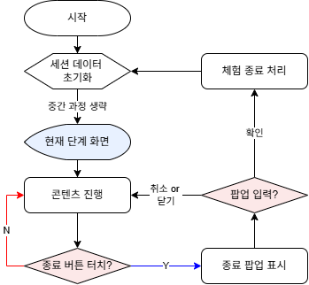
 
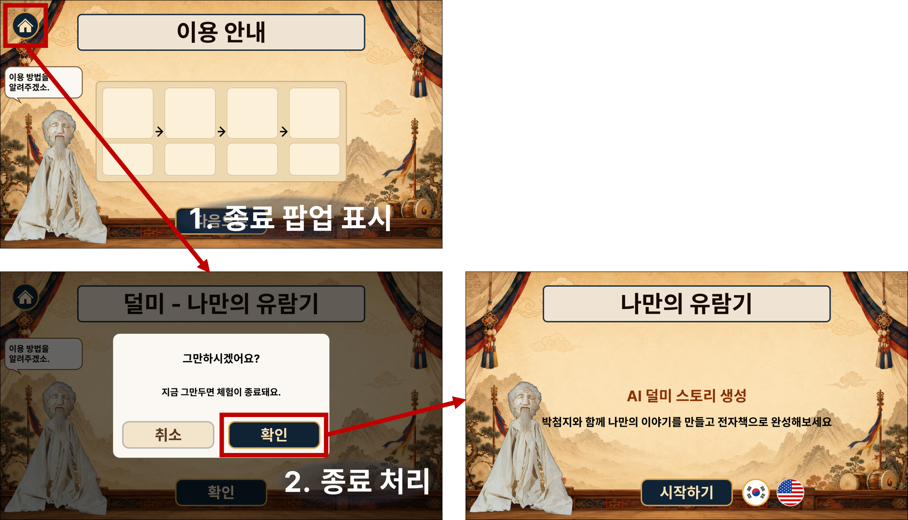

##### (1) 적용 조건

- 유저가 종료 버튼 터치 시 적용

##### (2) 처리 방식

- 종료 팝업 생성 후 확인 버튼 터치 시 종료 처리

#### 2) 미입력 타임아웃 시 처리

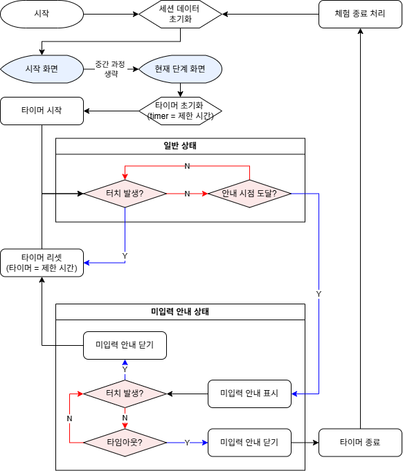
 
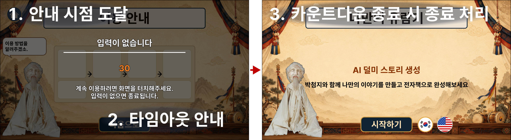

##### (1) 적용 조건

- 세션 진행 중 일정 시간 동안 화면 터치 입력이 없는 경우 적용

##### (2) 처리 방식

- 각 단계 화면 진입 시 미입력 타이머 시작
- 화면 터치가 발생하면 타이머 초기화
- 안내 시점까지 입력이 없으면 미입력 안내 표시
- 안내 중 화면을 터치하면 안내를 닫고 타이머 초기화 후 현재 단계 계속 진행
- 안내 후 제한 시간까지 입력 없을 시 미입력 안내 닫고 종료 처리

##### (3) 기획서에서의 표시

- 해당 시스템이 적용되는 화면에는 상기 아이콘 표시

#### 3) 세션 진행 실패 시 처리

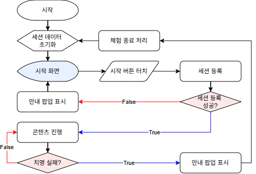
 
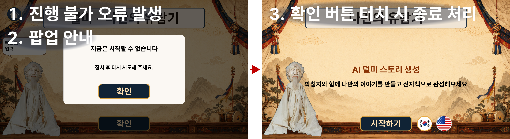

##### (1) 적용 조건

- 세션 등록 실패
	- 서버에 클라이언트의 세션 데이터를 전송 실패
	- 서버에서 세션 ID 부여 실패
- 체험 진행이 불가능한 오류 발생
	- 체험 콘텐츠 리소스 로드 실패, 카메라 및 인식 계통의 지속적 장애 발생

##### (2) 처리 방식

- 재시도(2회) 후 계속 오류 상태일 경우 오류 안내 팝업 표시 후 체험 종료 처리
	- 오류 안내 팝업은 3초간 유지 후 다음 단계 유지
- 세션 등록 실패 시 종료할 세션이 없으므로 체험 종료 처리 없이 시작 화면으로 복귀

## 3.5 유저 기반 모션 인식 시스템

### 3.5.1 개요

- **정의**
	- 카메라로 등록된 유저의 신체와 양손을 추적하고 손 움직임을 게임 입력으로 변환하는 시스템
- **진행**
	- 양손 중 지정 움직임 기준을 먼저 충족한 손을 입력 손으로 지정
	- 입력 손의 화면 위치에 손 위치 포인터 표시 후 원으로 충돌 영역 지정
	- 손 위치 포인터 영역과 관심 영역(ROI)의 충돌 판정
	- 현재 입력 종료 시 입력 손 해제 후 양손 다시 비교
- **목적**
	- 유저가 별도 컨트롤러 없이 직관적인 신체 동작으로 콘텐츠를 조작하게 함
	- 카메라 영상을 화면에 표시하지 않아도 유저가 자신의 입력 위치를 확인하게 함

### 3.5.2 레퍼런스

#### 1) EyeToy: Play - Kung Foo

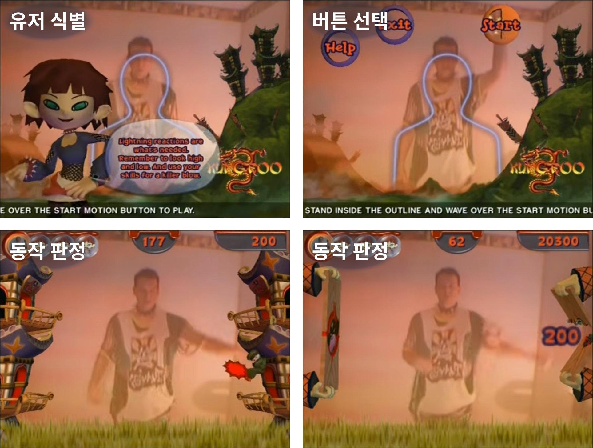

- **게임 정보**
	- 타이틀: EyeToy: Play
	- 미니게임: **Kung Foo**
	- 장르: 체감형/파티 미니게임
	- 플레이 영상: https://youtu.be/0h1EKk6JpK8?si=GEQY9L-9jSdw3drs
- **게임 개요**
	- 카메라를 이용해 신체 움직이믕로 화면상의 오브젝트와 상호작용하는 체감형 콘텐츠
	- 화면 중앙의 플레이어를 향해 여러 방향에서 등장하는 적을 신체 움직임으로 타격함
- **적용 요소**
	- 별도 컨트롤러 없이 유저의 신체 움직임을 콘텐츠 입력으로 직접 사용
	- 카메라 영상을 대신하는 손 위치 포인터로 입력 위치 표시

### 3.5.3 동작 방식

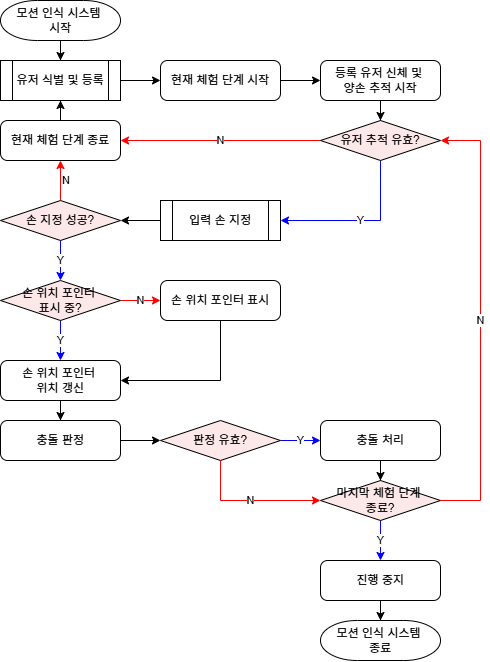

#### 1) 유저 식별과 추적

- 화면의 가이드라인을 기준으로 체험 위치에 선 유저 식별
- 식별된 유저를 현재 세션의 추적 대상으로 등록
	- 주변 인원과 구분하여 추적
- 등록 유저의 신체 영역에서 양손만 입력 후보로 사용
-
- ==등록 유저 추적 끊길 경우 입력 판정과 포인터 표시 중지==
- ==추적 실패가 허용 시간 초과 시 현재 입력 취소 후 입력 손 해제==
- ==추적 실패가 재식별 전환 시간 초과 시 유저 재식별 실행==

#### 2) 양손 위치와 움직임 추적

- 등록 유저의 양손 위치를 개별 추적
- 양손 위치를 화면 좌표로 변환
- 각 손의 이동 방향, 이동 거리, 이동 속도와 ==추적 신뢰도== 산출
- 입력 손 지정되지 않은 경우 양손 움직임 비교 유지

#### 3) 입력 손 지정과 해제

- 지정 조건
	- 현재 입력 손이 없음 and 손 추적 신뢰도가 기준 이상
	- 입력 손 지정 움직임 기준을 먼저 충족한 손을 입력 손으로 지정
		- 조건 동시 충족 시 오른손을 입력 손으로 지정
- 유지
	- 입력 손 지정 시점부터 ==현재 입력 종료 시점==까지 입력 손 유지
- 해제
	-
- 다음 입력

- 양손마다 유효 움직임 조건과 현재 활성 ROI  접근 조건 개별 확인
- 양손에서 **유효 움직임 조건**이나 현재 **활성 ROI 접근 조건**이 처음 성립한 시점 비교
- 두 조건 중 먼저 성립한 손을 입력 손으로 지정
	- 조건이 같은 시점에 성립했을 경우 오른손을 입력 손으로 지정
- 입력 손 지정 시 현재 입력이 끝날 때까지 다른 손으로 전환하지 않음
- 입력 손 지정은 손 선택 시부터 게임 입력 성공, 또는 현재 단계가 끝날 때까지 유지
	- 현재 단계: 옴탈잡이 조우, 잡아채기, 채검하기, 몰아내기
- 게임 입력이 성공, 또는 현재 단계가 끝날 시 입력 손 해제
	- 목표 소멸, 입력 취소 또는 입력 손 추적 실패 시에도 입력 손 해제
- 입력 손 해제 후 양손을 다시 비교해 다음 입력 손 지정

- 화면의 가이드라인을 기준으로 체험 위치에 선 유저 식별
- 식별된 유저를 현재 세션의 추적 대상으로 등록
	- 주변 인원과 구분하여 추적할 기준으로 사용

#### 4) 유저 추적 및 영역 추출

- 등록된 유저의 신체 영역을 카메라 영상에서 계속 추적
- 등록된 유저의 왼손과 오른손의 위치를 각각 추적
- 양손의 위치를 화면 좌표로 변환
- 양손마다 위치, 이동 방향, 이동 거리, 이동 속도와 추적 신뢰도 산출
- 각 손의 화면 좌표를 해당 손 위치 포인터와 원형 충돌 영역의 중심점으로 사용

#### 5) 입력 손 지정

-
- 양손마다 유효 움직임 조건과 현재 활성 ROI  접근 조건 개별 확인
- 양손에서 **유효 움직임 조건**이나 현재 **활성 ROI 접근 조건**이 처음 성립한 시점 비교
- 두 조건 중 먼저 성립한 손을 입력 손으로 지정
	- 조건이 같은 시점에 성립했을 경우 오른손을 입력 손으로 지정
- 입력 손 지정 시 현재 입력이 끝날 때까지 다른 손으로 전환하지 않음
- 입력 손 지정은 손 선택 시부터 게임 입력 성공, 또는 현재 단계가 끝날 때까지 유지
	- 현재 단계: 옴탈잡이 조우, 잡아채기, 채검하기, 몰아내기
- 게임 입력이 성공, 또는 현재 단계가 끝날 시 입력 손 해제
	- 목표 소멸, 입력 취소 또는 입력 손 추적 실패 시에도 입력 손 해제
- 입력 손 해제 후 양손을 다시 비교해 다음 입력 손 지정

#### 6) 손 위치 포인터 표시와 갱신

- 입력 손을 지정 시 해당 손의 화면 좌표에 손 위치 포인터 표시
- 입력 손의 움직임에 따라 포인트 위치 갱신
- 손 떨림과 인식값의 작은 변화는 보정 뒤 포인터에 반영
- 유효 입력으로 판정되지 않은 움직임도 현재 손 위치를 알려주기 위해 포인터 이동에 반영
- 입력 손 추적 끊기거나 유저가 체험 영역 벗어날 시 포인터 숨김

#### 7) ROI(관심 영역 / 판정 영역) 입력 판정

- ROI는 입력 판정을 위해 화면상에 설정하는 가상의 영역임
- 현재 단계에서 활성화된 ROI와 손 위치 포인터의 위치 비교

| 적용 단계   | 목표 ROI         | 판정 기준                               |
| ------- | -------------- | ----------------------------------- |
| 옴탈 조우   | 화면 좌우에 나타난 옴탈  | - 포인터와 옴탈 중첩 - 입력 손 수평 움직임 > 기준값 |
| 옴탈 잡아채기 | 옴탈 머리 영역       | - 포인터와 ROI 중첩                       |
| 옴탈 채검하기 | 화면 가득 채운 옴탈 얼굴 |                                     |
| 옴탈 몰아내기 | 날아오는 옴탈 얼굴     |                                     |

- 손 위치 포인터와 현재 활성화된 ROI의 위치 및 중첩 여부 확인
- 손 위치 포인터가 ROI 안에 있고 움직임 검출값이 판정 기준을 충족하면 유효 판정
	- ROI 안에 있더라도 움직임이 없으면 무효 판정

#### 8) 게임 입력 변환

- 유효 판정 ROI에 연결된 입력 정보를 게임 입력으로 변환
- 각 ROI에 설정된 행동 실행

### 3.5.4 설정 및 예외 처리

#### 1) 주요 설정값

- 모션 인식 및 입력 판정에 필요한 값으로 데이터 테이블화하여 JSON 파일로 관리
- 구체적인 수치는 실제 설치 환경과 테스트 결과에 따라 조정

| 항목               | 설명                                         |
| ---------------- | ------------------------------------------ |
| 유저 식별 영역         | 최초 유저 식별 및 등록에 사용하는 화면상의 위치 및 영역 정보        |
| 유저 식별  신뢰도 기준 | 유저 식별 성공 여부를 판단하는 최소 기준                    |
| 유저 추적  신뢰도 기준 | 등록된 유저의 추적 상태를 정상으로 판단하는 최소 기준             |
| 움직임 검출  임계값   | 영상 변화를 유효한 움직임으로 인정하는 최소 기준                |
| 최소 움직임  영역 비율 | 미세 움직임이나 영상 노이즈를 제외하기 위한 최소 범위             |
| 입력 쿨다운           | 동일 움직임으로 인한 연속, 중복 입력 방지 시간                |
| 추적 실패 허용 시간      | 일시적인 추적 실패를 허용하는 시간                        |
| 재식별 전환 시간        | 추적 실패 지속 시 유저 재식별 절차로 전환하는 기준 시간           |
| 손 위치 좌표 보정값      | 카메라에서 인식한 손 위치와 화면상의 포인터 위치를 맞추기 위한 좌표 보정값 |
| 포인터 이동 보정값       | 손 떨림이나 인식값 변화로 포인터가 과도하게 흔들리는 현상을 줄이는 보정값  |
| 포인터 숨김 기준 시간     | 손 위치를 인식하지 못했을 때 포인터를 숨기기까지 허용하는 시간        |

#### 2) ROI 데이터

개별 ROI 정보값으로 데이터 테이블화하여 JSON 파일로 관리

|항목|설명|
|---|---|
|ROI ID|ROI 고유 식별값|
|적용 단계|ROI를 사용하는 마당 및 진행 단계|
|X / Y|화면 내 ROI 기준 위치|
|Width / Height|ROI 판정 영역의 크기|
|판정 기준|움직임을 유효 입력으로 인정하는 기준|
|연결 입력|판정 성공 시 발생시키는 게임 입력|

#### 3) 예외 처리

| 유형               | 처리                                                                                                                        |
| ---------------- | ------------------------------------------------------------------------------------------------------------------------- |
| 유저 추적 실패         | - 등록 유저 정상 추적 불가 시 모션 입력 판정 및 손 위치 포인터 표시 일시 중지 - 일정 기준 이상 추적 실패 시 유저 식별 및 재등록 진행 - 세션 데이터에 저장된 체험 단계값을 기준으로 체험 재진행 |
| 유저 영역 이탈         | - 유저가 정상 체험 범위 이탈 시 포인터 숨김 후 위치 복귀 유도                                                                                     |
| 다중 인원 간섭         | - 등록된 유저의 손 위치만 포인터에 반영함                                                                                                  |
| 미세 움직임 및  오검출 | - 설정값의 최소 움직임 영역 비율값 미만으로 입력될 경우 처리 X                                                                                     |
| 연속, 중복 입력        | - 설정값의 입력 쿨다운값으로 입력 간격 및 재판정 조건 조정                                                                                        |
| 카메라 입력 이상        | - 영상 입력 중단이나 카메라 상태 이상 발생 시 모션 입력 중단 - 세션 진행 실패 처리 진행                                                                  |

%%
## 3.6 키워드 조합 시스템 (2차 연도 개발 예정)

### 3.6.1 개요

- 정의
	- 소재 키워드와 방식 키워드를 차례로 선택하여 사전에 작성된 재담 갈래를 진행하는 시스템
- 목적
	- 완성된 재담을 직접 고르는 대신, 유저가 재담의 소재와 비트는 방식을 조합하도록 함
	- 같은 소재에서도 방식 선택에 따라 서로 다른 재담과 반응이 나오도록 구성

### 3.6.2 동작 방식

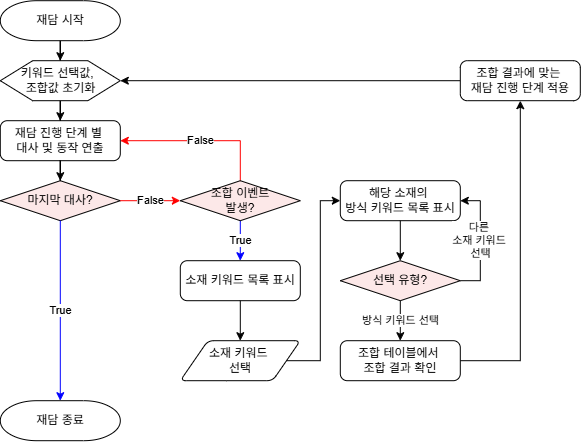

#### 1) 소재 키워드 선택

- 재담 진행 시 사전에 지정된 대사 표시 후 화면에 선택 가능한 소재 키워드 목록 표시
- 소재 키워드 선택 상태에서 다른 소재 키워드 선택 시 소재 키워드 변경

#### 2) 방식 키워드 표시

- 소재 키워드 선택 시 해당 소재 키워드와 조합할 수 있는 방식 키워드 목록 추가 표시
- 소재 키워드 선택 변경 시 방식 키워드 목록 갱신

#### 3) 조합 판정

- 소재 키워드와 방식 키워드가 모두 선택 시 바로 판정 실행
- 조합 확정 후 키워드 선택 종료하고 조합 결과로 재담 진행
- 조합 결과 별로 점수 차등 책정

#### 4) 조합 결과

- 등록된 모든 키워드 조합에 다음 결과를 미리 연결
	- 말뚝이 및 장쇠의 대사
	- 샌님의 반응 대사 및 동작
	- 점수

### 3.6.3 설정

#### 1) 데이터 테이블 기반 제어

- 관리 및 진행을 데이터 테이블로 제어할 수 있어야 함
	- 재담 진행과 키워드 조합 실행할 위치
	- 소재 키워드 및 방식 키워드 목록
	- 키워드 조합 결과에 따른 점수 및 재담 진행
- 구체적인 스키마 구조는 추후 작성 예정

## 3.7 증거 조합 시스템 (2차 연도 개발 예정)

### 3.7.1 개요

- 정의
	- 먹중잡이 진행 시 화면에 표시된 증거 중 2개를 선택하고 조합하여 먹중의 위선을 판정하는 시스템
	- 유효한 조합 성공 시 신분, 향락, 여색, 폭력, 사기 중 해당 내용을 폭로하고 관련 재담과 먹중의 반응 동작 진행
- 목적
	- 먹중잡이의 핵심 재미인 위선 폭로에 증거를 조합하는 추리의 재미를 더함

### 3.7.2 동작 방식

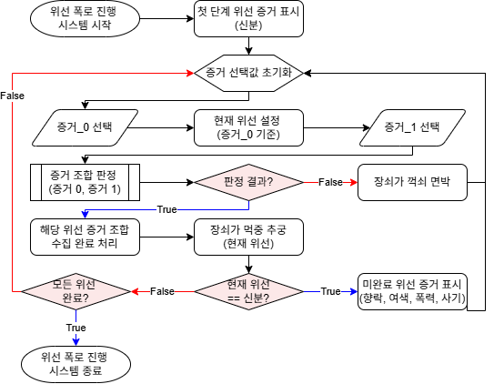
 
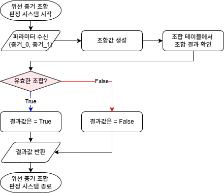

#### 1) 증거 선택

- 화면에 표시된 증거 중 첫 번째 증거 선택
- 이미 선택된 증거 재선택 시 선택 해제
- 화면에 표시된 증거 중 두 번째 증거 선택

#### 2) 조합 판정

- 증거 2개 선택 시 바로 판정 실행
- 증거 선택 순서와 관계없이 동일한 조합으로 처리
- 조합 판정 후 성공 / 실패에 따른 재담 분기 적용

#### 3) 조합 성공

- 해당 위선 증거 조합 수집 완료 처리
- 수집 완료한 위선의 증거 오브젝트 숨김
- 조합 성공에 해당하는 재담과 먹중의 반응 동작 진행
- 현재 위선이 신분이면 향락, 여색, 폭력 및 사기의 증거 표시
- 미완료 위선이 남아 있으면 증거 선택값 초기화 후 새로운 증거 조합 진행
- 모든 위선의 증거 조합을 수집 완료하면 증거 조합 시스템 종료

#### 4) 조합 실패

- 조합 실패에 해당하는 재담 진행
- 증거 선택값 초기화 후 새로운 증거 조합 진행

### 3.7.3 설정

#### 1) 조합 판정 시스템

- 선택한 증거 2개의 식별자를 파라미터로 전달
- 전달받은 증거 2개로 조합값 생성
- 증거 선택 순서와 관계없이 동일한 조합값 생성
- 조합 테이블에서 생성된 조합값 조회
- 조합값 조회 성공 여부를 반환

#### 2) 데이터 테이블 기반 제어

- 관리 및 진행을 데이터 테이블로 제어할 수 있어야 함
	- 재담 진행과 증거 조합 시스템 실행할 위치
	- 증거 목록
	- 증거 조합 결과에 따른 재담 진행
- 구체적인 스키마 구조는 추후 작성 예정
%%

# 4. 인트로 진행

## 4.1 개요

- 인트로 진행은 시작, 가이드 및 이용 동의로 구성되며 프로젝트의 다른 콘텐츠와 공통으로 사용하는 단계임

## 4.2 진행

### 4.2.1 시작

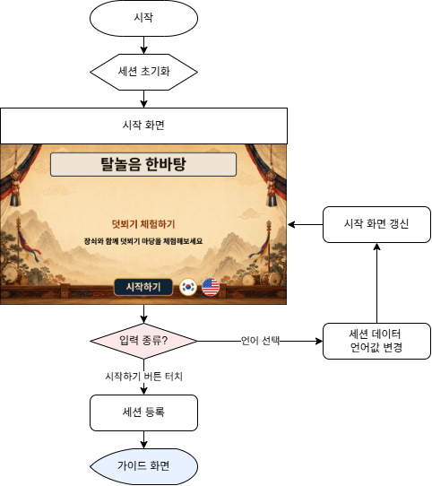

#### 1) 세션 등록 (2차년도 사양)

- 서버에 클라이언트의 세션 데이터를 전송
- 서버에서 세션 ID 부여 후 클라이언트로 전달

### 4.2.2 가이드

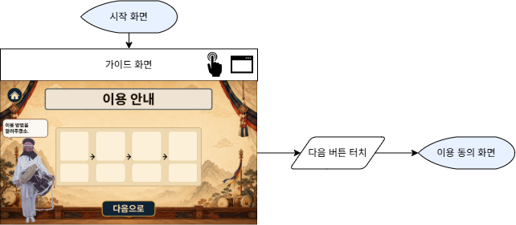

### 4.2.3 이용 동의

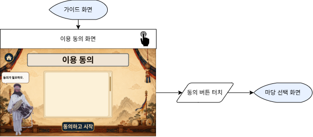

# 5. 마당 선택 진행

## 5.1 개요

- 유저가 체험할 덧뵈기 마당을 선택하는 단계로 마당씻이는 오프닝 성격이어서 본 체험에서는 제외함
- 각 마당은 시연 시 연결되어 진행되나 각 마당이 옴니버스 구성이므로 플레이 시간을 고려하여(한 개 마당 체험에 대략 7분 정도 소요) 체험은 개별 진행함

## 5.2 진행

### 5.2.1 마당 선택

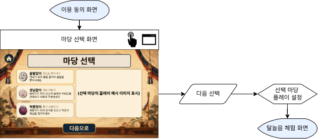

#### 1) 마당 선택 및 적용

- 마당 선택 -> 다음 선택 시 선택 마당 정보를 반영하여 탈놀음 체험 화면 셋팅

# 6. 탈놀음 체험 진행

## 6.1 개요

#### 1) 정의

- 유저에게 덧뵈기의 각 마당 별 재미 요소 체험 수단을 제공하여 마당 별 특성을 체험 및 학습하는 단계

### 6.1.1 진행

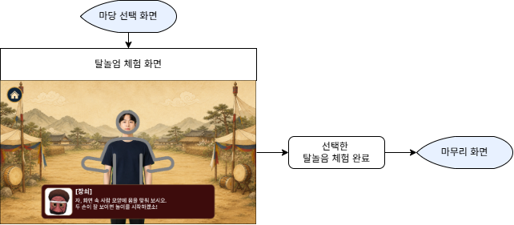

- 진행 시 등장 인물의 유형, 위치, 동작, 대사 및 이벤트 진행(각 마당 별 체험 콘텐츠)은 데이터 테이블로 제어

## 6.2 공통 체험 준비

### 6.2.1 개요

- 탈놀음 체험에 앞서 유저의 자세와 모션 인식 상태를 확인하는 단계

### 6.2.2 진행

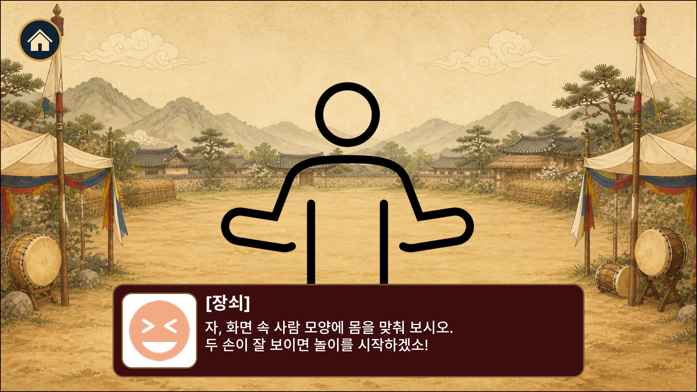

#### 1) 체험 준비 UI 표시

- 자세 가이드라인과 장쇠 대사 표시
- 장쇠가 가이드라인에 몸을 맞추도록 안내
- 카메라에 비친 유저의 모습을 화면에 표시하여 유저가 정위치에 있을 수 있도록 안내

#### 2) 체험 준비 완료

- 유저 등록이 완료 시 가이드라인 숨김
- 장쇠가 준비 완료 및 체험 시작 안내

#### 3) 선택 마당 시작

- 선택 마당 체험 시작

## 6.3 옴탈잡이

### 6.3.1 개요

- 덧뵈기의 두 번째 마당으로, 꺽쇠가 재담과 신체적 대치로 기괴한 옴탈을 쫓아내는 통쾌함을 담은 가면극

### 6.3.2 진행

#### 1) 시작

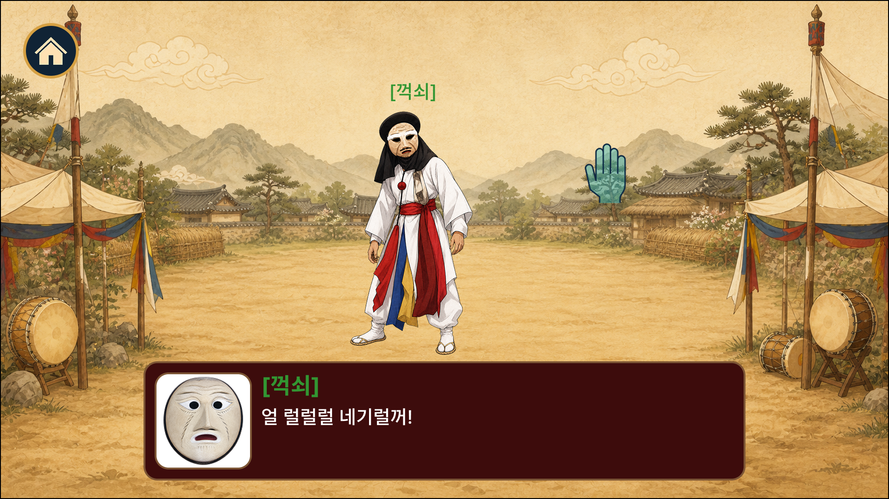

##### (1) 진행
1. 화면에 장쇠와 꺽쇠가 등장하여 대사 진행

#### 2) 옴탈 조우

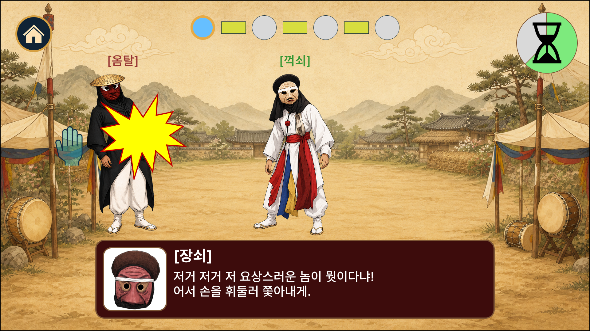

##### (1) 진행

1. 꺽쇠 화면 중앙 배치 및 화면 상단에 진행 인디케이터 표시
2. 옴탈 화면 좌우 측에 랜덤하게 지정된 횟수(데이터 테이블로 관리)만큼 랜덤하게 배치
3. 유저가 팔을 휘두르면 모션 인식 후 꺽쇠가 팔 휘두르는 동작 실행
	- 모션 인식 후 동작 실행까지 걸리는 시간이 짧아야 함
4. 모션 인식 결과 ROI 유효 판정 시 공격 성공 처리
	- 진행 점수(세션 데이터 / 수행 기록) 반영
	- 진행 인디케이터 갱신
5. 지정된 횟수(데이터 테이블로 관리) 도달 시 다음 단계 진행

#### 3) 옴탈 잡아채기

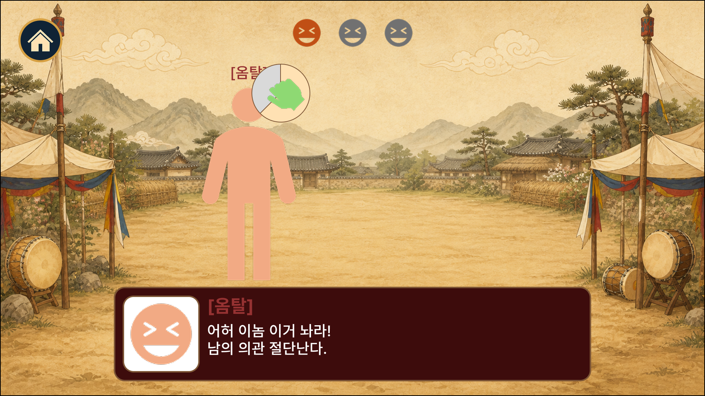

##### (1) 진행

1. 꺽쇠 퇴장, 옴탈 화면 중앙 배치 및 진행 인디케이터 갱신
2. 옴탈 머리 영역에 잡아채는 아이콘 표시
3. 옴탈이 지정된 영역 내에서 좌우로 랜덤하게 이동
	- 랜덤 거리 이동 -> 대기 -> 방향 랜덤 결정 -> 랜덤 거리 이동 (반복)
	- 이동 중 영역 한계 충돌 시 대기 후 반대 방향으로 랜덤 거리 이동
4. 유저가 팔을 움직여 모션 인식으로 잡아채는 아이콘 선택 시도
5. ROI 유효 판정 유지 시 쿨다운(데이터 테이블로 관리)이 실행되고 완료 시 공격 성공 처리
	- 진행 점수(세션 데이터 / 수행 기록) 반영
	- 진행 인디케이터 갱신
6. 지정된 횟수(데이터 테이블로 관리) 도달 시 다음 단계 진행

#### 4) 옴탈 채검하기

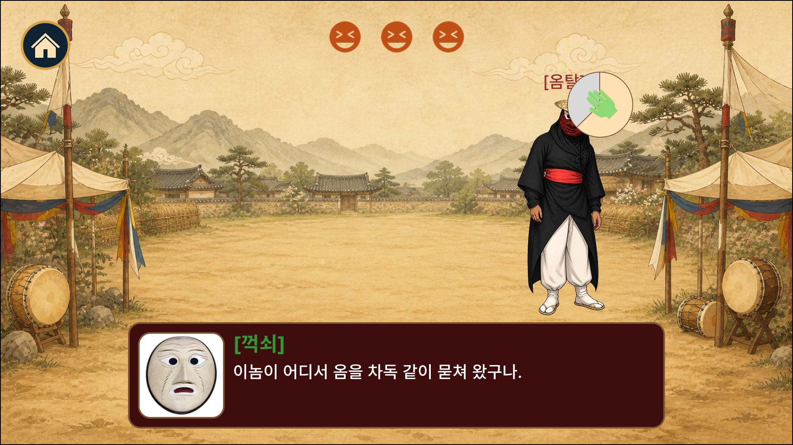

##### (1) 진행

1. 옴탈 화면 중앙 배치 유지 및 진행 인디케이터 갱신
2. 옴탈 얼굴 영역에 긁는 아이콘 표시
3. 옴탈이 지정된 영역 내에서 좌우로 랜덤하게 이동
	- 랜덤 거리 이동 -> 대기 -> 방향 랜덤 결정 -> 랜덤 거리 이동 (반복)
	- 이동 중 영역 한계 충돌 시 대기 후 반대 방향으로 랜덤 거리 이동
4. 유저가 팔을 움직여 모션 인식으로 긁는 아이콘 선택 시도
5. ROI 유효 판정 유지 시 쿨다운(데이터 테이블로 관리)이 실행되고 완료 시 공격 성공 처리
	- 진행 점수(세션 데이터 / 수행 기록) 반영
	- 진행 인디케이터 갱신
6. 지정된 횟수(데이터 테이블로 관리) 도달 시 다음 단계 진행

#### 5) 옴탈 몰아내기

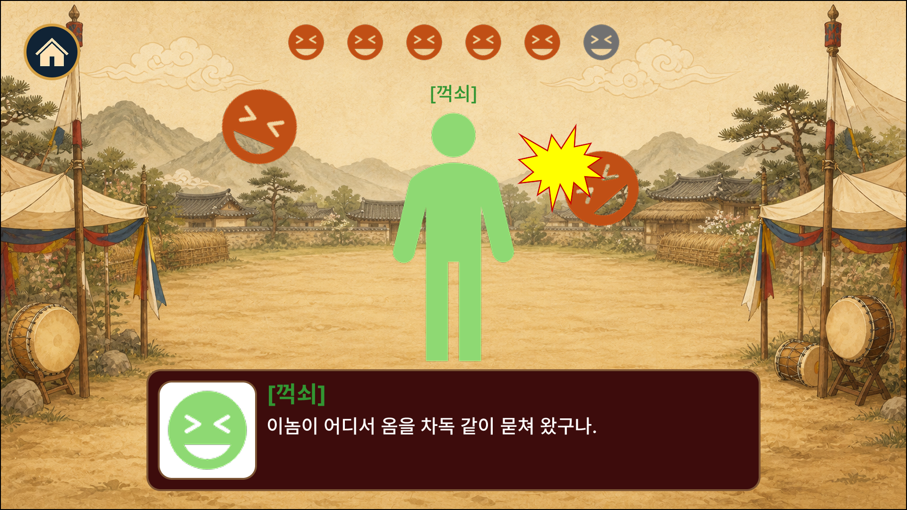

##### (1) 진행

1. 옴탈 퇴장, 꺽쇠 화면 중앙 배치 및 진행 인디케이터 숨김김
2. 화면 좌우의 상, 중, 하 6개 지점에서 랜덤하게 옴탈의 탈이 꺽쇠에게 이동함
	- 옴탈의 탈은 포물선 이동
3. 유저가 팔을 휘두르면 모션 인식 후 꺽쇠가 팔 휘두르는 동작 실행
	- 모션 인식 후 동작 실행까지 걸리는 시간이 짧아야 함
	- 모션 인식이 일정 값 이상일 경우에 ROI 유효 판정 실행
		- 가만히 있을 경우 판정 X
4. 모션 인식 결과 ROI 유효 판정 시 공격 성공 처리
	- 진행 점수(세션 데이터 / 수행 기록) 반영
	- 진행 인디케이터 갱신
5. 지정된 횟수(데이터 테이블로 관리) 도달 시 다음 단계 진행

#### 6) 마무리

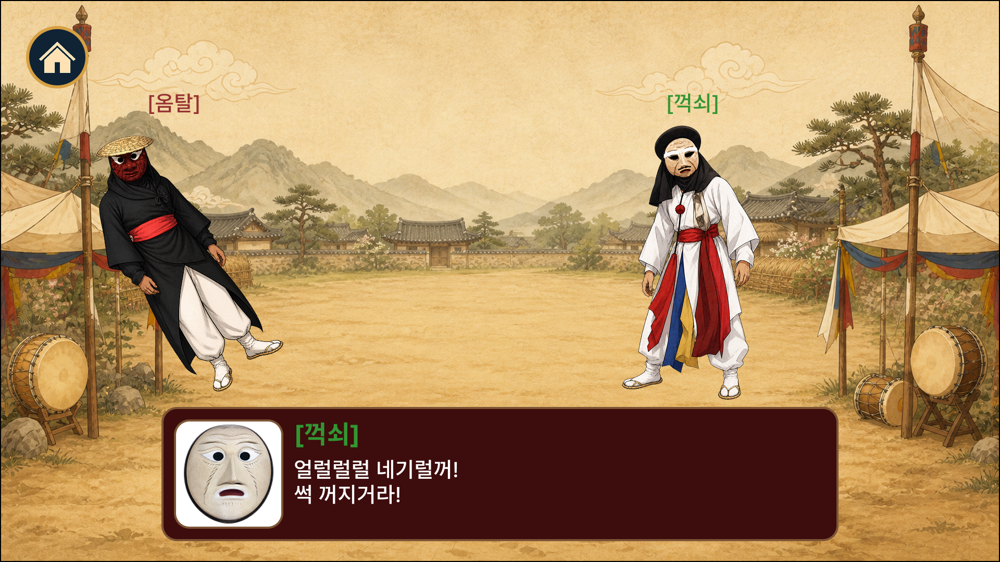

##### (1) 진행

1. 꺽쇠 화면 우측 배치, 옴탈 등장 및 화면 좌측 배치
2. 꺽쇠 마무리 대사 진행
3. 옴탈이 우스꽝스럽게 화면 밖으로 퇴장
4. 다음 단계 진행

## 6.4 샌님잡이

### 6.4.1 개요

- 덧뵈기의 세 번째 마당으로, 말뚝이가 샌님의 말을 재치 있게 받아쳐 샌님의 신분과 권위를 무너뜨리는 통쾌함을 담은 가면극

### 6.4.2 진행

#### 1) 시작

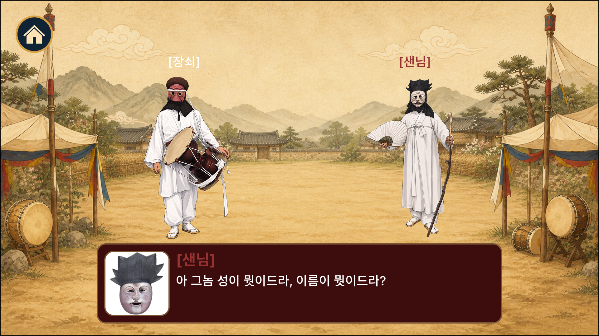

##### (1) 진행

1. 장쇠 화면 좌측 배치, 샌님 화면 우측 배치
2. 장쇠와 샌님의 재담 진행

#### 2) 샌님에게 인사하기

##### (1) 진행

1. 장쇠 퇴장, 샌님 화면 중앙 배치 및 화면 상단에 진행 인디케이터 표시
2. 샌님이 말뚝이 부르는 대사 후 조합 이벤트 발생
3. 유저가 키워드 조합 진행
4. 조합 결과 판정 및 반영
	- 진행 점수(세션 데이터 / 수행 기록) 반영
	- 조합 결과 별 말뚝이 대사 진행
5. 다음 단계 진행

#### 3) 샌님에게 절 배우기

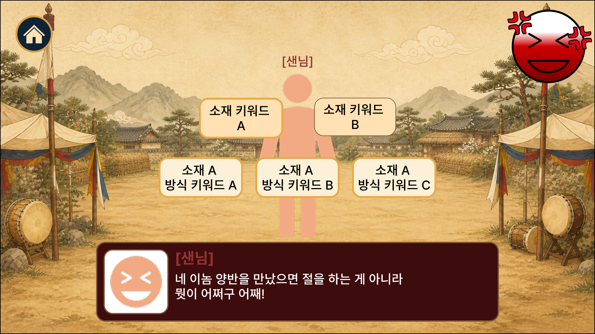

##### (1) 진행

1. 샌님 화면 중앙 배치 유지 및 진행 인디케이터 갱신
2. 샌님이 말뚝이에게 절 시키는 대사 후 조합 이벤트 발생
3. 유저가 키워드 조합 진행
4. 조합 결과 판정 및 반영
	- 진행 점수(세션 데이터 / 수행 기록) 반영
	- 조합 결과 별 말뚝이 대사 진행
5. 다음 단계 진행

#### 4) 샌님 따라하기

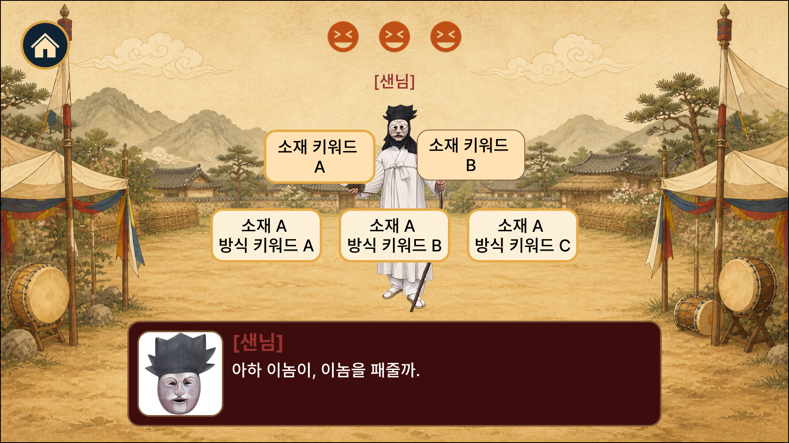

##### (1) 진행

1. 샌님 화면 중앙 배치 유지 및 진행 인디케이터 갱신
2. 샌님이 말뚝이에게 절 가르치는 대사 후 조합 이벤트 발생
3. 유저가 키워드 조합 진행
4. 조합 결과 판정 및 반영
	- 진행 점수(세션 데이터 / 수행 기록) 반영
	- 조합 결과 별 말뚝이 대사 진행
5. 다음 단계 진행
#### 5) 샌님 몰아내기

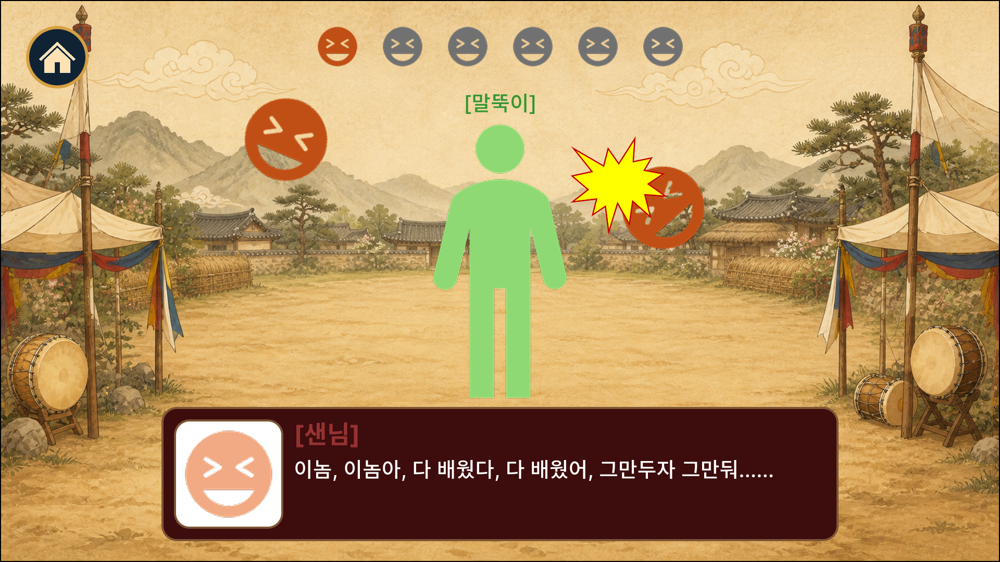

##### (1) 진행

1. 샌님 퇴장, 말뚝이 화면 중앙 배치 및 진행 인디케이터 숨김
	- 화면 우상단의 진행 인디케이터 숨김
	- 화면 상단에 몰아내기 진행 인디케이터 표시
2. 화면 좌우의 상, 중, 하 6개 지점에서 랜덤하게 샌님의 탈이 말뚝이에게 이동함
	- 말뚝이의 탈은 포물선 이동
3. 유저가 팔을 휘두르면 모션 인식 후 말뚝이가 팔 휘두르는 동작 실행
	- 모션 인식 후 동작 실행까지 걸리는 시간이 짧아야 함
	- 모션 인식이 일정 값 이상일 경우에 ROI 유효 판정 실행
		- 가만히 있을 경우 판정 X
4. 모션 인식 결과 ROI 유효 판정 시 공격 성공 처리
	- 진행 점수(세션 데이터 / 수행 기록) 반영
5. 지정된 횟수(데이터 테이블로 관리) 도달 시 다음 단계 진행

#### 6) 마무리

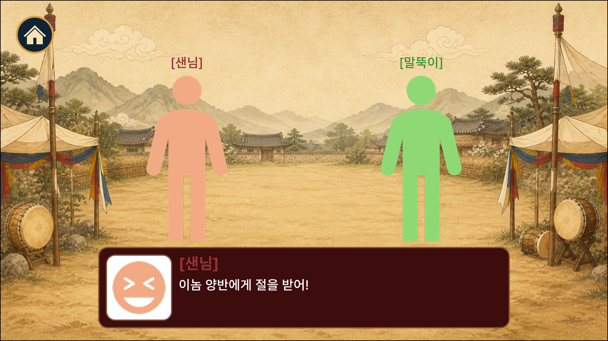

##### (1) 진행

1. 말뚝이 화면 우측 배치, 샌님 등장 및 화면 좌측 배치
2. 말뚝이와 샌님 재담 진행하며 샌님이 말뚝이에게 절함
3. 샌님 화내는 동작 실행 후 다음 단계 진행

## 6.5 먹중잡이

### 6.5.1 개요

- 덧뵈기의 네 번째 마당으로, 취발이가 근엄한 척하는 먹중의 욕망과 위선을 폭로하는 통쾌함을 담은 가면극

### 6.5.2 진행

#### 1) 시작

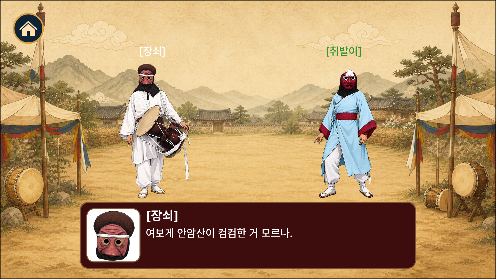

##### (1) 진행

1. 장쇠 화면 좌측 배치, 취발이 화면 우측 배치
2. 장쇠와 취발이이의 재담 진행

#### 2) 먹중 신분 폭로

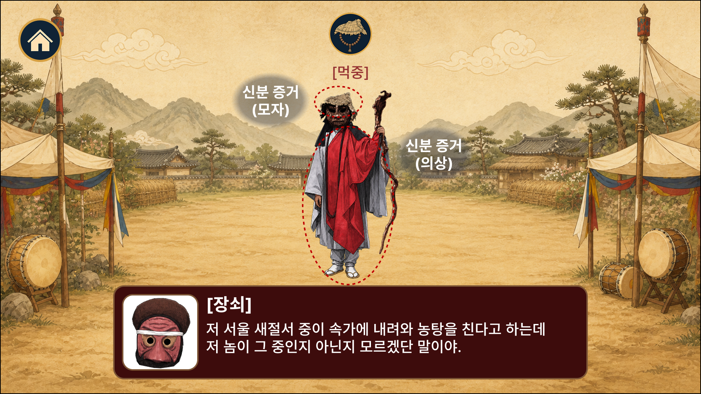

##### (1) 진행

1. 장쇠와 취발이 퇴장, 먹중 화면 중앙 배치 및 화면 상단에 신분 폭로 아이콘 표시
	- 증거 조합 전에는 무채색 처리리
2. 신분 증거 활성화
	- 모자, 의상
3. 유저가 모자와 의상을 선택하면 신분 증거 조합 성공 처리
4. 다음 진행

#### 3) 흠결 폭로 진행

##### (1) 개요

- 정해진 순서 없이 화면의 소품과 인물(피조리 갑/을, 꺽쇠, 취발이)을 선택하여 먹중의 흠결에 대한 정보를 수집하고 위선을 폭로함

##### (2) 사전 처리

1. 소품 및 인물 표시
	- 인물은 2조(피조리 갑/을, 꺽쇠/말뚝이)로 구성되며 '피조리 갑/을'을 기본값으로 표시
	- 인물은 화면의 인물 교체 버튼 터치로 변경 가능
2. 화면 상단에 추가 폭로 아이콘 표시
	- 향락, 여색, 폭력, 사기
	- 각 아이콘은 아직 증거 수집 전이므로 무채색 표시

##### (3) 흠결 폭로- 향락

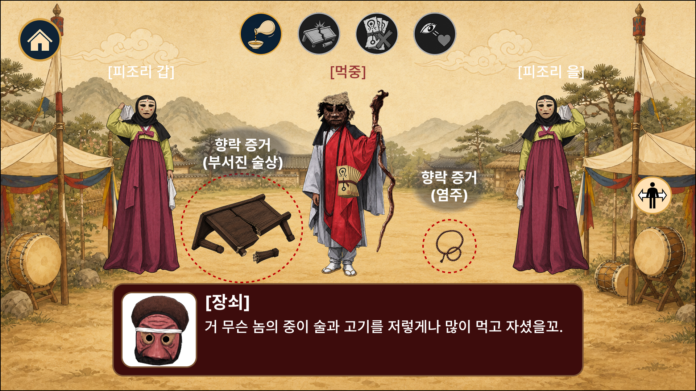

1. 유저가 부서진 술상과 염주를 선택하면 향락 증거 조합 성공 처리
2. 상단의 향락 증거 아이콘 유채색 처리
3. 다음 진행

##### (4) 흠결 폭로 - 여색

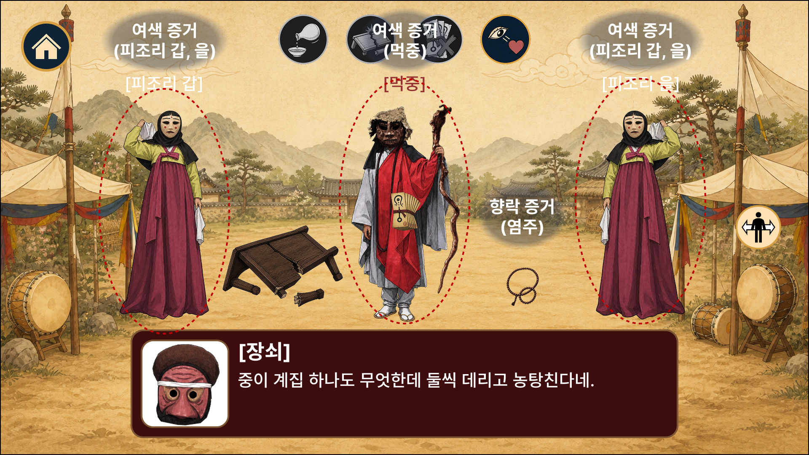

1. 유저가 피조리 갑/을과 먹중을 선택하면 여색 증거 조합 성공 처리
2. 상단의 여색색 증거 아이콘 유채색 처리
3. 다음 진행

##### (5) 흠결 폭로 - 폭력

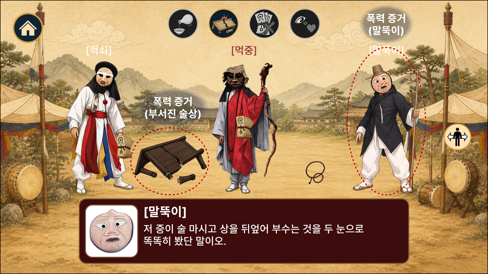

1. 유저가 무서진 술상과 말뚝이를 선택하면 폭력 증거 조합 성공 처리
2. 상단의 폭력 증거 아이콘 유채색 처리
3. 다음 진행

##### (6) 흠결 폭로 - 사기

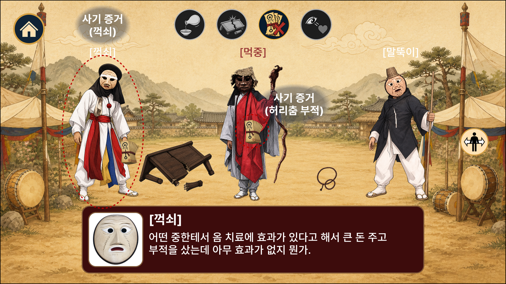

1. 유저가 꺽쇠와 먹중 허리춤의 부적을 선택하면 사기 증거 조합 성공 처리
2. 상단의 사기 증거 아이콘 유채색 처리
3. 다음 진행

#### 4) 먹중 몰아내기

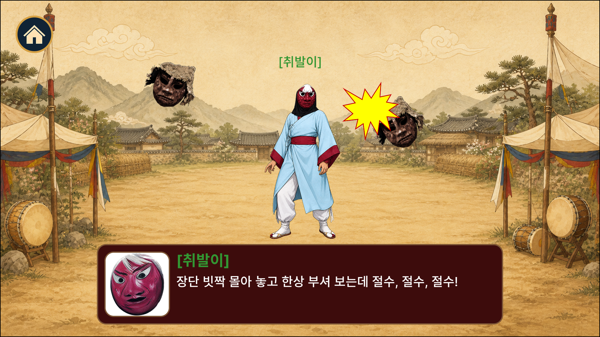

##### (1) 진행 조건

- 모든 위선 폭로 진행 완료

##### (2) 진행

1. 먹중 및 증거 인물  퇴장, 취발이 화면 중앙 배치 및 '취발이' UI 갱신
	- 화면 우상단의 진행 인디케이터 숨김
	- 화면 상단에 몰아내기 진행 인디케이터 표시
2. 화면 좌우의 상, 중, 하 6개 지점에서 랜덤하게 먹중의 탈이 취발이에게 이동함
	- 먹중의 탈은 포물선 이동
3. 유저가 팔을 휘두르면 모션 인식 후 취발이가 팔 휘두르는 동작 실행
	- 모션 인식 후 동작 실행까지 걸리는 시간이 짧아야 함
	- 모션 인식이 일정 값 이상일 경우에 ROI 유효 판정 실행
		- 가만히 있을 경우 판정 X
4. 모션 인식 결과 ROI 유효 판정 시 공격 성공 처리
	- 진행 점수(세션 데이터 / 수행 기록) 반영
	- 진행 인디케이터 갱신
5. 지정된 횟수(데이터 테이블로 관리) 도달 시 다음 단계 진행

#### 5) 마무리

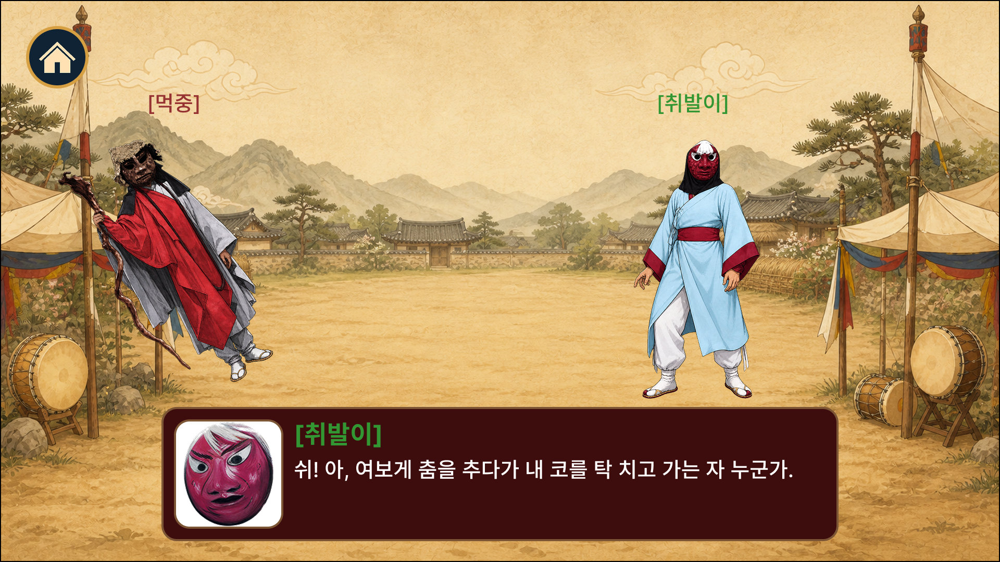

##### (1) 진행

1. 취발이 화면 우측 배치, 먹중 등장 및 화면 좌측 배치
2. 취발이 마무리 대사 진행
3. 먹중이 우스꽝스럽게 화면 밖으로 퇴장
4. 다음 단계 진행

# 7. 마무리 진행

## 7.1 개요

마무리 진행은 결과 안내 및 종료로 구성되어 세션을 마무리하는 단계임

## 7.2 진행

### 7.2.1 결과 안내 및 종료

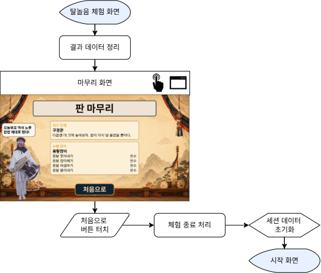

#### 1) 결과 데이터 집계 및 확정

- 세션 데이터에서 현재 언어, 선택 마당 및 수행 기록 로드
- 선택 마당의 단계 별 수행 기록을 결과 화면에 표시할 항목으로 집계
	- 모션 체험: 성공 횟수 누적
	- 키워드 조합: 조합 별 획득 점수 누적
	- 증거 조합: 조합 성공 개수 누적
- 집계 결과를 최종 결과 데이터로 확정
- 기록 없는 항목은 미수행 상태로 처리

#### 2) 결과 화면 표시

- 선택한 마당의 명칭과 최종 결과 요약을 현재 언어로 표시
- 확정된 결과 데이터를 마당별 결과 항목에 맞춰 표시

#### 3) 체험 종료 처리

- '처음으로' 버튼 터치 or 화면 타임아웃 or 미입력 타임아웃 실행 시 체험 종료 처리  진행
- 결과 화면의 추가 입력 차단하고 진행 중인 타이머와 대사 출력을 종료
- 서버에 해당 세션의 체험 종료 상태 기록
	- 2차년도 개발 사양
- 종료 처리 완료 시 세션 데이터 초기화 진행

#### 4) 세션 데이터 초기화

- 종료된 세션의 임시 데이터를 초기값으로 변경
- 키워드 및 증거 선택값, 진행 인디케이터와 타이머 상태 초기화
- 초기화 완료 후 시작 화면으로 이동

%%

# 8. 운영 파라미터

# 9. 에러 케이스

%%
