# 1. 개요

- **콘텐츠 정의**
	- 남사당놀이 덧뵈기 3개 마당(옴탈잡이, 샌님잡이, 먹중잡이) 중 옴탈잡이 마당을 체험하는 키오스크 콘텐츠
		- 1차년도 개발 대상으로 옴탈잡이 우선 개발 진행
- **소재**
	- 남사당놀이의 덧뵈기는 여타 탈 관련 무형문화재에 비해 춤사위보다 마임과 재담 및 사회 풍자가 두드러지는 특징을 지님
	- 마당씻이 -> 옴탈잡이 -> 샌님잡이 -> 먹중잡이로 진행되나 각 마당은 독자적인 구성이며 마당씻이는 오프닝 성격이어서 본 체험에서는 제외함
	- 각 마당은 희극이라는 카테고리에 묶일 수 있으나 웃음을 유발하는 요인은 각자 다름 (옴탈잡이: 기괴한 존재 퇴치, 샌님잡이: 권위 전복, 먹중잡이: 위선 폭로)
- **개발 목적**
	- 유저에게 덧뵈기의 각 마당 별 재미 요소 체험 수단을 제공하여 마당 별 특성을 체험 및 학습할 수 있도록 함

# 2. 전체 진행

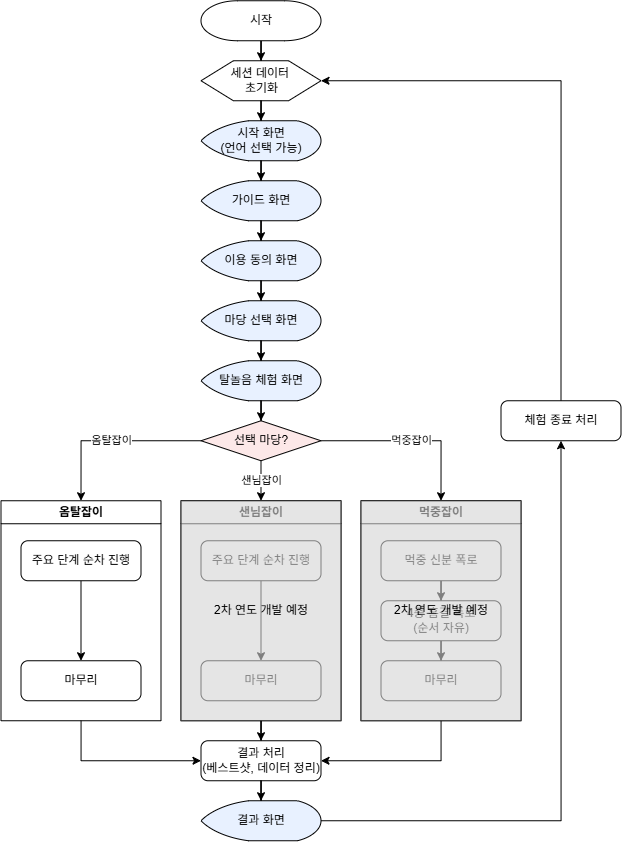

# 3. 인트로 진행

## 3.1 개요

- 인트로 진행은 시작, 가이드 및 이용 동의로 구성되며 프로젝트의 다른 콘텐츠와 공통으로 사용하는 단계임

## 3.2 진행

### 3.2.1 시작

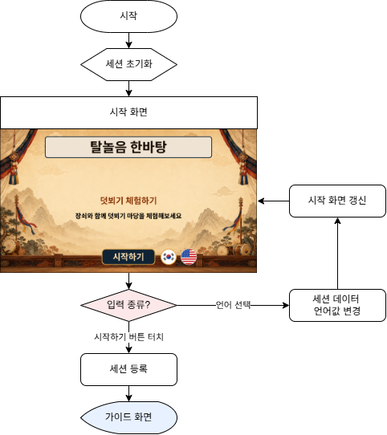

#### 1) 세션 등록 (2차년도 사양)

- 서버에 클라이언트의 세션 데이터를 전송
- 서버에서 세션 ID 부여 후 클라이언트로 전달

### 3.2.2 가이드

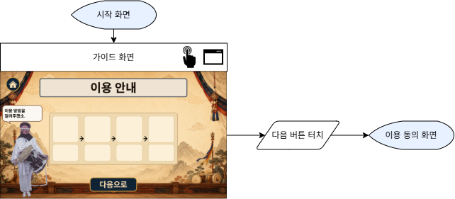

### 3.2.3 이용 동의

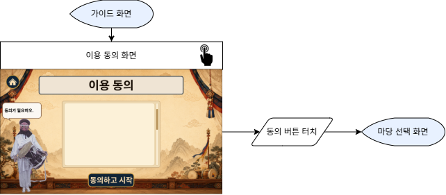

# 4. 마당 선택 진행

## 4.1 개요

- 유저가 체험할 덧뵈기 마당을 선택하는 단계로 마당씻이는 오프닝 성격이어서 본 체험에서는 제외함
- 각 마당은 시연 시 연결되어 진행되나 각 마당이 옴니버스 구성이므로 플레이 시간을 고려하여(한 개 마당 체험에 대략 7분 정도 소요) 체험은 개별 진행함

## 4.2 진행

### 4.2.1 마당 선택

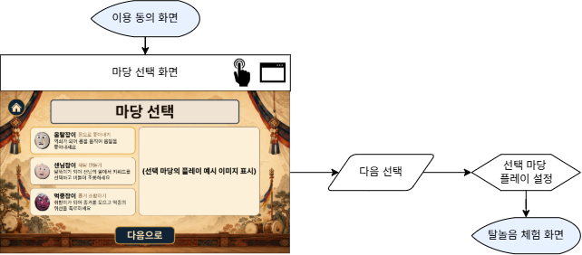

#### 1) 마당 선택 및 적용

- 마당 선택 -> 다음 선택 시 선택 마당 정보를 반영하여 탈놀음 체험 화면 셋팅

# 5. 탈놀음 체험 진행

## 5.1 개요

#### 1) 정의

- 유저에게 덧뵈기의 각 마당 별 재미 요소 체험 수단을 제공하여 마당 별 특성을 체험 및 학습하는 단계

### 5.1.1 진행

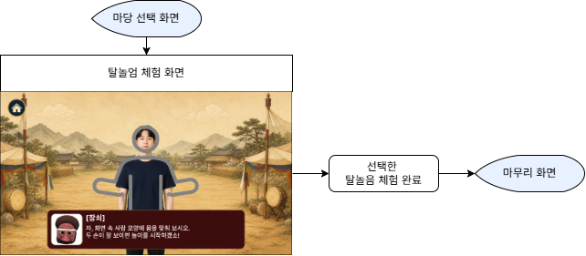

- 진행 시 등장 인물의 유형, 위치, 동작, 대사 및 이벤트 진행(각 마당 별 체험 콘텐츠)은 데이터 테이블로 제어

## 5.2 공통 체험 준비

### 5.2.1 개요

- 탈놀음 체험에 앞서 유저의 자세와 모션 인식 상태를 확인하는 단계

### 5.2.2 진행

#### 1) 체험 준비 UI 표시

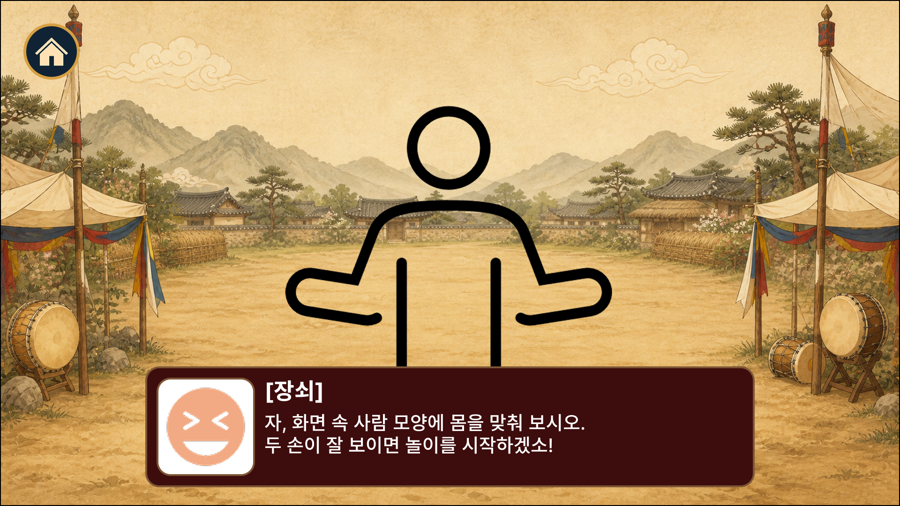

- 자세 가이드라인과 장쇠 대사 표시
- 장쇠가 가이드라인에 몸을 맞추도록 안내
- 카메라에 비친 유저의 모습을 화면에 표시하여 유저가 정위치에 있을 수 있도록 안내

#### 2) 체험 준비 완료 및 시작

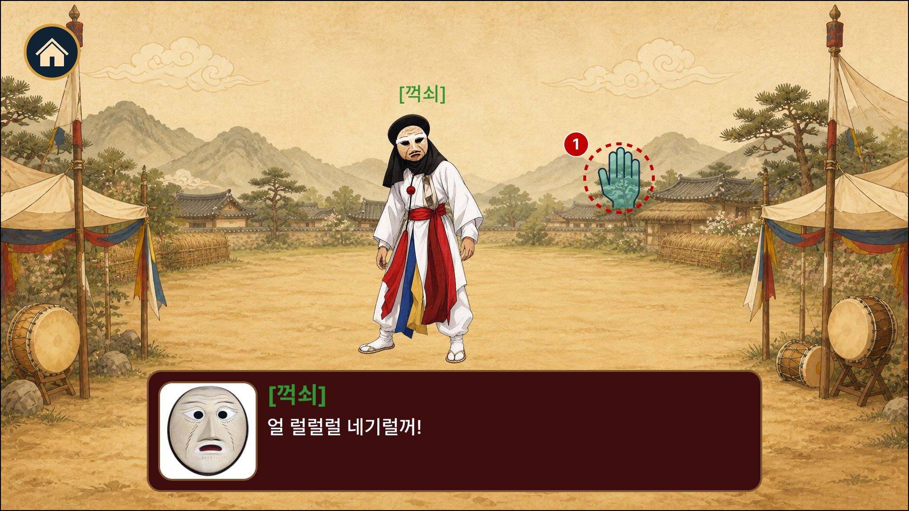

- 유저 등록이 완료 시 가이드라인 숨김
- ① 손 위치 포인터(이하 포인터) 표시

## 5.3 옴탈잡이

### 5.3.1 개요

- 덧뵈기의 두 번째 마당으로, 꺽쇠가 재담과 신체적 대치로 기괴한 옴탈을 쫓아내는 통쾌함을 담은 가면극

### 5.3.2 진행

#### 1) 시작

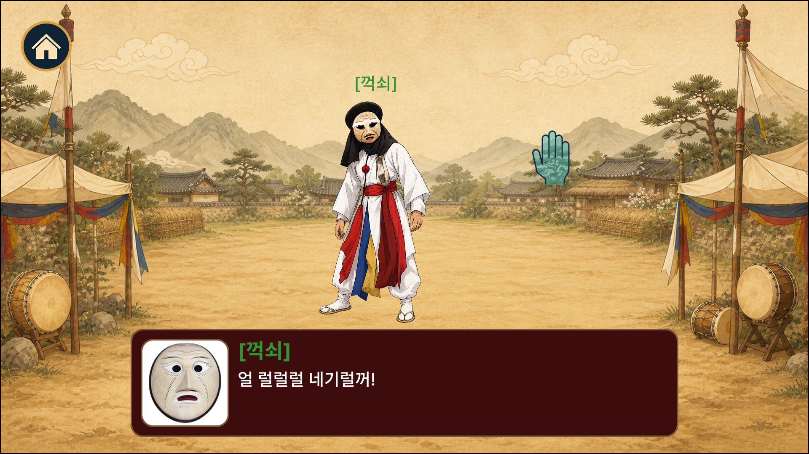

##### (1) 진행
1. 꺽쇠가 화면 중앙에 등장하여 대사 진행

#### 2) 옴탈 쫓아내기

##### (1) 진행

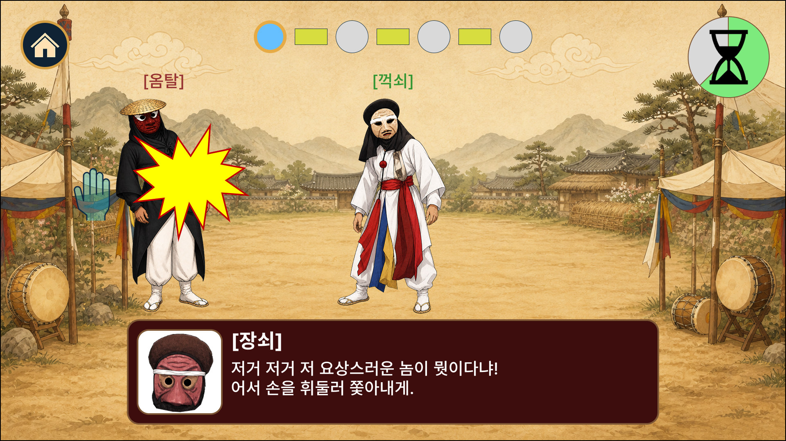

1. UI 활성화 및 초기화
	- 인디케이터 초기화
	- 타이머 초기화
2. 옴탈이 화면 좌우측에 랜덤하게 지정된 횟수(데이터 테이블로 관리)만큼 배치
3. 유저가 팔을 휘두르면 모션 인식 후 꺽쇠가 팔 휘두르는 동작 실행
	- 모션 인식 후 동작 실행까지 걸리는 시간이 짧아야 함
4. 모션 인식 결과 유효 판정 시 공격 성공 처리
	- 진행 점수(세션 데이터 / 수행 기록) 반영
		- 유저 움직임의 정도에 따라 점수 차등 적용
	- 옴탈 피격 동작 1회 실행 및 피격 이펙트 표시
5. 타이머 종료 시 다음 단계 진행

#### 3) 옴탈 잡아채기

##### (1) 시작

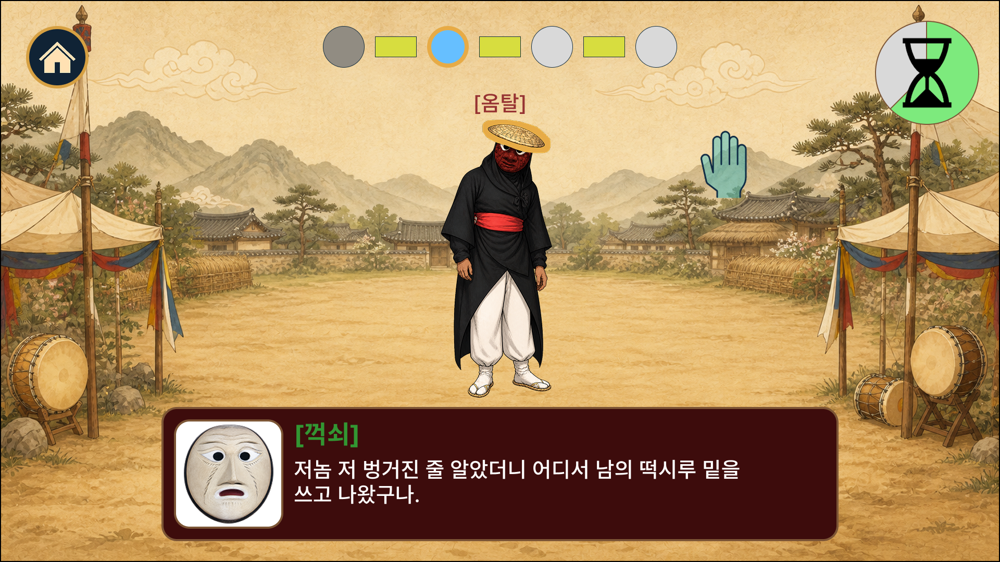

1. 꺽쇠 퇴장, 옴탈 화면 중앙 배치
2. UI 갱신
	- 인디케이터 갱신
	- 타이머 초기화
3. 옴탈 머리의 벙거지 테두리에 굵은선(주변과 구별될 수 있는 색)이 표시되면서 확대 축소 반복
4. 모션 인식 결과 포인터가 벙거지에 닿으면 진행 시작

##### (2) 진행

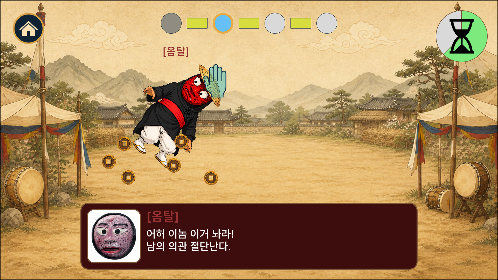

1. 꺽쇠 캐릭터 오브젝트 변환
	- 우스꽝스러운 SD 캐릭터
		- 요청사항: 얼굴과 목이 분리되어 있어서 흔들릴 때 덜렁거리는 느낌이 더 강하게 났으면 합니다.
2. 유저의 모션에 따라 옴탈 SD 캐릭터가 흔들리고 캐릭터로부터 엽전이 떨어짐
	- 요청사항: 엽전 떨어지는 연출은 디아블로의 보물 고블린같은 느낌이 났으면 합니다.
3. 흔들림 강도에 따라 연출 차등 적용
	- 옴탈 SD 캐릭터의 흔들림
	- 옴탈에게서 떨어지는 엽전의 수량
4. 모션 인식 결과 흔들 때마다 공격 성공 처리
	- 일정 거리 이상 흔들어야 유효 판정
	- 진행 점수(세션 데이터 / 수행 기록) 반영
		- 유저 움직임의 정도에 따라 점수 차등 적용
5. 타이머 종료 시 다음 단계 진행

#### 4) 옴탈 채검하기

##### (1) 시작

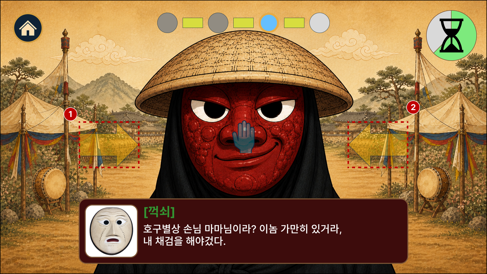

1. 꺽쇠 캐릭터 오브젝트 변환
	- 기분 나쁜 표정을 짓고 있는 옴탈의 얼굴 강조 캐릭터
2. UI 갱신
	- 인디케이터 갱신
	- 타이머 초기화
	- 옴탈 얼굴 좌우에 불투명 화살표(①, ②) 표시
3. 모션 인식 결과 포인터가 좌 -> 우, 우 -> 좌로 일정 거리 이상 움직이면 진행 시작

##### (2) 진행

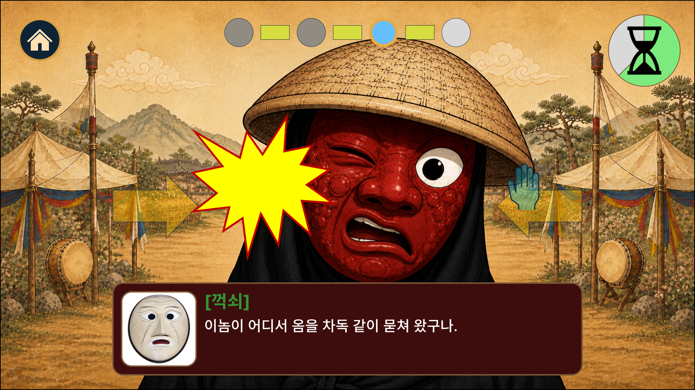

1. 피격 판정 성공 시 처리
	- 옴탈 피격 애니메이션 및 이펙트 실행
		- 애니메이션 실행 중 포인터는 유지하지만 입력은 막음
2. 휘두르는 강도에 따라 연출 차등 적용
	- 옴탈 캐릭터 흔들림
	- 이펙트 크기
3. 모션 인식 결과 옴탈 피격 시 공격 성공 처리
	- 일정 거리 이상 손을 휘둘러야 유효 판정
	- 진행 점수(세션 데이터 / 수행 기록) 반영
		- 유저 움직임의 정도에 따라 점수 차등 적용
4. 타이머 종료 시 다음 단계 진행

#### 5) 옴탈 몰아내기

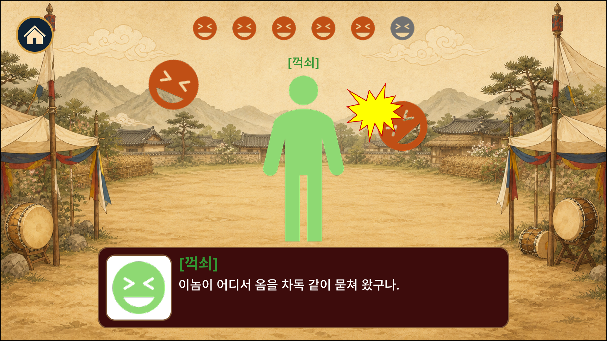

##### (1) 진행

1. 옴탈 퇴장, 꺽쇠 화면 중앙 배치
2. UI 갱신
	- 인디케이터 갱신
	- 타이머 초기화
	- 옴탈 얼굴 좌우에 불투명 화살표(①, ②) 숨김
3. 꺽쇠는 탈춤을 추는 동작을 반복
4. 화면 좌우의 상, 중, 하 6개 지점에서 랜덤하게 옴탈의 탈이 꺽쇠에게 포물선을 그리며 이동함
	- 꺽쇠에게 옴탈의 탈이 닿으면 꺽쇠는 피격 동작 실행
5. 유저는 포인터를 움직여 옴탈의 탈을 맞춰야 함
6. 모션 인식 결과 유효 판정 시 공격 성공 처리
	- 진행 점수(세션 데이터 / 수행 기록) 반영
	- 옴탈 피격 동작 1회 실행 및 피격 이펙트 표시
7. 타이머 종료 시 다음 단계 진행

#### 6) 마무리

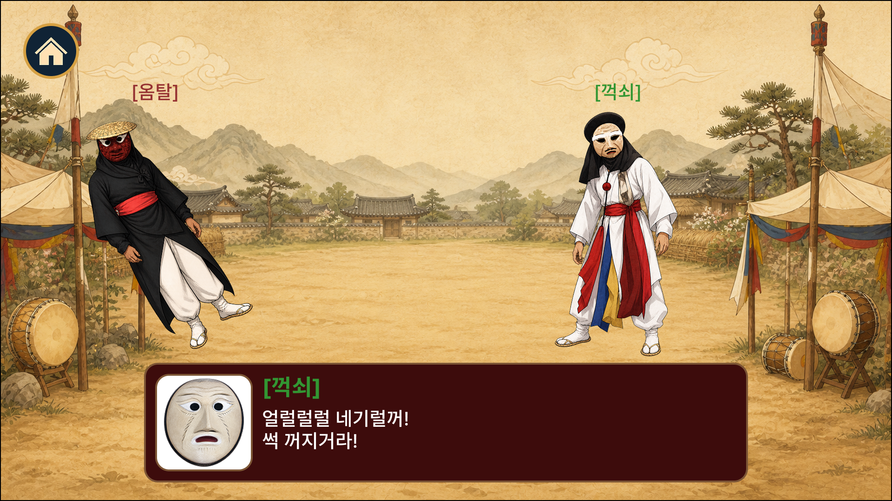

##### (1) 진행

1. 꺽쇠 화면 우측 배치, 옴탈 등장 및 화면 좌측 배치
2. 꺽쇠 마무리 대사 진행
3. 옴탈이 우스꽝스럽게 화면 밖으로 퇴장
4. 다음 단계 진행

# 6. 마무리 진행

## 6.1 개요

마무리 진행은 결과 안내 및 종료로 구성되어 세션을 마무리하는 단계임

## 6.2 진행

### 6.2.1 결과 안내 및 종료

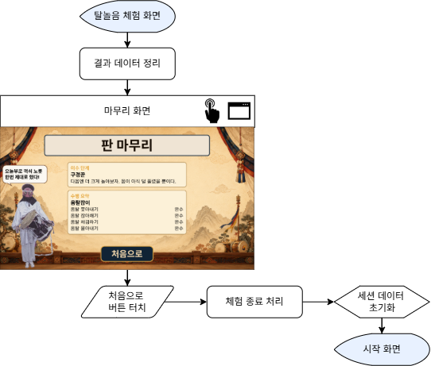

#### 1) 결과 데이터 집계 및 확정

- 세션 데이터에서 현재 언어, 선택 마당 및 수행 기록 로드
- 선택 마당의 단계 별 수행 기록을 결과 화면에 표시할 항목으로 집계
	- 각 단계의 점수를 100점 기준으로 정규화 후 가중 평균 처리
- 집계 결과를 최종 결과 데이터로 확정
- 기록 없는 항목은 미수행 상태로 처리

#### 2) 결과 화면 표시

- 선택한 마당의 명칭과 최종 결과 요약을 현재 언어로 표시
- 확정된 결과 데이터를 마당별 결과 항목에 맞춰 표시

#### 3) 체험 종료 처리

- '처음으로' 버튼 터치 or 화면 타임아웃 or 미입력 타임아웃 실행 시 체험 종료 처리  진행
- 결과 화면의 추가 입력 차단하고 진행 중인 타이머와 대사 출력을 종료
- 서버에 해당 세션의 체험 종료 상태 기록
	- 2차년도 개발 사양
- 종료 처리 완료 시 세션 데이터 초기화 진행

#### 4) 세션 데이터 초기화

- 종료된 세션의 임시 데이터를 초기값으로 변경
- 키워드 및 증거 선택값, 진행 인디케이터와 타이머 상태 초기화
- 초기화 완료 후 시작 화면으로 이동
