# 0. 문서 정보

| 버전    | 날짜         | 내용    | 항목  | 작성자 |
| ----- | ---------- | ----- | --- | --- |
| 1.0.0 | 2026.08.05 | 초안 작성 | 전체  | 조상연 |

# 1. 개요

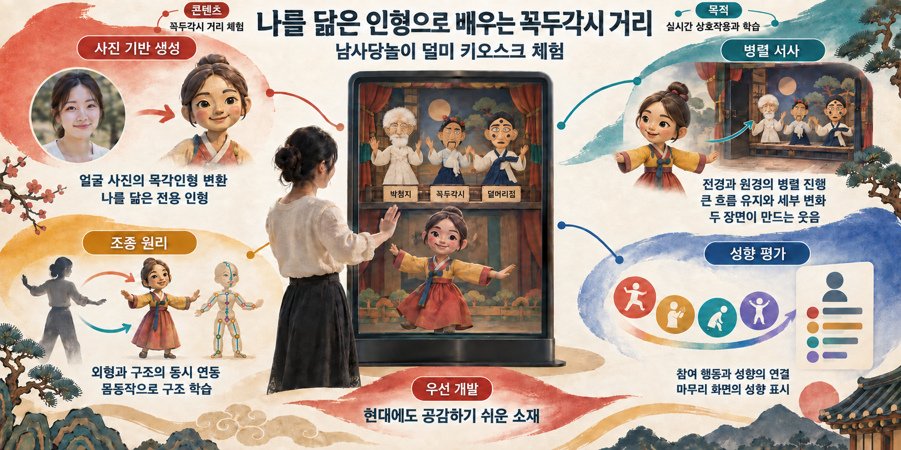

## 1.1 콘텐츠 개요

- **콘텐츠 정의**
	- 남사당놀이 덜미 2개 마당 7개 거리 중 꼭두각시 거리를 체험하는 키오스크 콘텐츠
- **개발 목적**
	- 무형문화유산의 형식과 포함된 의미를 사용자와 실시간으로 상호작용하며 체험 및 학습할 수 있는 수단 제공
- **개발 범위**
	- 현대 사람들도 공감하기 쉬운 치정극이라는 소재와 간단한 구성(박첨지, 꼭두각시, 덜머리집)을 가진 꼭두각시 거리를 우선 개발
## 1.2 핵심 시스템

- **조종 원리 시각화 시스템**
	-  유저 동작을 외형 인형과 구조 인형에 동시에 연동하여 움직임 및 조작 원리 시각화
		- 조작 체험 구현의 경우 난이도가 높기 때문에 체험 대신 구조 학습 수단 제공
- **병렬 서사 시스템**
	- 전경의 유저 인형과 원경의 덜미 인형극을 병렬로 진행하며 이야기의 큰 흐름은 유지하면서 유저 행동이 세부 진행을 바꿔 두 장면이 합쳐진 웃음을 만드는 시스템
		- 유저의 체험에 큰 제약을 두지 않으면서 인형극 진행에 복잡한 분기를 두지 않아 매끄러운 진행 유도
- **유저 성향 평가 시스템**
	- 유저의 행동을 토대로 성향을 평가하여 마무리 화면에 표시
		- 병렬 서사 시스템에서 유저가 한 행동과 유저의 성향을 연결시켜 유저의 행동에 의미 부여
- **사진 기반 인형 생성 시스템**
	- 유저의 얼굴 촬영 뒤 생성형 AI를 이용하여 목각인형으로 변환
		- 병렬 서사 시스템에서 사용할 유저 인형이 필요하며 몰입감을 높이기 위해 공통 인형 대신 유저 전용 인형 사용

# 2. 전체 플로우

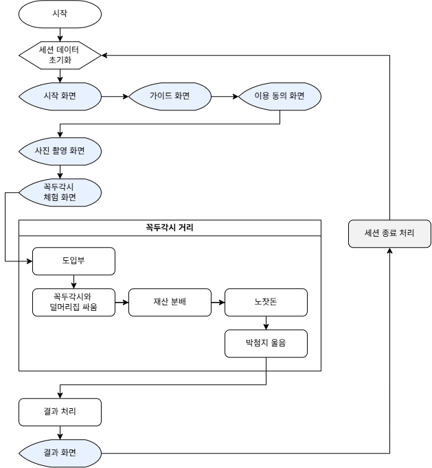

# 3. 공용 시스템

## 3.1 세션 데이터

### 3.1.1 역할과 목적

- **정의**
	- 세션 진행 중 필요한 상태, 선택 및 수행 기록 등을 통합 관리하는 데이터
- **목적**
	- 콘텐츠 진행에 필요한 데이터를 체계화하여 **진행 상태 관리 및 데이터 관리 편의성 향상**

### 3.1.2 구성

| 데이터   | 값                                                   |
| ----- | --------------------------------------------------- |
| 세션 ID | 세션마다 부여되는 고유 식별자                                    |
| 현재 언어 | 세션에 적용 중인 언어 (기본값: 한국어)                          |
| 현재 단계 | 현재 진행 중인 단계 (시작, 가이드, 이용 동의, 마당 선택, 탈놀음 체험, 마무리) |
| 에러 유형 | 에러 발생 시 확인된 에러 유형 (기본값: None)                    |
| 동의 내역 | 약관 버전, 동의 시각 기록                                     |
| 체험 단계 | 꼭두각시 거리의 진행 단계                                      |
| 수행 기록 | 유저 성향 판정에 쓰일 값                                      |
| 아바타   | 생성된 3D 아바타 자산                                       |

## 3.2 언어 선택

### 3.2.1 개요

- **정의**
	- 세션 진행 시 사용할 텍스트 언어를 결정하는 시스템
- **목적**
	- 비한국어권 유저에게도 원활한 콘텐츠 참여 기회 제공

### 3.2.2 동작 방식

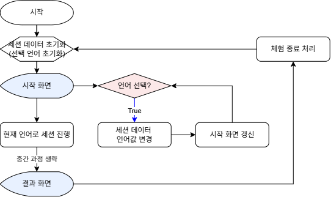
 
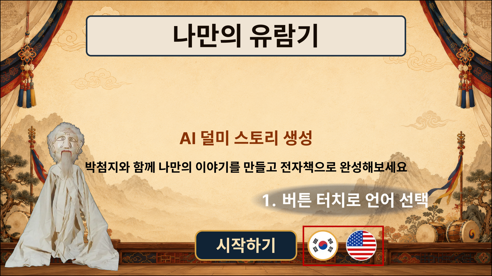

#### 1) 언어 선택 및 적용

- **기본값 설정**
	- 세션 데이터 초기화 시 **한국어**로 설정
- **언어 선택 시 처리**
	- 해당 언어를 세션 데이터에 적용 후 화면 갱신 실행
- **적용 범위**
	- 텍스트에만 적용하며 음성은 적용하지 않음

### 3.2.3 설정

#### 1) Localization 데이터

- JSON 파일로 관리

#### 2) 고려 사항

- 추후 프로젝트의 콘텐츠를 통합하게 되어 콘텐츠 선택 단계가 추가될 경우 언어 선택 시스템의 적용 위치를 통합 시작 화면으로 이전해야 하므로 개발 시 고려 필요

## 3.3 화면 타임아웃

### 3.3.1 개요

- **정의**
	- 한 화면에서 일정 시간(예: 60초) 이상 머무를 경우 다음 단계로 넘어가는 시스템
- **목적**
	- 유저의 장시간 키오스크 체류를 방지하여 키오스크 회전율 제고

### 3.3.2 동작 방식

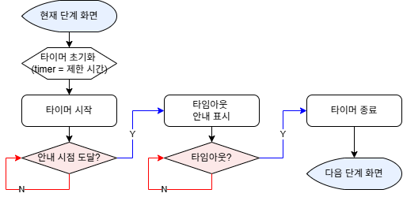
 
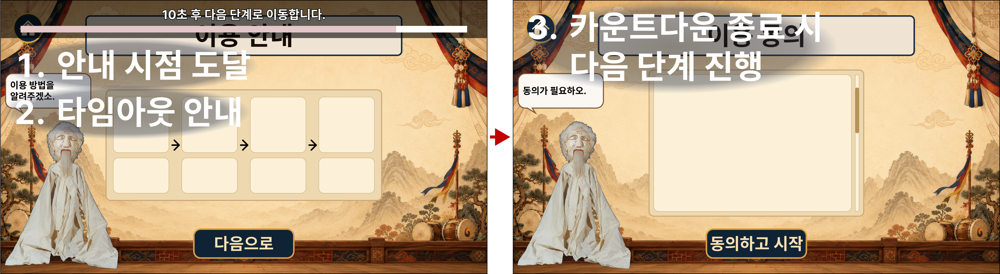

#### 1) 타임아웃

- 현재 단계 화면 진입 시 타이머 초기화 후 카운트다운 시작
- 카운트다운 종료 시 타이머 종료하고 다음 단계 진행

#### 2) 예외 처리

- 필수 입력이 필요한 화면(Ex. 이용 동의 화면, 텍스트 입력 화면)이나 생성 대기 화면에서는 사용하지 않음

#### 3) 기획서에서의 표시

- 해당 시스템이 적용되는 화면에는 상기 아이콘 표시

## 3.4 중도 종료

### 3.4.1 개요

- 정의
	- 유저의 자발적 이탈 또는 비정상적인 세션 중단 시 세션을 정상 종료하는 시스템
- 목적
	- 비정상적인 상황에서 세션이 종료되지 않은 채 유지되는 것을 방지하여 키오스크 회전율 제고

### 3.4.2 동작 방식

#### 1) 진행 중 종료 선택 시 처리

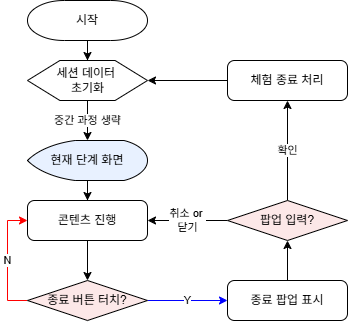
 
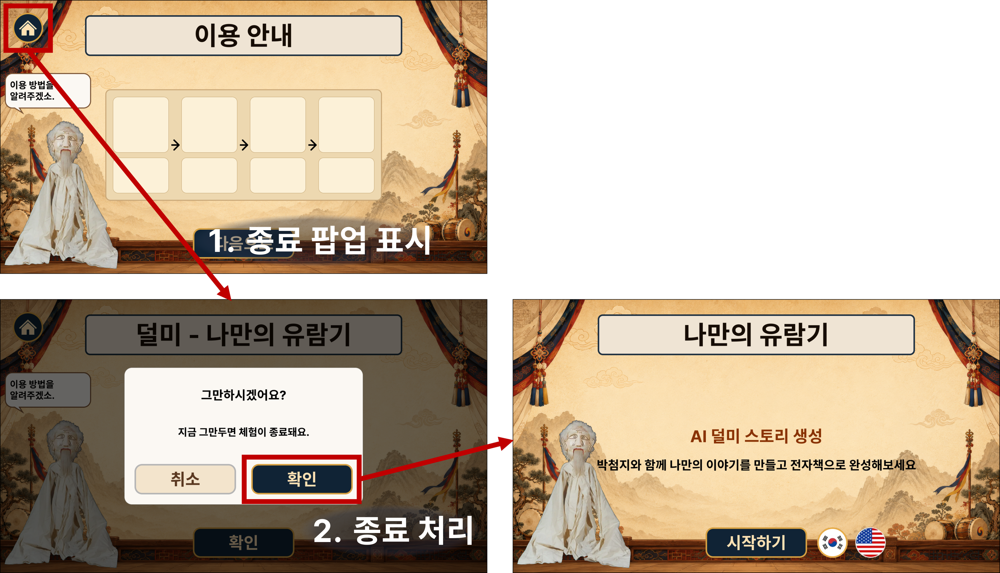

##### (1) 적용 조건

- 유저가 종료 버튼 터치 시 적용

##### (2) 처리 방식

- 종료 팝업 생성 후 확인 버튼 터치 시 종료 처리

#### 2) 미입력 타임아웃 시 처리

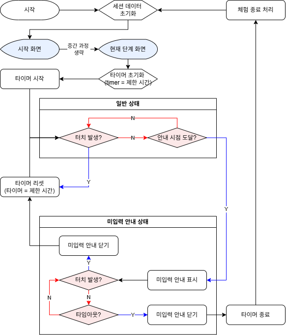
 
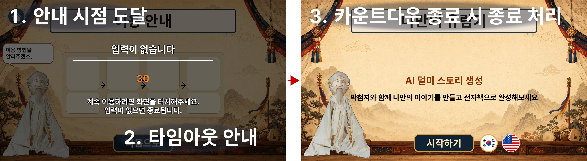

##### (1) 적용 조건

- 세션 진행 중 일정 시간 동안 화면 터치 입력이 없는 경우 적용

##### (2) 처리 방식

- 각 단계 화면 진입 시 미입력 타이머 시작
	- 미입력 터치아웃 UI는 레이어 최상단에 위치
- 화면 터치가 발생하면 타이머 초기화
- 안내 시점까지 입력이 없으면 미입력 안내 표시
- 안내 중 화면을 터치하면 안내를 닫고 타이머 초기화 후 현재 단계 계속 진행
- 안내 후 제한 시간까지 입력 없을 시 미입력 안내 닫고 종료 처리

##### (3) 기획서에서의 표시

- 해당 시스템이 적용되는 화면에는 상기 아이콘 표시

#### 3) 세션 진행 실패 시 처리

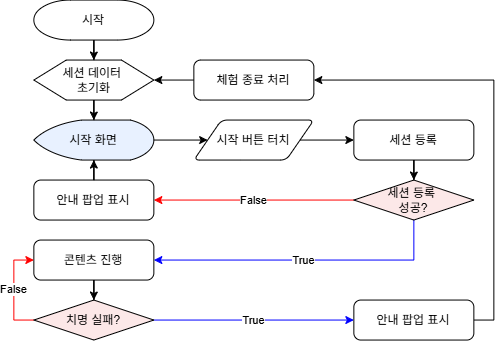
 
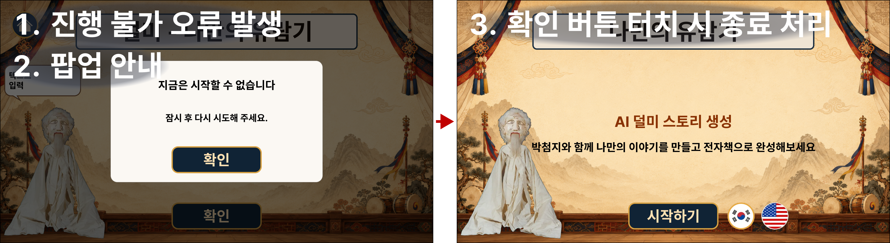

##### (1) 적용 조건

- 세션 등록 실패
	- 서버에 클라이언트의 세션 데이터를 전송 실패
	- 서버에서 세션 ID 부여 실패
- 체험 진행이 불가능한 오류 발생
	- 체험 콘텐츠 리소스 로드 실패, 카메라 및 인식 계통의 지속적 장애 발생

##### (2) 처리 방식

- 재시도(2회) 후 계속 오류 상태일 경우 오류 안내 팝업 표시 후 체험 종료 처리
- 세션 등록 실패 시 종료할 세션이 없으므로 체험 종료 처리 없이 시작 화면으로 복귀

## 3.5 바닥면 처리

### 3.5.1 개요

- **정의**
	- 키오스크의 바닥면 투사 기능과 유저 동작 감지 기능을 연동하여 선택한 남사당놀이 종목에 맞는 이미지를 바닥에 투사하고 유저가 발을 디딘 위치에 시각 효과를 표시하는 상호작용 시스템
- **목적**
	- 바닥면까지 체험 영역으로 확장하여 선택한 종목의 분위기와 특징을 공간적으로 전달
	- 유저의 발 동작에 즉각적인 시각 피드백을 제공하여 체험의 몰입감과 참여감 향상

### 3.5.2 동작 방식

- **진행**
	- 선택한 마당과 체험 단계에 맞는 배경 이미지를 바닥에 투사
	- 센서로 유저의 발 위치를 감지하고 감지한 위치에 시각 효과를 표시
	- 유저가 움직이면 발 위치를 다시 감지하고 시각 효과의 표시 위치를 실시간으로 갱신
- **장비 연동**
	- 설치 시 프로젝터의 투사 좌표와 센서의 감지 좌표를 맞춰 하나의 체험 영역으로 설정
	- 투사 범위와 감지 방식 등 세부 기준은 프로젝터와 센서 선정 후 확정

# 4. 콘텐츠 시스템

## 4.1 조종 원리 시각화 시스템

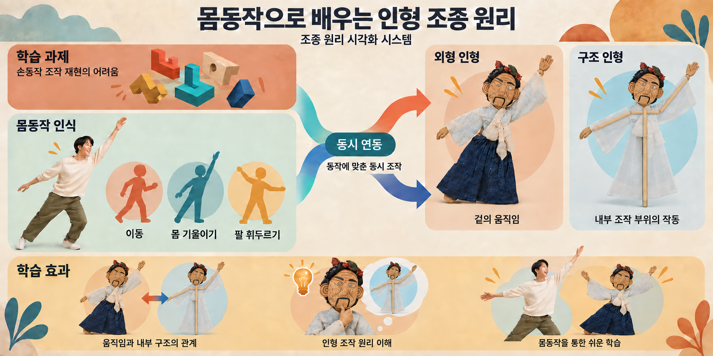

### 4.1.1 개요

- **정의**
	- 유저 동작을 외형 인형과 내부 조종 구조를 보여주는 구조 인형에 동시에 연동하는 시스템
- **목적**
	- 유저에게 인형의 움직임과 내부 구조의 관계를 동시에 보여주어서 유저가 인형 조작 원리를 이해할 수 있도록 함
	- 실제 손동작 조작을 재현하는 어려움을 줄이고 몸동작으로 쉽게 배울 수 있도록 함

### 4.1.2 동작 방식

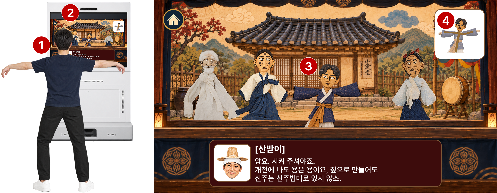

1. 유저가 유저 식별 및 등록을 마치고 키오스크 앞에서 동작을 취함
2. 유저의 동작에서 기울임, 회전, 팔 휘두름 값 등 인형 움직임에 필요한 값을 산출하고 외형 인형과 구조 인형에 연동
	- 유저의 동작을 그대로 인형에 반영하는 것이 아니라 인형이 움직일 수 있는 한계치까지만 반영
3. 외형 인형으로 겉의 움직임 시각화
4. 구조 인형으로 내부 조작 부위 작동 시각화

## 4.2 병렬 서사 시스템

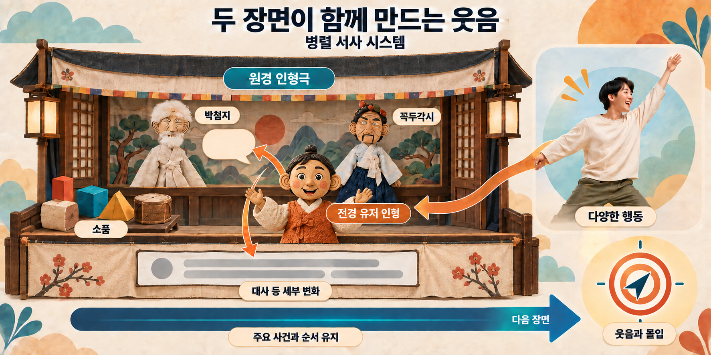

### 4.2.1 개요

- **정의**
	- 전경의 유저 인형과 원경의 덜미 인형극을 병렬로 진행하고 유저 행동을 원경의 세부 진행에 반영하는 시스템
- **목적**
	- 유저의 행동을 폭넓게 허용하면서 이야기의 큰 흐름을 유지함
	- 유저 행동과 인형극의 반응이 어우러져 웃음을 만들고 몰입감을 높임

### 4.2.2 동작 방식

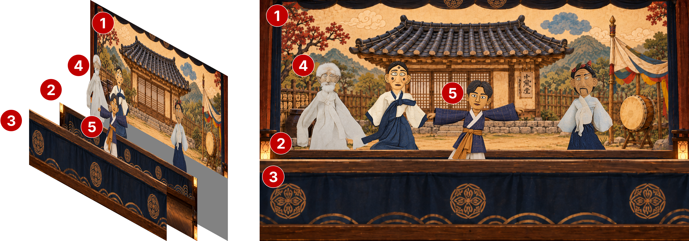

1. 원경 배경 설치
2. 중경 배경 설치
3. 근경 배경 설치
4. 원경과 중경 사이에 꼭두각시 거리 인형 배치
	- 꼭두각시 거리 인형극 진행
5. 중경과 근경 사이에 유저 인형과 소품 오브젝트 배치
	- 유저 행동에 따라 인형극 진행의 대사와 동작이 바뀜
	- 인형극의 큰 흐름은 유지

## 4.3 유저 성향 평가 시스템

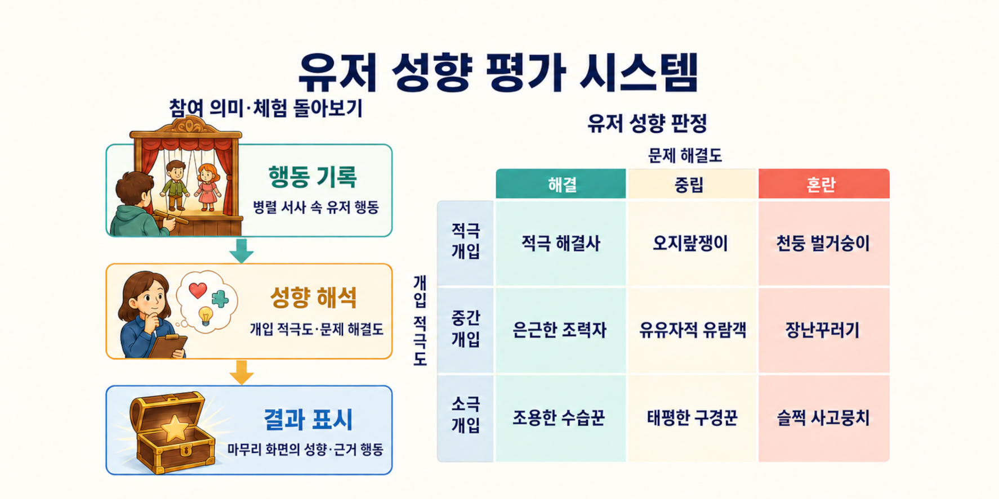

### 4.3.1 개요

- **정의**
	- 체험 중 유저의 행동을 해석해 성향을 평가하고 마무리 화면에 보여주는 시스템
- **목적**
	- 인형극에 참여한 행동에 의미를 부여하고, 자신의 체험을 돌아보게 함

### 4.3.2 동작 방식

1. 병렬 서사 진행 중 유저가 한 행동을 기록함
2. 기록한 행동을 평가 기준에 따라 해석해 체험에서 드러난 성향을 정리함
3. 마무리 화면에 성향과 그 근거가 된 행동을 함께 보여줌

## 4.4 사진 기반 인형 생성 시스템

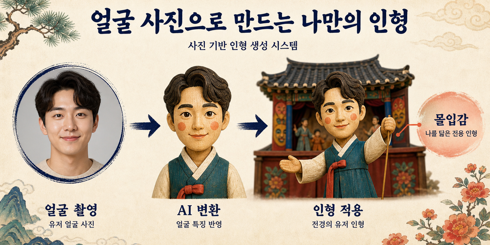

### 4.4.1 개요

- **정의**
	- 촬영한 유저 얼굴을 생성형 AI로 목각인형 모습으로 변환하는 시스템
- **목적**
	- 유저를 닮은 전용 인형으로 인형극에 대한 몰입감을 높임

### 4.4.2 동작 방식

#### 1) 기본 진행

##### (1) 전체 플로우

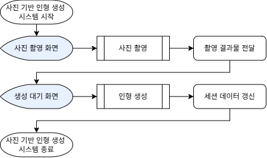

##### (2) 사진 촬영

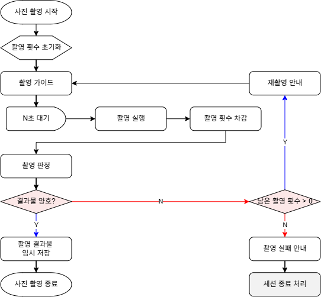

##### (3) 인형 생성

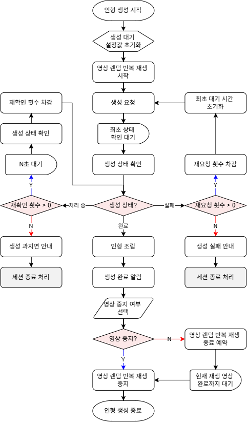

#### 2) 사진 촬영

- 촬영 횟수 초기화 -> 가이드 -> 대기 -> 촬영 및 횟수 차감 -> 결과 판정 순서로 진행
- 결과 양호 시 사진 임시 저장 후 종료
- 양호하지 않을 경우 N회 촬영 재시도
	- 촬영 재시도 횟수 모두 소진 시 촬영 실패 안내 후 세션 종료 처리

#### 3) 인형 생성

- 설정값 초기화 -> 대기 영상 반복 재생 -> 생성 요청 -> 상태 확인 순서로 진행
- 상태 확인 결과 생성 완료 시 작업
	- 인형 조립
		- 생성된 얼굴을 미리 준비한 몸통에 연결
	- 완료 알림 진행
	- 대기 영상은 현재 재생분까지만 재생하나 유저가 중도 종료할 수 있음
- 상태 확인 결과 처리 중일 경우 작업
	- 일정 간격으로 재확인하며 재확인 횟수 소진 시 과지연 안내 후 세션 종료
- 상태 확인 결과 실패 시 작업
	- 재요청 실행하고 재요청 횟수 소진 시 생성 실패 안내 후 세션 종료

# 5. 인트로 진행

## 5.1 개요

- 인트로 진행은 시작, 가이드 및 이용 동의로 구성되며 프로젝트의 다른 콘텐츠와 공통으로 사용하는 단계임

## 5.2 진행

### 5.2.1 시작

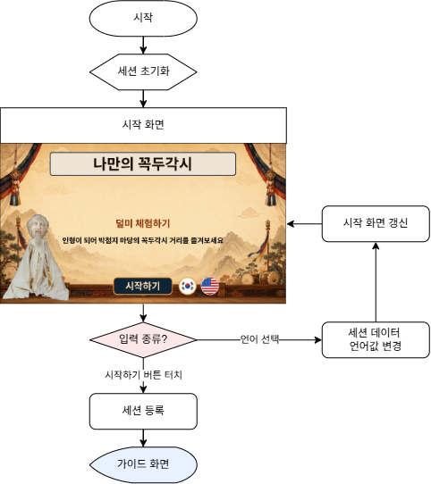

#### 1) 세션 등록 (2차년도 사양)

- 서버에 클라이언트의 세션 데이터를 전송
- 서버에서 세션 ID 부여 후 클라이언트로 전달

### 5.2.2 가이드

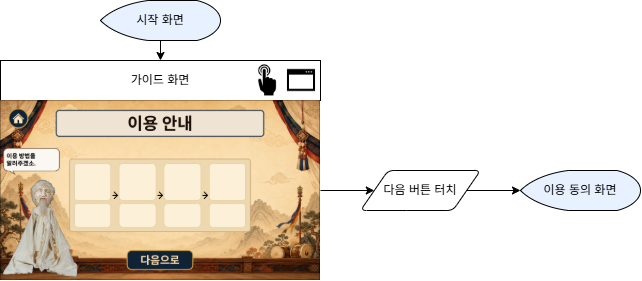

### 5.2.3 이용 동의

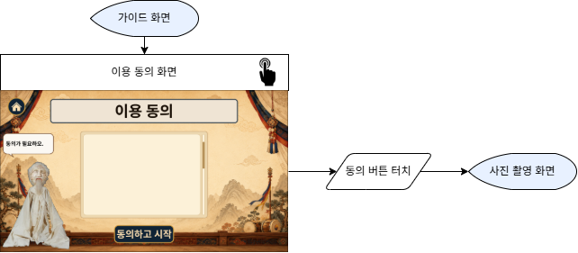

# 6. 꼭두각시 체험 진행

## 6.1 사진 촬영

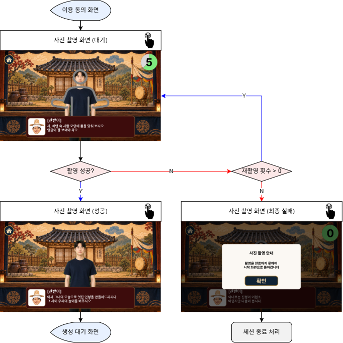

## 6.2 생성 대기

## 6.3 꼭두각시 체험

### 6.3.1 도입부

### 6.3.2 꼭두각시와 덜머리집 싸움

### 6.3.3 재산 분배

### 6.3.4 노잣돈

### 6.3.5 박첨지 울음

# 7. 마무리 진행

# 8. 운영 파라미터

본문과 화면 예시의 수치를 기준값으로 정리함. 미정 항목은 개발 및 현장 테스트 후 확정함.

## 8.1 공통 운영

| 항목 | 적용 대상 | 기준값 | 설명 |
| --- | --- | --- | --- |
| 화면 타임아웃 제한 시간 | 화면 타임아웃 | 60초 (본문 예시) | 화면 진입 후 다음 단계로 넘어가기까지의 제한 시간 |
| 화면 타임아웃 안내 표시 시간 | 화면 타임아웃 | 미정 | 남은 시간이 이 값에 도달하면 타임아웃 안내 표시 |
| 미입력 타임아웃 제한 시간 | 중도 종료 | 미정 | 화면 터치 없이 이 시간이 지나면 세션 종료 |
| 미입력 타임아웃 안내 표시 시간 | 중도 종료 | 미정 | 남은 시간이 이 값에 도달하면 미입력 안내 표시 |
| 오류 해결 재시도 횟수 | 세션 진행 실패 | 2회 | 최초 시도 실패 후 추가로 허용하는 재시도 횟수 |
| 오류 해결 재시도 간격 | 세션 진행 실패 | 미정 | 오류 해결을 다시 시도하기까지의 대기 시간 |
| 바닥 투사 좌표 보정값 | 바닥면 처리 | 미정 | 프로젝터의 투사 위치와 센서가 감지한 발 위치를 맞추는 값 |

## 8.2 사진 촬영과 인형 생성

| 항목 | 적용 대상 | 기준값 | 설명 |
| --- | --- | --- | --- |
| 사진 촬영 대기 시간 | 사진 촬영 | 5초 (화면 예시) | 촬영 가이드 후 촬영 실행까지의 대기 시간 |
| 사진 촬영 가능 횟수 | 사진 촬영 | 미정 | 촬영 시작 시 설정하며 촬영할 때마다 1회씩 차감하는 횟수 |
| 최초 생성 상태 확인 대기 시간 | 인형 생성 | 미정 | 생성 요청 후 최초로 상태를 확인하기까지의 대기 시간 |
| 생성 상태 재확인 간격 | 인형 생성 | 미정 | 처리 중인 생성 요청의 상태를 다시 확인하기까지의 대기 시간 |
| 생성 상태 재확인 횟수 | 인형 생성 | 미정 | 최초 상태 확인 결과가 처리 중일 때 추가로 확인할 수 있는 횟수 |
| 인형 생성 재요청 횟수 | 인형 생성 | 미정 | 생성 실패 시 추가로 허용하는 생성 요청 횟수 |

## 8.3 체험 진행과 동작 인식

| 항목 | 적용 대상 | 기준값 | 설명 |
| --- | --- | --- | --- |
| 유저 인식 재시도 횟수 | 체험 도입부 | 미정 | 최초 인식 실패 후 추가로 허용하는 인식 시도 횟수 |
| 유저 인식 재시도 간격 | 체험 도입부 | 2초 | 유저 인식을 다시 시도하기까지의 대기 시간 |
| 인형 기울임 한계 각도 | 조종 원리 시각화 | 미정 | 유저의 몸 기울임을 인형에 반영할 수 있는 최대 각도 |
| 인형 회전 한계 각도 | 조종 원리 시각화 | 미정 | 유저의 몸 회전을 인형에 반영할 수 있는 최대 각도 |
| 인형 팔 동작 범위 | 조종 원리 시각화 | 미정 | 유저의 팔 동작을 인형에 반영할 수 있는 각도 범위 |
| 소품 배치 최소 거리 | 소품 배치 | 유저 인형의 팔을 뻗은 거리 이상 | 유저 인형과 새로 배치할 소품 사이의 최소 거리 |
| 소품 유지 시간 | 소품 배치 | 미정 | 소품 배치 완료부터 해당 소품이 사라질 때까지의 시간 |
| 오브젝트별 충돌체 크기 | 소품 획득과 전달 | 미정 | 유저 인형의 팔, 소품과 NPC 인형에 적용할 충돌 범위 |
| 팔 내림 속도 기준 | 소품 던지기와 패대기치기 | 미정 | 올린 팔을 내릴 때 두 행동을 실행할 수 있는 최소 속도 |
| 팔 수평 기준 각도 | 소품 던지기와 패대기치기 | 미정 | 팔이 수평에서 멈췄는지 수평을 넘어갔는지 구분하는 각도 |
| 양손 맞잡음 거리 | 소품 챙기기 | 미정 | 두 손을 맞잡은 동작으로 판정할 수 있는 최대 손 사이 거리 |
| 소품 전달 최소 이동 거리 | 소품 전달 | 미정 | 소품이 NPC 인형과 충돌할 때 전달로 인정할 최소 이동 거리 |
| 손 교체 기울임 각도 | 소품 쥔 손 교체 | 미정 | 몸을 기울인 방향의 손으로 소품을 옮기기 위한 최소 각도 |
| 박첨지 반응 판정 속도 | 박첨지 다독이기와 때리기 | 미정 | 팔을 천천히 흔드는 다독이기와 빨리 흔드는 때리기를 구분하는 속도 |

## 8.4 성향 평가와 결과 표시

| 항목 | 적용 대상 | 기준값 | 설명 |
| --- | --- | --- | --- |
| 중간 개입도 시작 건수 | 개입도 평가 | 4건 | 선택 행동이 4~6건이면 중간으로 판정 |
| 적극 개입도 시작 건수 | 개입도 평가 | 7건 | 선택 행동이 7건 이상이면 적극으로 판정 |
| 기억에 남는 행동 표시 수 | 결과 화면 | 최대 3개 | 성향에 맞는 행동을 선정해 표시하는 최대 개수 |
