# 1. 개요

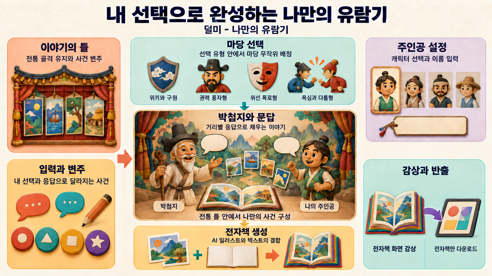

- **콘텐츠 정의**: 덜미를 소재로 한 AI 전자책 키오스크 콘텐츠
- **소재**: 한국 전통 인형극 덜미
- **목표 경험**: 덜미의 문학적 골격은 고정하고, 그 안의 사건과 해설을 유저 입력과 AI 생성으로 채워 매번 다른 이야기를 만듦
- **핵심 메커닉**: AI가 4종 마당 유형의 플롯을 사전 생성해 두고, 유저가 유형을 고르면 그 유형 마당 하나가 랜덤 배정되어 거리 단위로 채워짐
- **산출물**: 2D 일러스트와 텍스트를 엮은 전자책. 본문을 박첨지 목소리로 낭독한 음성이 감상 화면에 함께 나오며, 반출은 전자책만 함

# 2. 전체 플로우

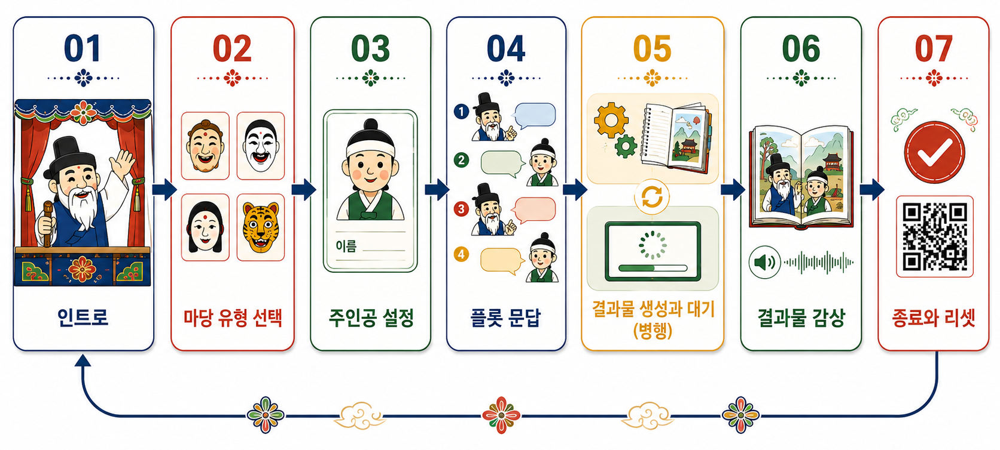

# 3. 세션 진행

## 3.1 Step 1. 인트로

### 3.1.1 클라이언트: 시작 화면

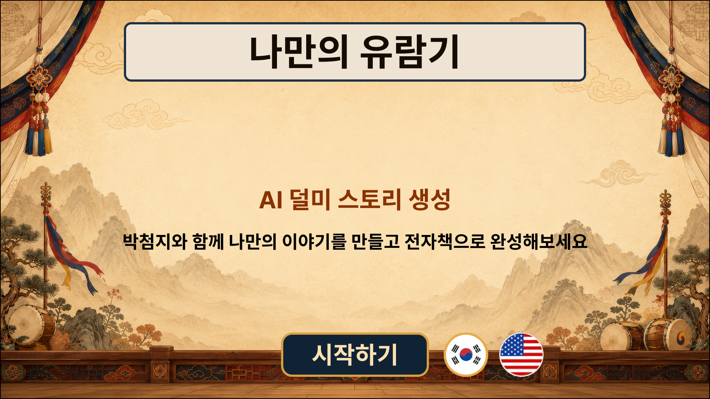

#### 1) 진행

- 시작하기 버튼 터치 시 선택한 언어를 반영하여 다음 단계 진행
	- 서버로 신규 세션 생성 요청

### 3.1.2 서버: 세션 생성

#### 1) 진행

- 신규 세션 생성 및 세션 ID 부여 및 선택 언어 정보 저장
	- 분기: 세션 생성 실패 시 재시도(2회 잠정) 후 상황 안내 팝업 → 시작 화면 복귀

### 3.1.3 클라이언트: 가이드 화면

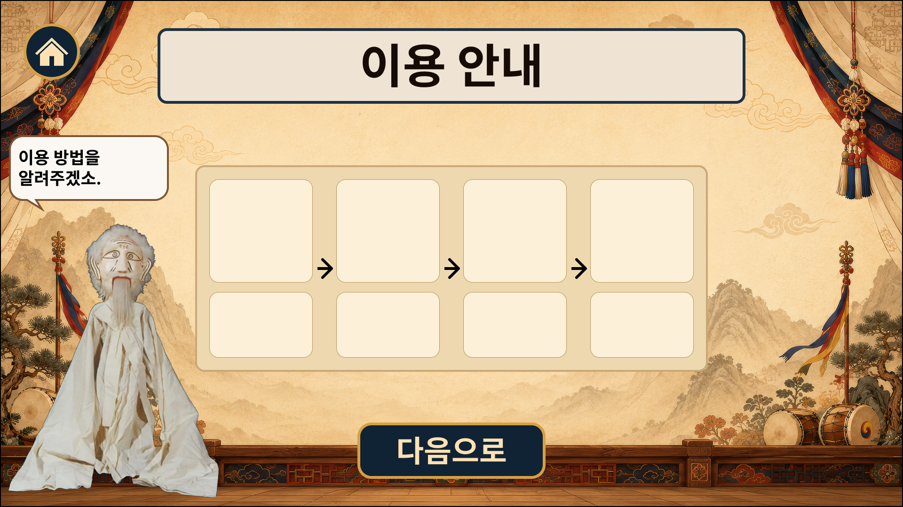

#### 1) 진행

- 다음 진행 버튼 터치 시 다음 단계 진행
	- 분기: 미입력 타임아웃 → 종료 처리
	- 분기: 그만두기 선택 시 확인 팝업 → 확정 시 종료 처리

### 3.1.4 클라이언트: 이용 동의 화면

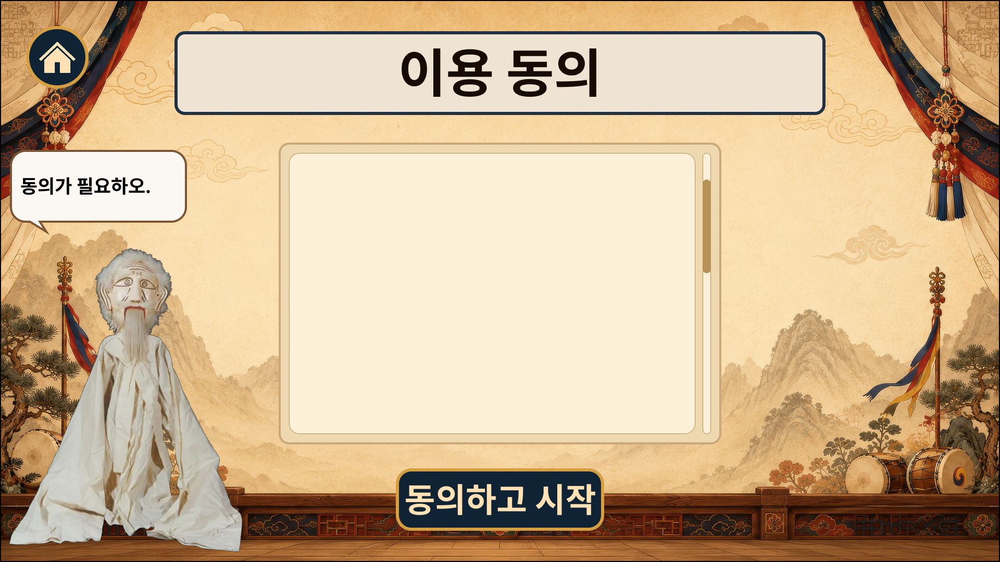

본 콘텐츠는 개인정보를 수집하지 않으므로 개인정보 수집 동의가 아님. AI가 만든 결과물의 책임 범위 같은 이용 조건에 동의를 받음(약관 항목은 규정 검토에서 확정).

#### 1) 진행

- 동의하고 시작하기 터치 시 클라이언트가 약관 동의 정보(약관 버전, 타임스탬프)를 동의 확정 이벤트로 서버에 전송하고 다음 단계로 진행함. 서버는 이 이벤트를 받아 세션에 동의 기록을 저장함
	- 분기: 미입력 타임아웃 → 종료 처리
	- 분기: 그만두기 선택 시 확인 팝업 → 확정 시 종료 처리

## 3.2 Step 2. 마당 유형 선택

### 3.2.1 클라이언트: 마당 유형 선택 화면

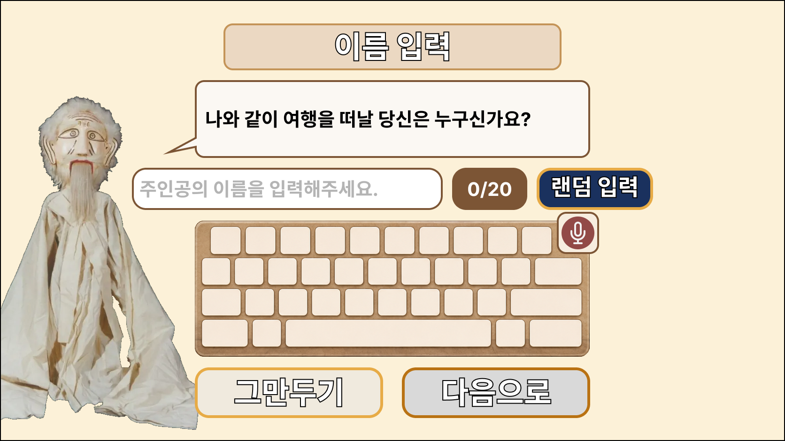

#### 1) 진행

- 마당 유형 4종 카드 선택 후 다음 진행 버튼 터치 시 클라이언트 세션 데이터의 선택 마당 유형 정보 갱신하고, 선택한 마당 유형을 서버로 전송해 다음 단계(마당 배정) 진행
	- 분기: 미입력 타임아웃 → 종료 처리
	- 분기: 그만두기 선택 시 확인 팝업 → 확정 시 종료 처리

### 3.2.2 서버: 마당 배정

#### 1) 진행

- 클라이언트가 전송한 선택 마당 유형의 풀에서 마당 1개를 랜덤으로 배정하고, 배정 결과를 서버 세션에 저장한 뒤 클라이언트에 반환함. 클라이언트는 받은 배정 결과를 세션 데이터에 반영함
	- 마당 플롯 생성 LLM 사전 산출물 사용
	- 분기: 풀 조회나 배정 실패 시 재시도(2회 잠정) 후 상황 안내 팝업 → 종료 처리

## 3.3 Step 3. 주인공 설정

### 3.3.1 클라이언트: 캐릭터 카드 선택 화면

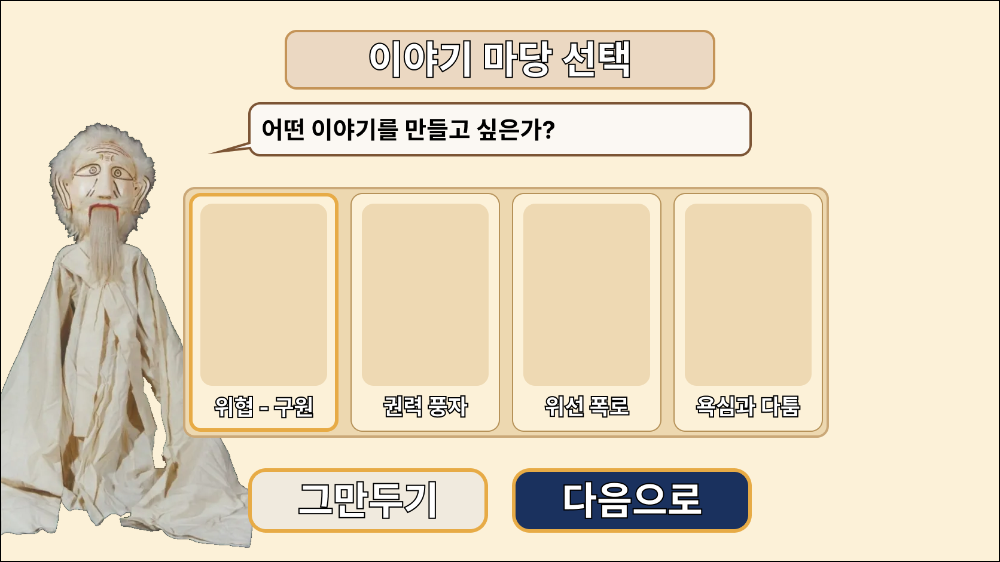

#### 1) 진행

- 캐릭터 카드(6개: 아이/청소년/어른 × 남/여) 중 1개 선택 후 다음 진행 버튼 터치 시 클라이언트 세션 데이터의 캐릭터 정보 갱신하고 다음 단계 진행
	- 분기: 미입력 타임아웃 → 종료 처리
	- 분기: 그만두기 선택 시 확인 팝업 → 확정 시 종료 처리

### 3.3.2 클라이언트: 이름 입력 화면

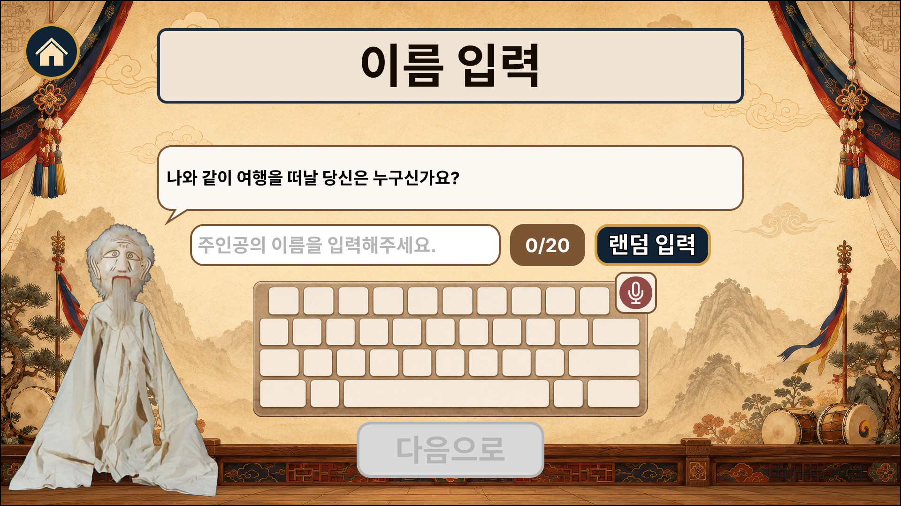

#### 1) 진행

- 이름 입력 확정 후 유효성 검증 통과 시 클라이언트 세션 데이터의 캐릭터 정보 갱신하고 다음 단계 진행
	- 길이 상한(20자)은 입력 단계에서 막음(팝업 없음)
	- 분기: 미입력 타임아웃 → 종료 처리
	- 분기: 비속어 검출 시 안내 팝업 → 3회(잠정) 위반 시 종료 처리
	- 분기: 음성 인식 실패 시 안내 팝업 → 가상 키보드로 계속 입력받음
	- 분기: 그만두기 선택 시 확인 팝업 → 확정 시 종료 처리

#### 2) 이름 랜덤 입력

- **역할**: 사전 작성한 이름 목록에서 하나를 뽑아 이름 입력 필드를 채우는 보조 입력 수단. 유저가 이름을 직접 떠올리지 않아도 바로 시작하게 함
- **동작**
	- 유저가 랜덤 입력 버튼을 터치하면 사전 이름 목록에서 하나를 랜덤으로 골라 이름 입력 필드에 표시함
	- 직전과 같은 이름을 연속으로 뽑지 않게 하는 중복 회피 적용
	- 현재 언어(세션 데이터)에 맞는 이름 텍스트를 표시함
	- 채워진 이름은 일반 입력과 동일하게 다룸: 그대로 다음으로 넘기거나, 가상 키보드로 편집하거나, 랜덤 입력을 다시 눌러 바꿀 수 있음(반복 가능)
- **이름 목록**
	- 사전 작성하고 검수해 고정한 이름 풀(character_name_pool.json). 언어별로 마련해 현재 언어에 맞는 텍스트를 제공함
	- 목록 이름은 비속어 필터와 길이 상한(20자)을 이미 통과하도록 사전 검수함. 랜덤 채움만으로는 유효성 위반이 생기지 않음
	- 유저가 채워진 이름을 편집하면 일반 입력이 되어, 다음으로 넘길 때 유효성 검증을 그대로 받음

## 3.4 Step 4. 플롯 문답

본 절의 진행 단위(박첨지 문답 화면부터 세션 저장까지)는 배정된 마당의 4거리(도입/전개/절정/마무리)를 순서대로 반복함.

### 3.4.1 클라이언트: 박첨지 문답 화면

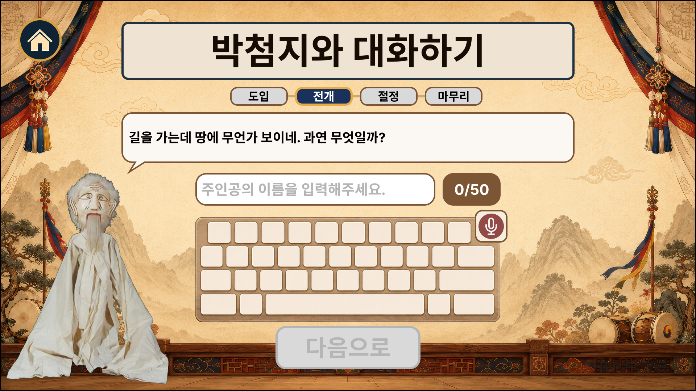

#### 1) 진행

- 거리별 사전 질문을 표시하고 유저 응답 입력 확정 시 다음 단계 진행
	- 가상 키보드를 기본으로 제공하고 STT 음성 입력 병행
	- 길이 상한(50자)은 입력 단계에서 막음(팝업 없음)
	- 분기: 미입력 타임아웃 → 종료 처리
	- 분기: 비속어 검출 시 안내 팝업 → 3회(잠정) 위반 시 종료 처리
	- 분기: 음성 인식 실패 시 안내 팝업 후 가상 키보드로 계속 입력 받음
	- 분기: 그만두기 선택 시 확인 팝업 → 확정 시 종료 처리

### 3.4.2 서버: 유저 응답 가드레일

#### 1) 진행

- 유저 응답의 런타임 입력 검사를 실행함
	- 분기: 위반 시 안내 팝업 → 3회(잠정) 위반 시 종료 처리
	- 분기: 가드레일 호출이 재시도 한도를 넘기면 안내 팝업 → 위반 횟수에 넣지 않고 재입력 받음

### 3.4.3 클라이언트: 세션 저장

#### 1) 진행

- 세션 데이터에 진행 상황과 응답 내용을 누적 저장

## 3.5 Step 5. 결과물 생성과 대기 화면

백그라운드(서버 생성)와 포그라운드(클라이언트 대기 화면)가 동시 진행되고, 클라이언트의 상태 조회로 동기화됨.

### 3.5.1 클라이언트: 대기 화면 (포그라운드)

#### 1) 진행

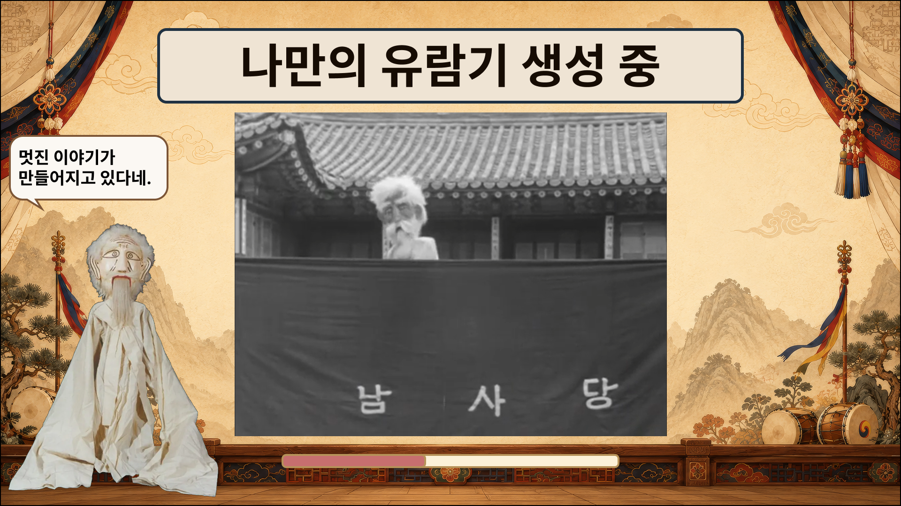

- 대기 콘텐츠 노출(덜미 준비 과정 및 공연 실제 영상)
	- 미리 여러 개로 분할한 영상을 준비하여 랜덤 재생
- 서버 상태 조회(주기 2초, 잠정)
- 분기: `generating` → 대기 유지 / `completed` → 즉시 Step 6 / `failed` → 상황 안내 팝업 → 종료 처리 / 상태 조회 연속 3회 무응답(잠정) → 상황 안내 팝업 → 종료 처리

## 3.6 Step 6. 결과물 감상

### 3.6.1 클라이언트: 결과물 감상 화면

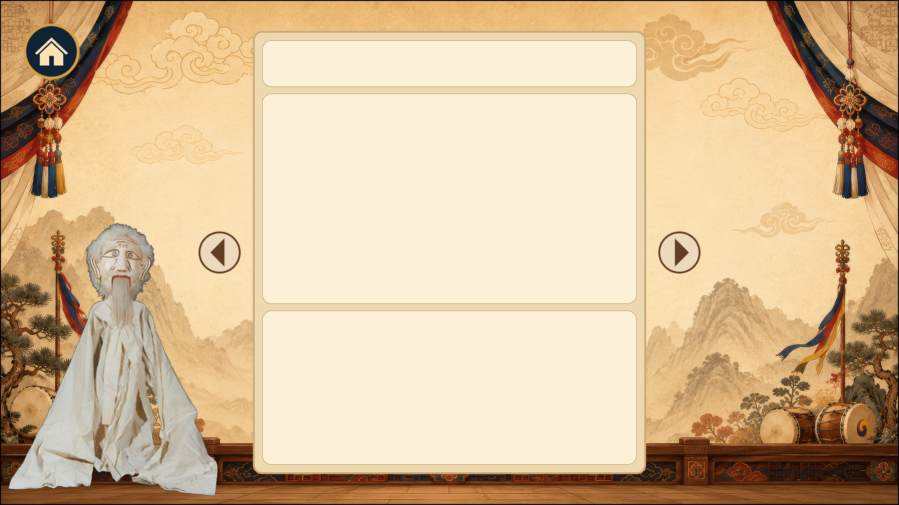

#### 1) 진행

- 결과물 첫 페이지를 표시하고 그 페이지의 낭독 음성을 재생함. 페이지 버튼 터치 시 재생을 멈추고 해당 페이지의 음성을 재생함.
	- 분기: 마지막 페이지에서 다음 페이지 버튼 터치 시 마무리 확인 팝업 생성
		- 분기: 확인 터치 시 다음 단계 진행
	- 분기: 화면 타임아웃 → 완주로 보고 다음 단계 진행(마무리 화면, [[시범콘텐츠 공통 사양#5.4 결과물 감상]])
	- 분기: 그만두기 선택 시 확인 팝업 → 확정 시 종료 처리

## 3.7 Step 7. 종료와 리셋

완주와 비완주 두 경로로 진입함. 완주(Step 6 마무리 확인 팝업에서 확인 터치 또는 화면 타임아웃으로 정상 진행)만 마무리 화면을 거치고, 비완주 종료(그만두기, 터치 미입력 타임아웃, 가드레일이나 비속어 위반 한도 초과, 실패 중단)는 마무리 화면을 건너뛰고 곧장 세션 종료와 리셋으로 감.

### 3.7.1 클라이언트: 마무리 화면

호스팅과 다운로드 URL 발급은 Step 5에서 이미 끝냈으므로, 이 화면은 그 URL로 QR만 그림.

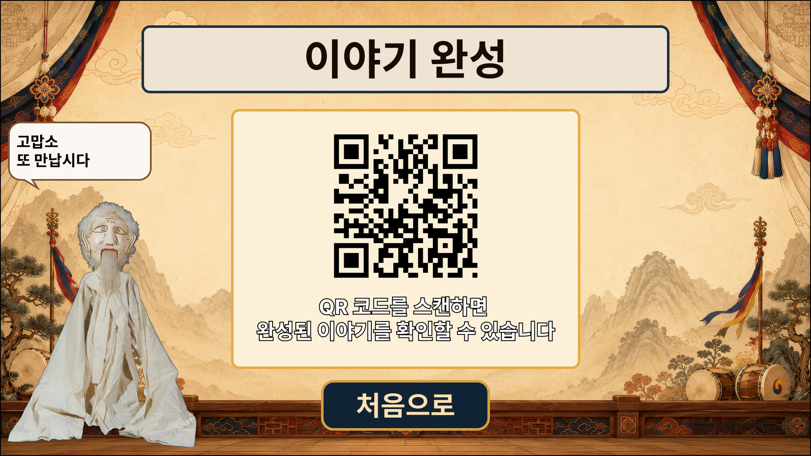

#### 1) 진행

- 완주로 진입한 경우에만 표시함. 
	- QR: Step 5가 발급한 다운로드 URL을 인코딩해 표시하고, 스캔 안내와 다운로드 가능 기간(48시간, 잠정)을 함께 보여줌. 유저가 본인 휴대폰으로 스캔해 전자책을 받음(낭독 음성은 반출하지 않음)
	- 분기: 화면 타임아웃 → 다음 단계 진행

### 3.7.2 클라이언트: 종료 이벤트 전송과 리셋

#### 1) 진행

- 종료 이벤트(완주 또는 이탈 결과)를 서버로 전송한 뒤 클라이언트 세션 데이터를 초기화하고 종료함
	- 완주는 유형(마무리 확인 터치, 감상 화면 타임아웃)을 구분해 기록함: 완주율 관측에서 방치 완주를 분리함
	- 완주와 비완주 종료가 모두 모이는 종착점임. 비완주 종료는 마무리 화면을 건너뛰고 여기로 바로 들어옴

### 3.7.3 서버: 세션 종료 확정

#### 1) 진행

- 클라이언트가 보낸 종료 이벤트를 받아 세션을 종료 상태로 확정함
	- 완주와 비완주 종료 모두 같은 종료 이벤트 경로로 확정함

### 3.7.4 클라이언트: 시작 화면 복귀

#### 1) 진행

- Step 1의 시작 화면으로 복귀하여 다음 유저 대기함
